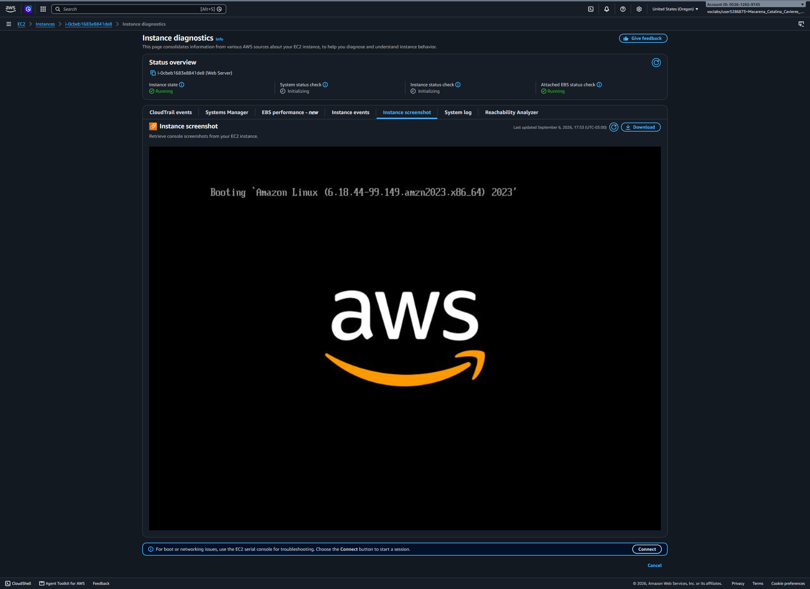
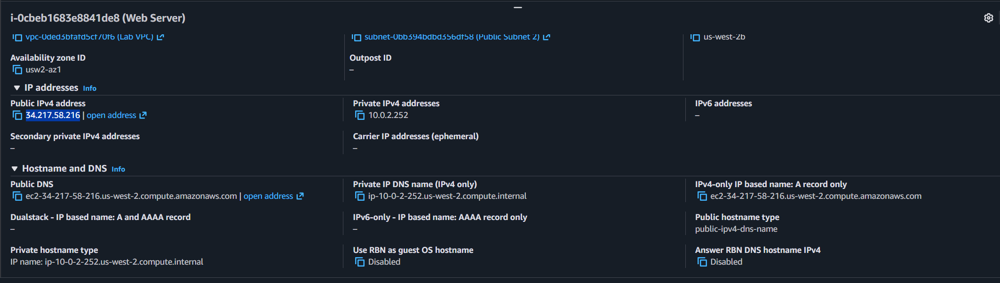
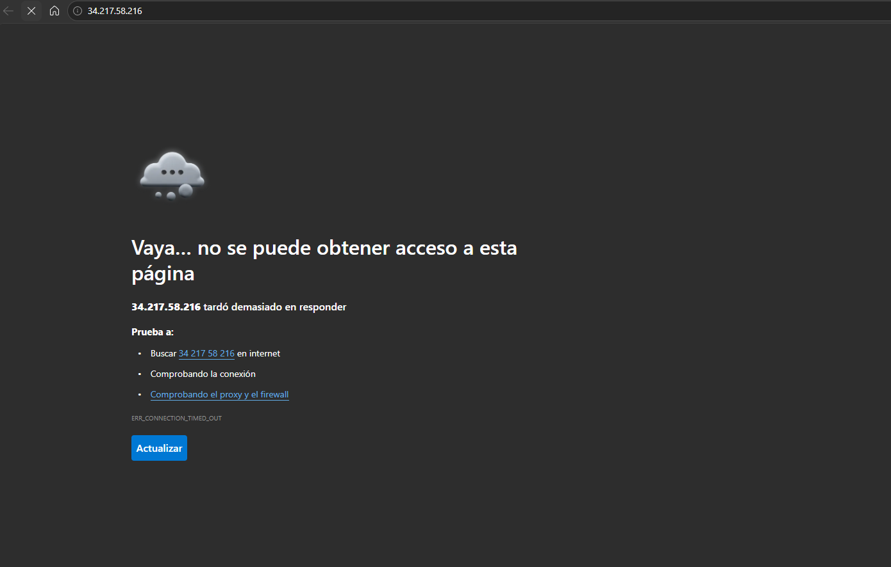
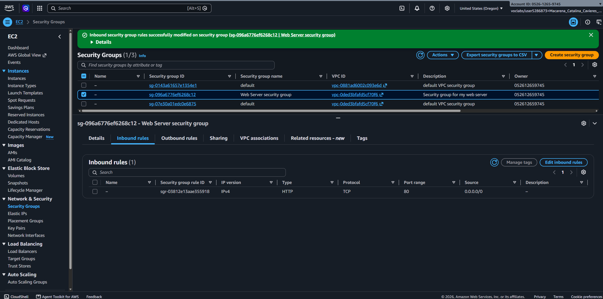
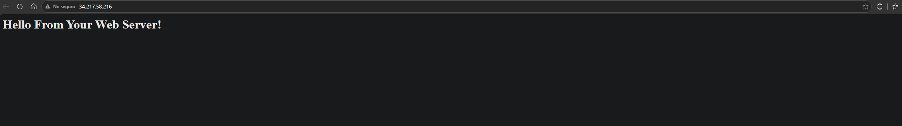
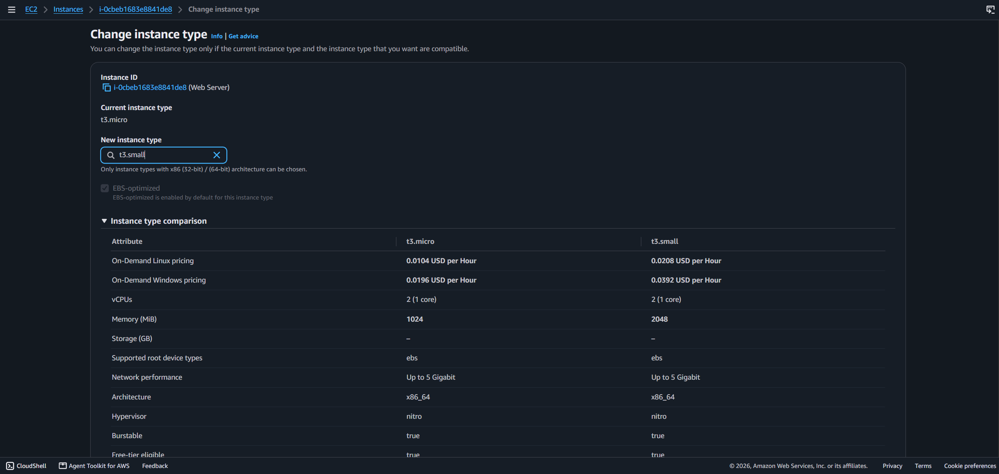
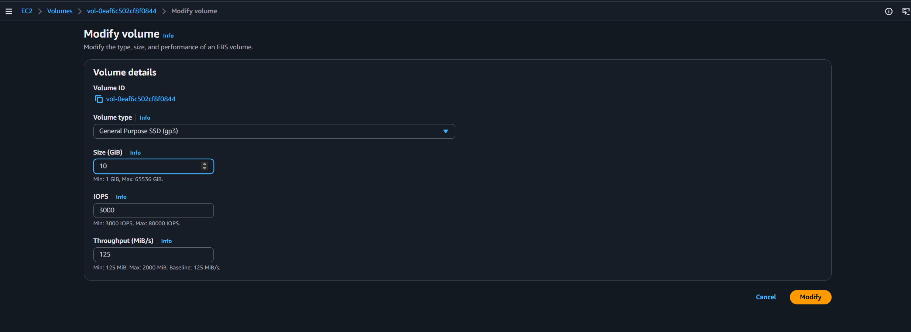
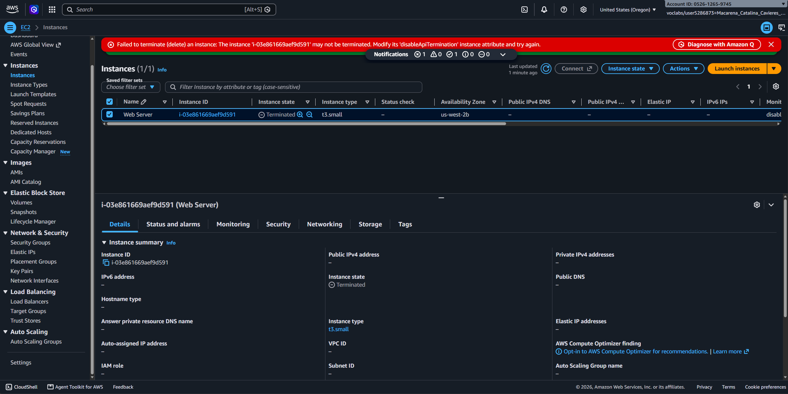

# Lab 11 Lanzamiento, Modificación y Supervisión de una Instancia Amazon EC2

## Objetivo del Laboratorio

Implementar y gestionar un servidor web Apache en **Amazon EC2** mediante la Consola de Administración de AWS, configurando la protección de terminación, personalizando las reglas de red mediante Grupos de Seguridad (Security Groups) y analizando la supervisión del sistema con Amazon CloudWatch.

## Servicios y Tecnologías Utilizadas

- **AWS Service:** Amazon EC2 (Elastic Compute Cloud)
- **Redes & Seguridad:** AWS Security Groups, Lab VPC
- **Sistema Operativo:** Amazon Linux 2023 AMI
- **Scripting / User Data:** Bash (Aprovisionamiento automatizado de Apache `httpd`)
- **Monitoreo:** Amazon CloudWatch (Métricas de estado y accesibilidad)

## Arquitectura y Flujo de Trabajo

```text
[ Cliente / Navegador ]
          │
          │ (Tráfico HTTP - Puerto 80)
          ▼
┌────────────────────────────────────────────────────────┐
│  Security Group: Web Server security group            │
│  Inbound Rule: Allow HTTP (80) from Any (0.0.0.0/0)    │
└─────────────────────────┬──────────────────────────────┘
                          │
                          ▼
┌────────────────────────────────────────────────────────┐
│  EC2 Instance: Web Server (t3.micro)                   │
│  - OS: Amazon Linux 2023                               │
│  - User Data: Bootstrapped httpd                       │
│  - Storage: 8 GiB EBS (Root Volume)                    │
│  - Termination Protection: Enabled                     │
└────────────────────────────────────────────────────────┘
```

## Paso a Paso y Evidencias Prácticas

### Paso 1: Lanzamiento de la Instancia EC2 con User Data

Se configuró una instancia t3.micro con el sistema operativo Amazon Linux 2023, habilitando la Protección de Terminación en los detalles avanzados y eliminando la regla SSH para minimizar la superficie de ataque.

Se incluyó el siguiente script en User Data para automatizar el despliegue del servidor web:

```bash
#!/bin/bash
yum -y install httpd
systemctl enable httpd
systemctl start httpd
echo '<html><h1>Hello From Your Web Server!</h1></html>' > /var/www/html/index.html

```

### Tarea 2: Monitoreo y Captura de Pantalla

- **Health Checks:** Se verificó el paso exitoso de las comprobaciones 2/2 checks passed (System & Instance Reachability).

- **CloudWatch:** Se inspeccionaron las métricas de rendimiento en tiempo real.

- **Get Instance Screenshot:** Se utilizó la herramienta de diagnóstico de consola de AWS para visualizar la pantalla física virtual del servidor sin necesidad de conectarse por SSH/RDP.


_Figura 1: Verificación de estado de la consola virtual mediante Instance Screenshot._

### Tarea 3: Configuración de Security Groups y Acceso Web

Al intentar acceder a la IP pública en el navegador, la conexión falló. Esto ocurrió debido a que la instancia carecía de reglas entrantes para el tráfico web.


_Figura 2: Obtener la IP pública de la instancia._


_Figura 3: Acceso web fallido._

**Solución:** Se editó el Web Server security group agregando una regla entrante (Inbound Rule):

- Tipo: HTTP
- Puerto: 80
- Origen: `Anywhere-IPv4 (0.0.0.0/0)`


_Figura 4: Modificación del Security Group._


_Figura 5: Carga exitosa del mensaje "Hello From Your Web Server!"._

### Tarea 4: Escalado Vertical (Tipo de Instancia y EBS Volume)

- **Detención:** Se detuvo la instancia (Stopped) para realizar cambios de hardware.

- **Cambio de Tipo:** Se modificó la capacidad de la instancia escalando de `t3.micro` a `t3.small` (duplicando la memoria RAM).


_Figura 6: Cambio del tipo de instancia a t3.small._

- **Redimensionamiento EBS:** En la sección de Elastic Block Store, se modificó el volumen raíz aumentando su capacidad de 8 GiB a 10 GiB.


_Figura 7: Cambio del volumen de la instancia._

- **Reinicio:** Se volvió a iniciar la instancia con los nuevos recursos asignados.

### Tarea 5: Validación de Protección de Terminación y Limpieza

- **Prueba de Fallo:** Se intentó terminar la instancia directamente desde el menú, generando un error intencional debido a la marca de Protección de Terminación activada en la Tarea 1.

- **Desactivación y Eliminación:** Se deshabilitó manualmente la regla `Change Termination Protection` y se procedió a terminar (Terminate) la instancia exitosamente.


_Figura 8: Error al tratar de terminar la instancia._

## Evidencia en Video

Mira el despliegue práctico completo, la resolución de fallos en vivo y la manipulación de la consola en mi canal de YouTube:

# [](https://www.youtube.com/watch?v=W-tGboDYI6o)

## Aprendizajes Clave

- **Diagnóstico sin SSH:** `Get Instance Screenshot` permite visualizar fallos de arranque o Kernel Panic sin depender de accesos remotos.

- **Comportamiento Stateful:** Los Security Groups actúan como firewalls a nivel de instancia; sin reglas de entrada explícitas para el Puerto 80, el tráfico HTTP es denegado por defecto.

- **Escalabilidad Vertical en AWS:** Los cambios de tipo de instancia requieren detener la máquina, mientras que la expansión de volúmenes EBS se puede gestionar desde el panel del almacenamiento.

- **Prevención de Errores Humanos:** La protección de terminación es un mecanismo indispensable para instancias de producción críticas.
