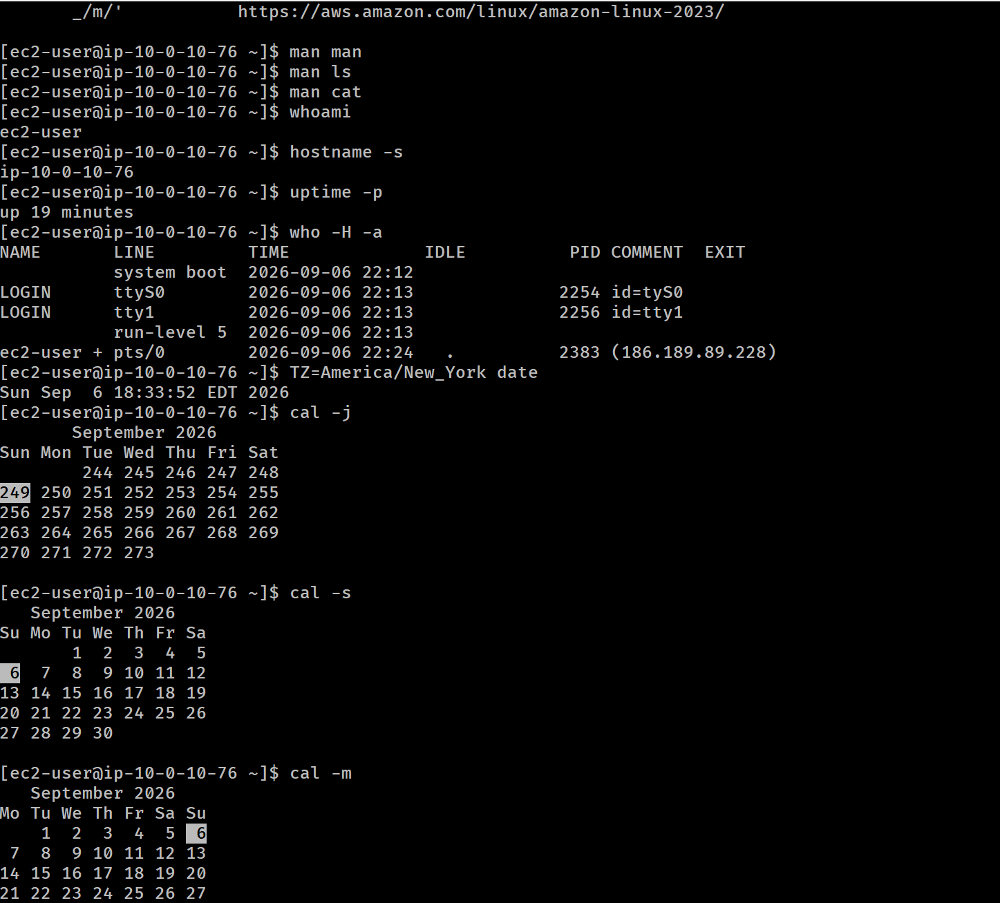

# Lab 225 - 227: Linux Fundamentals: Manual Pages, System Inspection & Bash Productivity


## Descripción General

Este repositorio documenta la ejecución práctica de dos laboratorios esenciales de fundamentos de Linux sobre una instancia **Amazon EC2 (Amazon Linux)** accedida mediante SSH. El objetivo es dominar el uso de la documentación nativa del sistema (`man pages`), la inspección de variables/usuarios y la optimización del flujo de trabajo en la terminal mediante atajos de la shell Bash.

---

## Objetivos de Aprendizaje

- **Acceso remoto:** Conexión vía SSH a una AMI de Amazon Linux.
- **Documentación del sistema:** Navegación, búsqueda e interpretación de encabezados en páginas `man`.
- **Información del sistema y sesión:** Uso de comandos para inspeccionar identidad, tiempo de actividad, usuarios activos y zonas horarias.
- **Productividad en Bash:** Reutilización de comandos mediante autocompletado (`Tab`), búsqueda inversa (`Ctrl + R`), historial (`history`) y expansión de comandos (`!!`).

---

## Laboratorio 1: Exploración de Páginas de Manual (`man`)

Las _man pages_ son el sistema de documentación estándar de los sistemas UNIX/Linux.

### Comandos ejecutados:

```bash
# Abrir el manual del propio comando man
man man
```

### Encabezados clave analizados:

| Encabezado      | Descripción                                                             |
| :-------------- | :---------------------------------------------------------------------- |
| **NAME**        | Nombre del programa o comando y breve descripción de una línea.         |
| **SYNOPSIS**    | Sintaxis exacta y estructura de los argumentos permitidos.              |
| **DESCRIPTION** | Explicación detallada del funcionamiento del programa.                  |
| **OPTIONS**     | Listado completo de parámetros y flags que modifican su comportamiento. |
| **EXAMPLES**    | Casos de uso prácticos de ejecución.                                    |
| **SEE ALSO**    | Comandos o manuales relacionados.                                       |

Navegación: Se utilizaron las teclas flecha arriba/abajo para desplazarse y q para salir del manual.

## Inspección del Sistema y Atajos de Bash (Lab 227)

### Tarea 1: Ejecución de Comandos de Inspección

Se ejecutaron comandos para diagnosticar el estado actual de la máquina y la sesión de usuario:

```bash
# Autocompletado del nombre de usuario actual
whoa <TAB> -> whoami

# Obtener nombre corto del host
hostname -s

# Ver tiempo de actividad del sistema en formato legible
uptime -p

# Información detallada de usuarios conectados (Línea, PID, tiempo inactivo)
who -H -a

# Consultar fecha en distintas zonas horarias utilizando variables de entorno temporales
TZ=America/New_York date
TZ=America/Los_Angeles date

# Visualizar calendario en fecha juliana (consecutiva)
cal -j

# Vistas alternativas del calendario (Semana iniciando en Domingo / Lunes)
cal -s
cal -m

# Consultar UID, GID y grupos del usuario ec2-user
id ec2-user
```

### Tarea 2: Optimización del Flujo de Trabajo en Bash

Uso eficiente del historial de comandos para evitar reescrituras innecesarias:

```bash
# Visualizar el historial completo de comandos ejecutados
history

# Búsqueda inversa en el historial (Presionar Ctrl + R y escribir 'TZ')
(reverse-i-search)`TZ': TZ=America/New_York date

# Repetición rápida del último comando ejecutado
date
!! # Ejecuta nuevamente el comando 'date'
```

## Imagen comandos de Linux


_Figura 1: Comandos ejecutados en la shell de linux_

## Conclusiones y Aplicación Práctica

- **Resolución de problemas (Troubleshooting):** Comandos como uptime, who, e id son fundamentales para auditar accesos e investigar comportamientos anómalos en servidores en la nube.

- **Eficiencia operativa:** La búsqueda en el historial (Ctrl + R) y la expansión !! aceleran significativamente la administración diaria de sistemas Linux mediante CLI.
