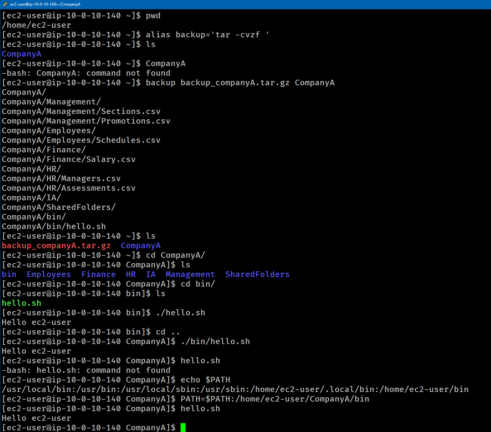

# Lab 249 Automatización de Respaldos con Alias (`tar`) y Configuración de Variables de Entorno (`PATH`)


## Descripción General

Este laboratorio práctico aborda la creación de atajos personalizados mediante `alias` para simplificar la compresión de directorios con `tar`, así como la inspección y modificación de la variable de entorno `PATH` para permitir la ejecución global de scripts de bash desde cualquier directorio del sistema.

## Objetivos del Laboratorio

- Crear un `alias` en la shell para automatizar la creación de respaldos comprimidos con `tar`.
- Utilizar opciones de empaquetado y compresión en formato `.tar.gz`.
- Comprender el funcionamiento del sistema de búsqueda de ejecutables mediante la variable `$PATH`.
- Modificar dinámicamente la variable `$PATH` para incluir rutas de binarios o scripts personalizados.

## Tarea 1: Creación de un Alias para Respaldos (`tar`)

Se configuró un atajo temporal de shell llamado `backup` que ejecuta de forma abreviada la compresión y empaquetado mediante `tar`.

### Comandos Ejecutados:

```bash
# Confirmar directorio de inicio
cd /home/ec2-user
pwd

# Crear el alias para empaquetar y comprimir
alias backup='tar -cvzf '

# Realizar el respaldo del directorio CompanyA
backup backup_companyA.tar.gz CompanyA

# Verificar la creación del archivo comprimido
ls -la
```

_Explicación de los flags de tar:_ \
_- `-c`: Crea un nuevo archivo de respaldo (create)._ \
_- `-v`: Muestra en consola el progreso detallado (verbose)._ \
_- `-z`: Comprime el archivo resultante usando la utilidad gzip._ \
_- `-f`: Especifica el nombre del archivo de salida (file)._

## Tarea 2: Inspección y Modificación de la Variable `$PATH`

Se analizó la causa por la cual un script ejecutable (`hello.sh`) no puede ser invocado directamente sin especificar su ruta relativa o absoluta, solucionándolo mediante la actualización de `$PATH`.

Diagnóstico de Ejecución:

```bash
# 1. Ejecución con ruta relativa desde la carpeta contenedora
cd /home/ec2-user/CompanyA/bin
./hello.sh
# Salida: hello ec2-user

# 2. Ejecución con ruta relativa desde el directorio raíz del proyecto
cd /home/ec2-user/CompanyA
./bin/hello.sh
# Salida: hello ec2-user

# 3. Intentar ejecutar directamente sin especificar ruta
hello.sh
# Salida: bash: hello.sh: command not found
```

### Solución: Actualización de la Variable de Entorno

```bash
# Inspeccionar la variable PATH actual
echo $PATH

# Exportar la nueva ruta añadiendo el directorio bin al final de PATH
PATH=$PATH:/home/ec2-user/CompanyA/bin

# Confirmar la actualización ejecutando el script directamente desde cualquier ubicación
hello.sh
# Salida: hello ec2-user
```


_Figura 1: Captura de los comandos ejecutados_

## Resumen de comandos y sintaxis

| Comando            | Opción / Flag       | Descripción / Caso de Uso                                                                                           |
| :----------------- | :------------------ | :------------------------------------------------------------------------------------------------------------------ |
| `alias`            | `nombre='comando '` | Crea un atajo de shell personalizado para ejecutar un comando o combinación de comandos.                            |
| `tar`              | `-cvzf`             | Empaqueta y comprime en formato `.tar.gz`: **c** (crear), **v** (detallado), **z** (gzip), **f** (archivo destino). |
| `echo`             | `$PATH`             | Imprime el contenido de la variable de entorno que define los directorios de búsqueda de ejecutables.               |
| `PATH=$PATH:/ruta` | Directa             | Agrega una nueva ruta de directorio a la variable `$PATH` de la sesión actual.                                      |

## Evidencia en Video

Mira la ejecución de este laboratorio paso a paso en mi canal de YouTube:

# [](https://www.youtube.com/watch?v=M-kv4fDhxXc)

## Aprendizajes Clave

- **Estructura de tar**: El parámetro -f siempre debe preceder al nombre del archivo de salida cuando se combinan argumentos simples (-cvzf archivo.tar.gz directorio/).

- **Búsqueda de Binarios en Linux**: Cuando escribes un comando sin especificar una ruta (./ o /), el sistema operativo recorre cada directorio listado en $PATH de izquierda a derecha separados por dos puntos (:).

- **Persistencia de Entorno**: Las modificaciones realizadas directamente en la terminal con PATH=$PATH:/ruta o alias aplican únicamente para la sesión de shell activa. Para hacerlas permanentes deben registrarse en archivos como ~/.bashrc o ~/.bash_profile.
