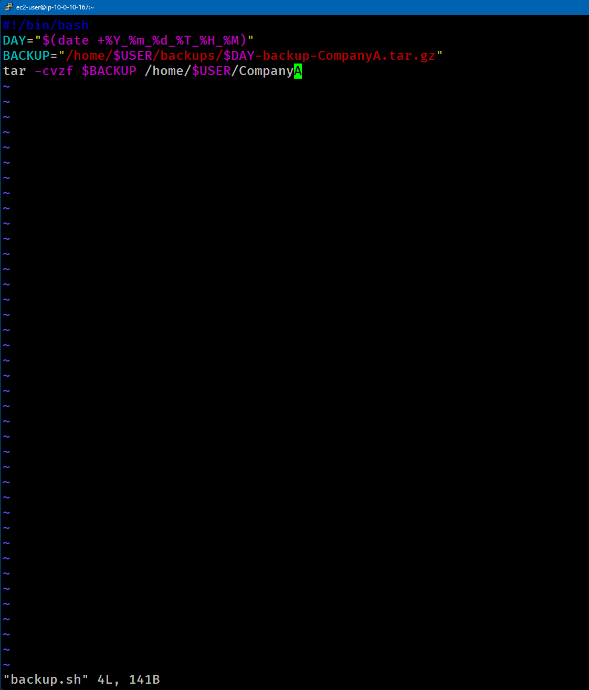
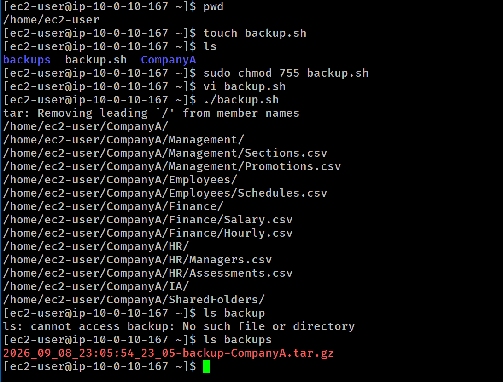

# Lab 251 Automatización de Respaldos Diarios con Script en Bash (`backup.sh`)


## Descripción General

Este laboratorio se enfoca en la creación y automatización de un script en Shell (`Bash`) para generar respaldos de directorios del sistema de forma dinámica. Se hace uso de variables de entorno, interpolación del comando `date` para asignación de marcas de tiempo (_timestamps_) y preservación de permisos con la herramienta `tar`.

## Objetivos del Laboratorio

- Crear un archivo ejecutable Bash con la línea Shebang (`#!/bin/bash`).
- Configurar permisos de ejecución en Linux utilizando `chmod`.
- Utilizar variables de sistema (`$USER`) y variables dinámicas con subcomandos (`$(date)`).
- Automatizar el empaquetado y compresión de archivos conservando permisos de origen mediante `tar`.

## Tarea 1: Creación y Preparación del Script

Se generó el archivo de script y se le otorgaron permisos de ejecución adecuados.

```bash
# Confirmar directorio base
cd /home/ec2-user

# Crear el archivo script vacio
touch backup.sh

# Otorgar permisos de lectura, escritura y ejecucion al propietario (755)
sudo chmod 755 backup.sh
```

Tarea 2: Escritura del Script de Automatización (vi)
Se editó el archivo backup.sh utilizando el editor de texto vi.

```bash
vi backup.sh
```

Contenido del Script (backup.sh):

```bash
#!/bin/bash

# Declaracion de variables de fecha y usuario
DAY="$(date +%Y_%m_%d_%T)"
BACKUP="/home/$USER/backups/$DAY-backup-CompanyA.tar.gz"

# Ejecucion del respaldo comprimido conservando permisos (-p)
tar -cvpzf $BACKUP /home/$USER/CompanyA
```

_Detalle de las banderas utilizadas en tar:_\
_- `-c`: Crea un nuevo archivo de respaldo (create)._\
_- `-s`: Mantiene orden en el empaquetado de archivos._\
_- `-v`: Modo detallado (verbose) para mostrar el progreso en pantalla._\
_- `-p`: Preserva los permisos de archivos y directorios originales (preserve permissions)._\
_- `-z`: Comprime el archivo resultante utilizando gzip._\
_- `-f`: Especifica la ruta y nombre del archivo de salida (file)._


_Figura 2: Captura de pantalla del script_

## Tarea 3: Ejecución y Verificación del Respaldo

Se probó la ejecución directa del script en la consola de comandos.

```bash
# Ejecutar el script
./backup.sh

# Confirmar la creacion del archivo comprimido con timestamp en el directorio backups/
ls -l backups/
```


_Figura 1: Captura de pantalla de los comandos_

## Salida Esperada:

El sistema crea automáticamente la compresión dentro de la carpeta `/home/ec2-user/backups/` nombrando el archivo con la fecha del día actual:
`2026_09_10_17:56:42-backup-CompanyA.tar.gz`

## Resumen de comandos y sintaxis

| Comando | Opción / Flag | Descripción / Caso de Uso                                                                              |
| :------ | :------------ | :----------------------------------------------------------------------------------------------------- |
| `touch` | Directa       | Crea un archivo vacío en la ruta especificada.                                                         |
| `chmod` | `755`         | Concede permisos de lectura/escritura/ejecución (`rwx`) al dueño y lectura/ejecución (`r-x`) al resto. |
| `date`  | `+%Y_%m_%d`   | Genera una cadena formateada con el año, mes y día actual para timestamps.                             |
| `tar`   | `-csvpzf`     | Comprime en `.tar.gz` preservando los permisos de archivo originales (`-p`).                           |

## Evidencia en Video

Mira la ejecución de este laboratorio paso a paso en mi canal de YouTube: \
[](https://www.youtube.com/watch?v=ouohJOD4lEE)

## Aprendizajes Clave

- **Estructura Shebang (`#!/bin/bash`)**: Le indica al kernel del sistema operativo qué intérprete debe usar para procesar las instrucciones del archivo.

- **Uso de Variables Dinámicas**: Encerrar el comando date dentro de `$()` permite capturar la salida en tiempo real al momento de correr el script, ideal para rotación de backups.

- **Preservación de Permisos (`-p`)**: Al hacer respaldos en producción es crítico usar la bandera `-p` de tar para evitar cambiar propietarios o permisos de lectura/escritura al restaurar datos.
