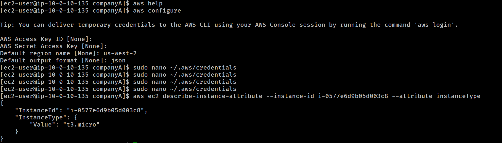

# Lab 243 Gestión de Paquetes con YUM e Instalación de AWS CLI en Linux

## Descripción General

Este laboratorio aborda la administración de paquetes en sistemas basados en Red Hat / Amazon Linux 2 utilizando el gestor de paquetes YUM. Se cubren tareas de actualización del sistema, aplicación de parches de seguridad, reversión de transacciones mediante el historial de YUM e instalación y verificación de la herramienta AWS CLI v2.

## Objetivos del Laboratorio

- Verificar y aplicar actualizaciones de seguridad y paquetes mediante YUM.
- Auditar y revertir transacciones de paquetes instalados usando el historial de YUM (`yum history`).
- Descargar, descomprimir e instalar AWS CLI v2 utilizando comandos de terminal (`curl`, `unzip`, `install`).
- Confirmar la correcta instalación y funcionamiento de AWS CLI v2.

## Tarea 1: Actualización y Gestión del Sistema con YUM

Se realizaron revisiones de parches de seguridad y actualizaciones del sistema con el gestor de paquetes YUM.

```bash
# Confirmar directorio de trabajo
cd companyA

# Consultar actualizaciones disponibles en los repositorios
sudo yum -y check-update

# Aplicar unicamente actualizaciones de seguridad
sudo yum update --security

# Actualizar todos los paquetes del sistema a la version mas reciente
sudo yum -y upgrade

# Instalar o verificar el estado de la instalacion del paquete httpd
sudo yum install httpd -y
```

## Tarea 2: Auditoria y Reversion de Paquetes (YUM History)

Se inspeccionó el historial de transacciones de YUM para identificar cambios recientes y revertir la instalacion de un paquete previo.

```bash
# Listar el historial de transacciones de YUM
sudo yum history list

# Inspeccionar los detalles de una transaccion especifica (reemplazar <ID> por el numero del historial)
sudo yum history info <ID>

# Deshacer la transaccion indicada para revertir los cambios en los paquetes
sudo yum -y history undo <ID>
```

## Tarea 3: Instalacion de AWS CLI v2

Se verificaron las dependencias base de Python y se procedio con la instalacion manual del ejecutable de AWS CLI v2.

```bash
# Verificar la version de Python 3 instalada
python3 --version

# Descargar el paquete de instalacion oficial de AWS CLI v2
curl "[https://awscli.amazonaws.com/awscli-exe-linux-x86_64.zip](https://awscli.amazonaws.com/awscli-exe-linux-x86_64.zip)" -o "awscliv2.zip"

# Descomprimir el archivo zip descargado
unzip awscliv2.zip

# Ejecutar el script de instalacion del sistema
sudo ./aws/install

# Confirmar la correcta instalacion consultando el menu de ayuda
aws help
```

## Tarea 4: Configuración y Uso de AWS CLI

Se configuraron las credenciales de acceso para interactuar con la infraestructura de AWS directamente desde la terminal.

```bash
# Iniciar la configuracion interactiva de AWS CLI
aws configure
```

### Edición manual del archivo de credenciales:

```bash
# Editar el archivo de credenciales de AWS
sudo nano ~/.aws/credentials
```

Estrucutura aplicada dentro de `~/.aws/credentials`:

```Ini
[default]
aws_access_key_id=TU_ACCESS_KEY_ID
aws_secret_access_key=TU_SECRET_ACCESS_KEY
aws_session_token=TU_SESSION_TOKEN
```

## Verificación de conectividad y recursos EC2:

Se ejecutó una consulta hacia la API de EC2 para obtener los atributos de la instancia actual (`Command Host`).

```bash
# Describir los atributos del tipo de instancia en AWS EC2
aws ec2 describe-instance-attribute --instance-id i-1234567890abcdefg --attribute instanceType
```


_Figura 1: Captura de la instancia con su instance ID_


_Figura 2: Captura de la terminal con la instancia conectada_

## Resumen de Comandos y Sintaxis

| Comando         | Opción / Flag                 | Descripción / Caso de Uso                                                                   |
| :-------------- | :---------------------------- | :------------------------------------------------------------------------------------------ |
| `yum`           | `check-update`                | Consulta la lista de paquetes con actualizaciones disponibles en los repositorios.          |
| `yum`           | `update --security`           | Aplica exclusivamente parches y actualizaciones clasificadas como de seguridad.             |
| `yum`           | `history list / undo`         | Lista las transacciones pasadas o revierte la instalación/actualización asociada a un ID.   |
| `curl`          | `-o archivo`                  | Descarga un recurso web y lo guarda localmente con el nombre de archivo especificado.       |
| `unzip`         | Directa                       | Extrae el contenido de un archivo comprimido en formato ZIP.                                |
| `./aws/install` | Directa                       | Script de instalación de AWS CLI v2 que genera binarios y enlaces simbólicos globales.      |
| `aws configure` | Directa                       | Asistente interactivo para configurar la región por defecto y formato de salida de AWS CLI. |
| `aws ec2`       | `describe-instance-attribute` | Consulta la API de AWS para obtener atributos específicos de una instancia EC2.             |

## Aprendizajes Clave

- **Control de Transacciones**: `yum history` permite auditar cambios en el sistema y revertir actualizaciones defectuosas mediante la función `undo`.

- **Instalación Manual de AWS CLI v2**: A diferencia de v1 (distribuido por PIP), AWS CLI v2 se distribuye como un paquete binario autocontenido que se instala compilado en `/usr/local/aws-cli`.

- **Gestión de Perfiles AWS**: Las credenciales se leen desde el archivo de configuración local `~/.aws/credentials`, permitiendo la ejecucion de llamadas autenticadas a la API de la nube desde la terminal de Linux.
