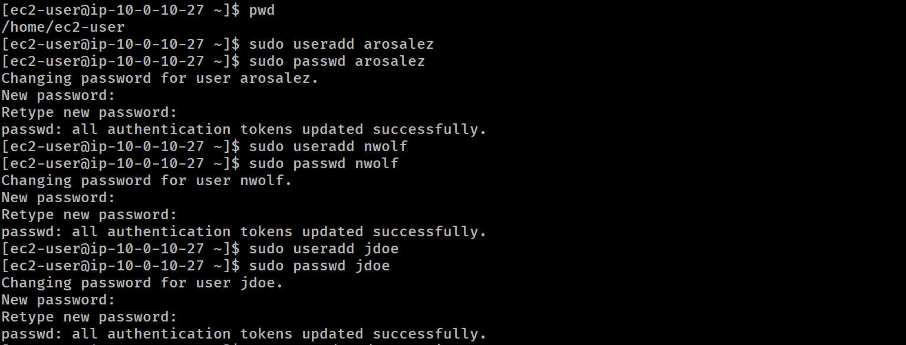
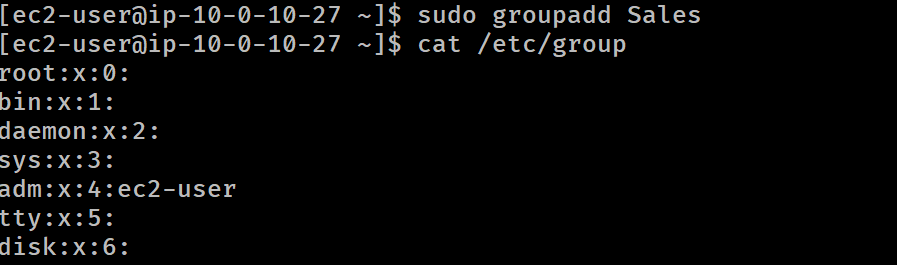
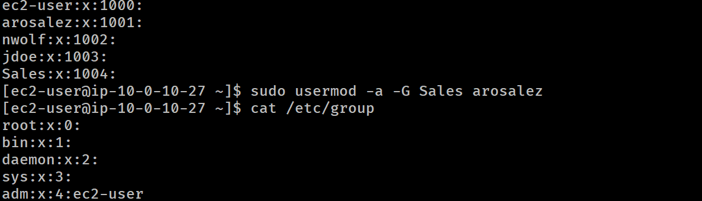
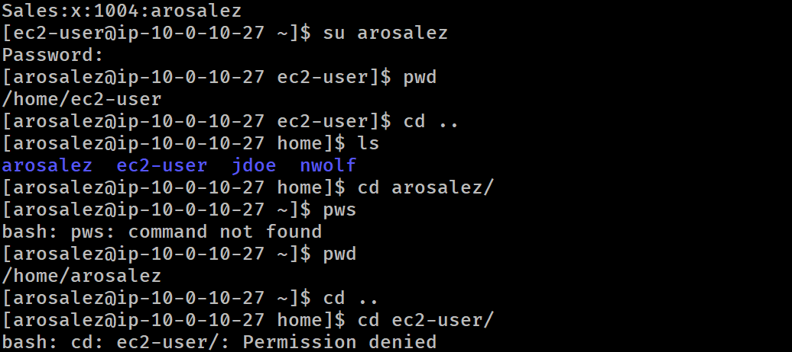

# Lab-229 Administración de Usuarios, Grupos y Permisos en Linux (Amazon EC2)


## Descripción General

Este laboratorio documenta la gestión básica de usuarios y grupos en Linux desde la CLI. Se aborda el aprovisionamiento de cuentas de usuario con contraseñas temporales, la creación de grupos departamentales/organizacionales, la asignación de membresías simples y múltiples mediante `usermod`, y la verificación de permisos del sistema de archivos al intentar realizar acciones no autorizadas entre directorios Home (`/home/username`).

## Objetivos del Laboratorio

- Crear y aprovisionar cuentas de usuario individuales con contraseñas iniciales.
- Crear grupos del sistema para reflejar la estructura organizacional de una empresa.
- Asignar usuarios a grupos primarios y secundarios (`usermod -a -G`).
- Inspeccionar archivos del sistema críticos: `/etc/passwd` y `/etc/group`.
- Demostrar la separación de privilegios al intentar escribir en el directorio de otro usuario.

## Tarea 1: Creación de Usuarios (`useradd` & `passwd`)

Se crearon las cuentas de usuario requeridas para la organización:

| Nombre    | Apellido | ID de Usuario | Rol de Trabajo       | Contraseña Inicial |
| :-------- | :------- | :------------ | :------------------- | :----------------- |
| Alejandro | Rosalez  | `arosalez`    | Sales Manager        | `P@ssword1234!`    |
| Efua      | Owusu    | `eowusu`      | Shipping             | `P@ssword1234!`    |
| Jane      | Doe      | `jdoe`        | Shipping             | `P@ssword1234!`    |
| Li        | Juan     | `ljuan`       | HR Manager           | `P@ssword1234!`    |
| Mary      | Major    | `mmajor`      | Finance Manager      | `P@ssword1234!`    |
| Mateo     | Jackson  | `mjackson`    | CEO                  | `P@ssword1234!`    |
| Nikki     | Wolf     | `nwolf`       | Sales Representative | `P@ssword1234!`    |
| Paulo     | Santos   | `psantos`     | Shipping             | `P@ssword1234!`    |
| Sofía     | Martínez | `smartinez`   | HR Specialist        | `P@ssword1234!`    |
| Saanvi    | Sarkar   | `ssarkar`     | Finance Specialist   | `P@ssword1234!`    |

### Comandos Utilizados:

```bash
# Crear un usuario
sudo useradd arosalez

# Asignar contraseña
sudo passwd arosalez

# Verificar creación filtrando /etc/passwd
sudo cat /etc/passwd | cut -d: -f1
```

### Creación de usuarios


_Figura 1: Comandos para crear usuarios_

## Tarea 2: Creación e Integración de Grupos (`groupadd` & `usermod`)

Se crearon grupos del sistema para organizar los departamentos y jerarquías:

```bash
# Crear grupos
sudo groupadd Sales
sudo groupadd HR
sudo groupadd Finance
sudo groupadd Shipping
sudo groupadd Managers
sudo groupadd CEO
```

### Creación de grupos



_Figura 2 y 3: Comandos para crear grupos y agregar un usuario al grupo_

### Matriz de Asignación de Usuarios a Grupos:

```bash
# Agregar usuarios a sus respectivos grupos (Sintaxis: sudo usermod -a -G <Grupo> <Usuario>)
sudo usermod -a -G Sales arosalez nwolf
sudo usermod -a -G HR ljuan smartinez
sudo usermod -a -G Finance mmajor ssarkar
sudo usermod -a -G Shipping eowusu jdoe psantos
sudo usermod -a -G Managers arosalez ljuan mmajor
sudo usermod -a -G CEO mjackson

# Agregar ec2-user a todos los grupos para mantener permisos de administración
sudo usermod -a -G Sales,HR,Finance,Shipping,Managers,CEO ec2-user
```

## Verificación Final (`/etc/group`):

```bash
cat /etc/group
```

_Salida esperada:_

```
Sales:x:1014:arosalez,nwolf,ec2-user
HR:x:1015:ljuan,smartinez,ec2-user
Finance:x:1016:mmajor,ssarkar,ec2-user
Shipping:x:1017:eowusu,jdoe,psantos,ec2-user
Managers:x:1018:arosalez,ljuan,mmajor,ec2-user
CEO:x:1019:mjackson,ec2-user
```

## Tarea 3: Verificación de Aislamiento de Usuarios y Permisos

1. Se cambió de sesión al usuario recién creado:

```bash
su arosalez
```

2. Estando en la ruta `/home/ec2-user`, se intentó crear un archivo dentro del directorio Home de otro usuario:

```bash
touch myFile.txt
```

3. Resultado:

```
touch: cannot touch 'myFile.txt': Permission denied
```


_Figura 4: Comandos para crear usuarios_

_Demostración práctica del principio de mínimo privilegio en Linux: los usuarios estándar no tienen permisos de escritura en los directorios home ajenos._

## Evidencia en Video

Mira el procedimiento práctico paso a paso en mi canal de YouTube:

# [](https://www.youtube.com/watch?v=99c_BAeI58k)

## Aprendizajes Clave

- **Archivos Críticos de Cuentas:** `/etc/passwd` almacena la configuración de usuarios y `/etc/group` registra los grupos e integrantes.

- **Membresías Múltiples:** La bandera `-a` (append) con `-G` en `usermod` es fundamental para agregar usuarios a nuevos grupos sin eliminar sus grupos anteriores.

- **Seguridad y Aislamiento:** Por defecto, la estructura de permisos POSIX de Linux evita que un usuario manipule archivos en los directorios de trabajo de otros usuarios.
