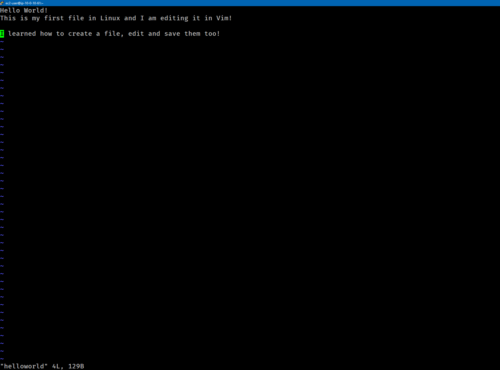
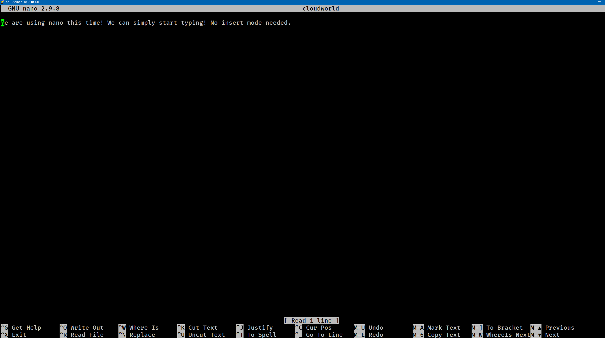

# Lab-231 Editores de Texto en Linux Terminal: Vim y Nano


## Descripción General

Este laboratorio aborda la creación y edición de archivos directamente en la línea de comandos de Linux utilizando los dos editores de texto más populares en administración de sistemas: **Vim** y **Nano**. Se practica el flujo de navegación modal en Vim, la ejecución de su tutorial interactivo (`vimtutor`), comandos de guardado/descarte, y la edición simplificada con Nano.

## Objetivos del Laboratorio

- Aprender los conceptos básicos y modos de trabajo en **Vim** mediante `vimtutor`.
- Crear, modificar, guardar (`:wq`) y descartar cambios (`:q!`) en archivos con Vim.
- Utilizar comandos de atajo en Vim (`dd` para borrar líneas, `u` para deshacer, `:w` para guardar).
- Crear y editar archivos en la terminal con **Nano** usando combinaciones de teclas (`Ctrl+O`, `Ctrl+X`).
- Comparar las ventajas y casos de uso entre un editor modal (Vim) y un editor directo (Nano).

## Tarea 1: Entrenamiento Interactivo con Vimtutor

Para aprender la navegación y manipulación de texto básica en Vim, se ejecutó el tutorial interactivo nativo:

```bash
# Instalación previa en caso de ser requerida
sudo yum install vim -y

# Iniciar el tutorial interactivo
vimtutor
```

_Se completaron las lecciones principales de navegación, inserción y borrado, saliendo del tutorial con el comando :q!_

## Tarea 2: Edición Modal con Vim

Vim es un editor modal, lo que significa que requiere alternar entre el Modo Normal (para comandos y navegación) y el Modo Inserción (para escribir texto).

Flujo de Trabajo Realizado:

1. Creación del archivo:

```bash
vim helloworld
```


_Figura 1: Vista de `vim`_

2. Edición e Inserción:

- Se presionó la tecla `i` para ingresar al Modo Inserción (-- INSERT --).
- Se agregó el siguiente texto:

```
Hello World!
This is my first file in Linux and I am editing it in Vim!
```

- Se presionó `ESC` para volver al Modo Normal.

3. Guardar y Salir:

```
:wq
```

4. Descarte de Cambios:

Se reabrió el archivo (`vim helloworld`), se agregó una línea adicional en modo inserción y luego se salió descartando los cambios con `:q!`, comprobando que la modificación no fue almacenada en disco.

5. **Atajos Útiles Practicados:**

| Comando | Modo      | Acción                                 |
| :------ | :-------- | :------------------------------------- |
| `i`     | Normal    | Entrar al Modo Inserción               |
| `ESC`   | Inserción | Volver al Modo Normal                  |
| `dd`    | Normal    | Eliminar la línea completa actual      |
| `u`     | Normal    | Deshacer (_Undo_) la última acción     |
| `:w`    | Comando   | Guardar cambios sin salir del archivo  |
| `:wq`   | Comando   | Guardar cambios y salir                |
| `:q!`   | Comando   | Salir forzadamente sin guardar cambios |

## Tarea 3: Edición Directa con Nano

A diferencia de Vim, Nano es un editor no modal donde el texto se puede ingresar inmediatamente al abrir el archivo.

### Flujo de Trabajo Realizado:

1. Creación y Apertura:

```bash
nano cloudworld
```


_Figura 2: Vista de `nano`_

2. Edición: \
   Se escribió texto de manera directa sin necesidad de cambiar de modo:

```
We are using nano this time! We can simply start typing! No insert mode needed.
```

3. Guardado y Salida:

- `Ctrl + O` + `Enter`: Escribir/Guardar los cambios en el archivo (WriteOut).
- `Ctrl + X`: Salir del editor Nano.

### Evidencia en Video

Mira la comparación práctica entre Vim y Nano paso a paso en mi canal de YouTube:

# [](https://www.youtube.com/watch?v=Evx9qcGCIMw)

## Aprendizajes Clave

- **Vim vs. Nano**: Nano es intuitivo y rápido para ediciones menores debido a su menú visible en pantalla. Vim ofrece una velocidad de edición superior y menor consumo de recursos en servidores headless mediante sus comandos modales.

- **Persistencia en Vim:** Recordar siempre presionar `ESC` antes de ingresar comandos como `:wq` o `:q!`.

- **Herramientas de Diagnóstico**: `vimtutor` es una excelente herramienta para aprender los atajos básicos de la terminal UNIX sin arriesgar archivos de producción.
