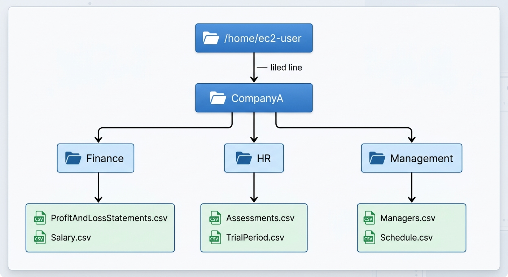
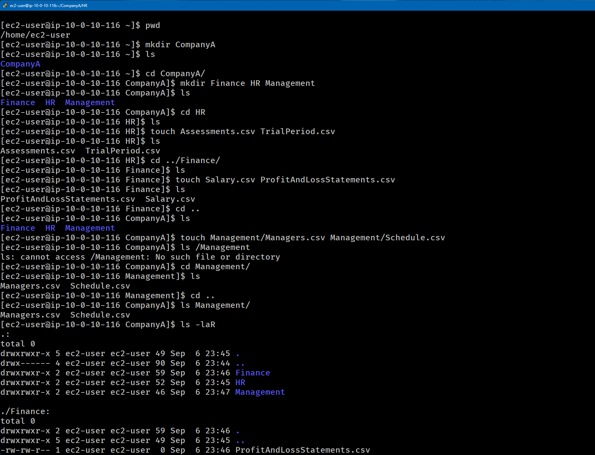
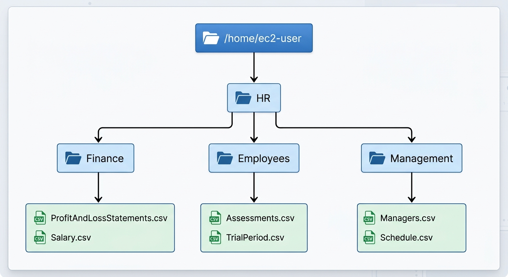
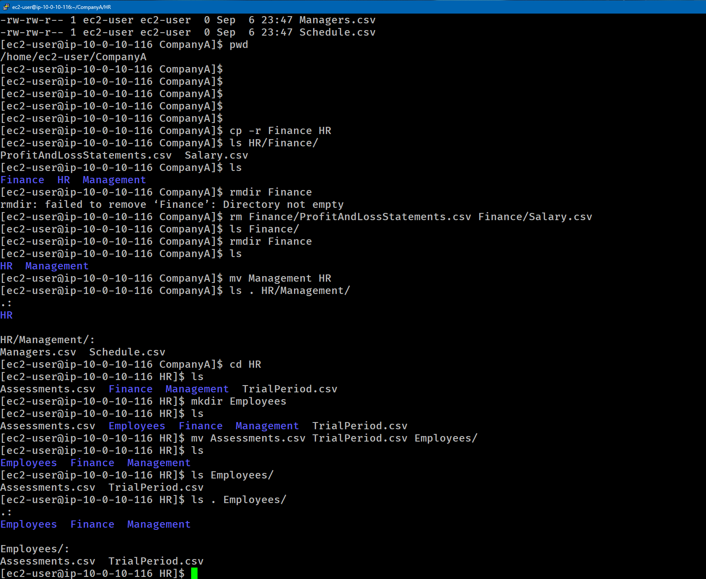

# Lab-233 Gestión de Archivos y Directorios en Linux: Operaciones Básicas de CLI


## Descripción General

Este laboratorio aborda el manejo del sistema de archivos en Linux mediante la interfaz de línea de comandos (CLI). Se ejercita la creación de árboles de directorios, la generación de archivos vacíos mediante `touch`, el uso de rutas absolutas y relativas, la copia recursiva (`cp -r`), el movimiento/renombrado de directorios (`mv`), y la eliminación segura de archivos y carpetas (`rm` y `rmdir`).

## Objetivos del Laboratorio

- Crear estructuras complejas de carpetas anidadas con `mkdir`.
- Crear archivos vacíos en ubicaciones específicas usando `touch` con rutas relativas.
- Copiar directorios y sus contenidos recursivamente con `cp -r`.
- Mover y reorganizar carpetas y archivos dentro del árbol del sistema usando `mv`.
- Eliminar archivos individuales con `rm` y directorios vacíos/no vacíos con `rmdir` y `rm -r`.
- Inspeccionar árboles de directorios completos mediante `ls -laR`.

## Tarea 1: Construcción de la Estructura Inicial

Se creó la estructura corporativa de la empresa `CompanyA` dentro del directorio Home de `ec2-user`:

### Estructura inicial


_Diagrama 1: Estructura inicial de carpetas y archivos_

### Comandos Ejecutados:

```bash
# Navegar al directorio personal y crear carpeta raíz
cd /home/ec2-user
mkdir CompanyA
cd CompanyA

# Crear subcarpetas departamentales
mkdir Finance HR Management

# Crear archivos vacíos usando rutas relativas
touch HR/Assessments.csv HR/TrialPeriod.csv
touch Finance/Salary.csv Finance/ProfitAndLossStatements.csv
touch Management/Managers.csv Management/Schedule.csv

# Verificar la estructura completa recursivamente
ls -laR
```


_Figura 1: Comandos ejecutados para crear carpetas, subcarpetas y archivos_

## Tarea 2: Reorganización y Restructuración de Carpetas

Posteriormente, se aplicaron cambios organizacionales para reestructurar los departamentos bajo la carpeta principal `HR/`:

## Estructura final


_Diagrama 2: Estructura final de carpetas y archivos_

1. Copiar recursivamente el departamento de Finanzas:

```bash
cp -r Finance HR/
```

2. Eliminar el directorio original no vacío:
   Al intentar borrar con `rmdir Finance`, Linux retorna un error porque la carpeta contiene archivos (`Directory not empty`).

```bash
# Opción utilizada: Limpiar archivos y remover directorio
rm Finance/ProfitAndLossStatements.csv Finance/Salary.csv
rmdir Finance
```

3. Mover el departamento de Administración:

```bash
mv Management HR/
```

4. Crear subcarpeta de Empleados y mover registros:

```bash
cd HR
mkdir Employees
mv Assessments.csv TrialPeriod.csv Employees/
```


_Figura 2: Comandos ejecutados para crear carpetas, subcarpetas y archivos de la estructura final_

## Resumen de Comandos y Sintaxis

| Comando | Opción / Flag | Descripción / Caso de Uso                                                                |
| :------ | :------------ | :--------------------------------------------------------------------------------------- |
| `mkdir` | Directa       | Crea un nuevo directorio en la ruta actual o especificada.                               |
| `touch` | Directa       | Crea archivos vacíos o actualiza la marca de tiempo de un archivo existente.             |
| `cp`    | `-r`          | Copia archivos o carpetas de forma recursiva (incluyendo todo su contenido).             |
| `mv`    | Directa       | Mueve o renombra archivos y directorios de un origen a un destino.                       |
| `rmdir` | Directa       | Elimina únicamente directorios que estén completamente vacíos.                           |
| `rm`    | `-r` / `-f`   | Elimina archivos de forma permanente. La opción `-r` elimina directorios recursivamente. |
| `ls`    | `-laR`        | Lista detalladamente (`-l`), incluyendo ocultos (`-a`), de forma recursiva (`-R`).       |

## Evidencia en Video

Mira la ejecución de este laboratorio paso a paso en mi canal de YouTube:

# [](https://www.youtube.com/watch?v=cM2wpKTn3kc)

## Aprendizajes Clave

- **Rutas Relativas vs. Absolutas**: Usar rutas como `../Management/` evita navegación innecesaria entre directorios con `cd`.

- **Manejo de Directorios No Vacíos**: `rmdir` es una medida de seguridad nativa de UNIX para evitar la pérdida accidental de datos. Para eliminar carpetas con contenido se requiere vaciarlas previamente o utilizar `rm -r`.

- **Comportamiento de `mv`**: El comando `mv` sirve tanto para reorganizar carpetas como para renombrar archivos dependiendo de si el destino es un directorio o un nombre nuevo.
