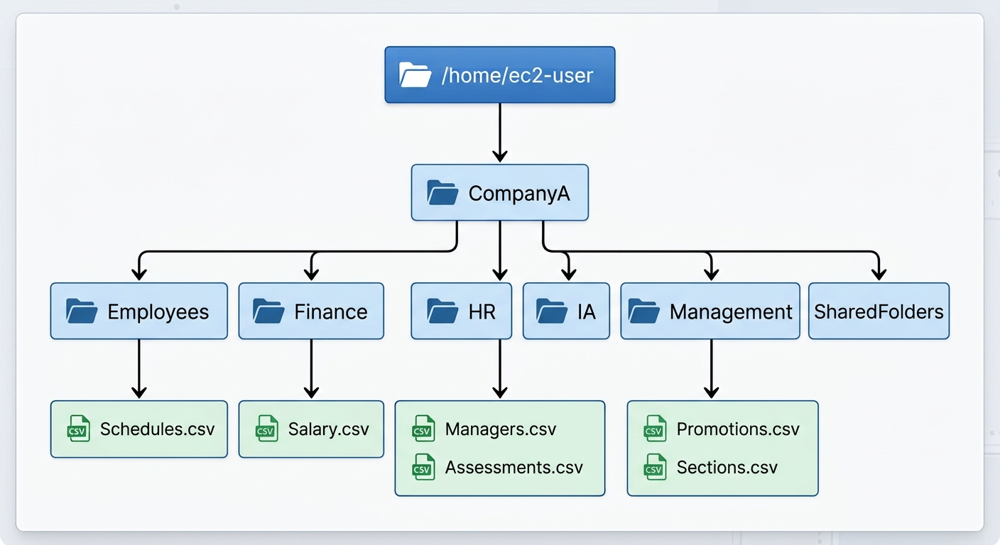
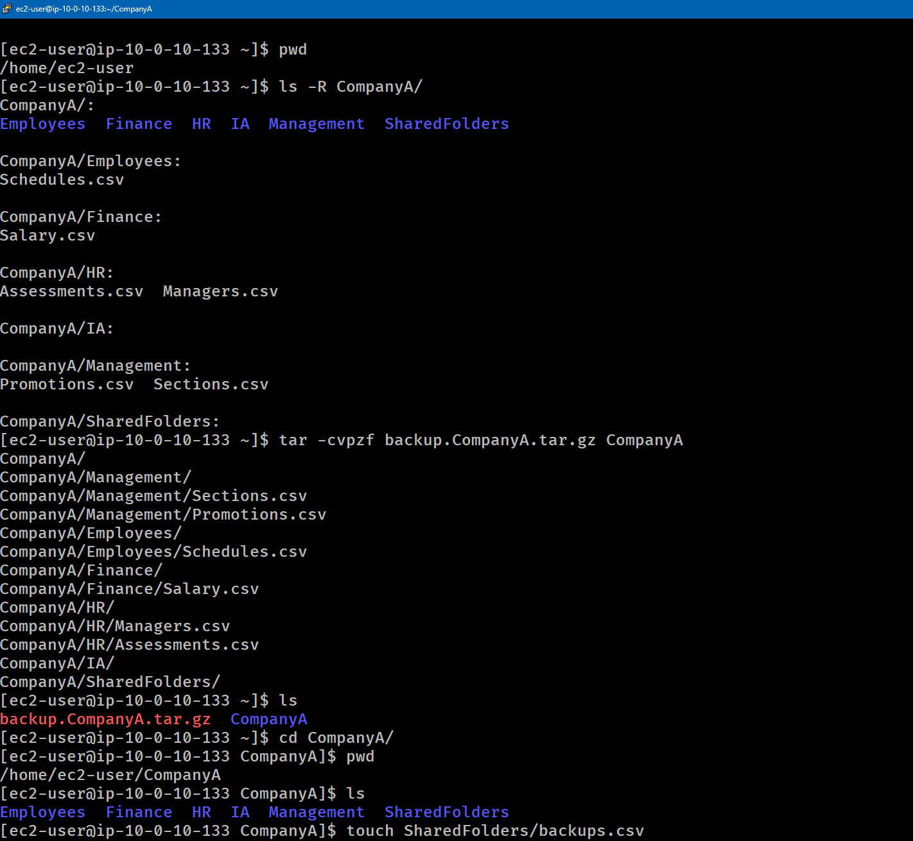
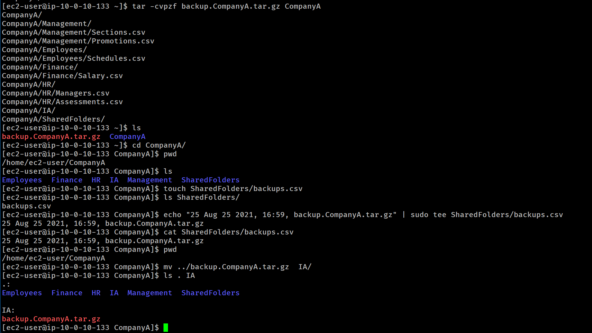

# Lab-235 Respaldos en Linux: Archivos TAR, Redirección de Salida y Logs


## Descripción General

En este laboratorio práctico se aborda la creación y gestión de copias de seguridad en entornos Linux mediante la herramienta `tar` (_Tape Archive_) con compresión `gzip`. Además, se ejercita el registro de auditoría (_logging_) combinando redirección de flujos con tuberías (`|`) y el comando `tee`, así como la reubicación de los respaldos dentro de la estructura de directorios del sistema.

## Objetivos del Laboratorio

- Crear un archivo empaquetado y comprimido (`.tar.gz`) de una estructura de directorios completa.
- Registrar metadatos de auditoría (fecha, hora y nombre del archivo) utilizando `echo` y `tee`.
- Comprender el flujo de datos mediante la tubería (`|`) y permisos de escritura con `sudo`.
- Trasladar el respaldo generado a un directorio de almacenamiento secundario (`IA/`).

## Estructura de carpetas


_Diagrama 1: Estructura de carpetas y archivos_

## Tarea 1: Creación del Respaldo Comprimido (`tar`)

Se generó un respaldo integral del directorio `CompanyA/` ubicado en el Home del usuario `ec2-user`.

### Comandos Ejecutados:

```bash
# Confirmar ubicación en la carpeta personal
cd /home/ec2-user
pwd

# Verificar la estructura existente
ls -R CompanyA

# Generar el archivo comprimido .tar.gz
tar -czvf backup.CompanyA.tar.gz CompanyA

# Verificar la creación del respaldo
ls
```


_Figura 1: Comandos ejecutados para listar y comprimir un directorio_

## Tarea 2: Registro de Auditoría y Redirección (`tee`)

Se creó un archivo de log (`backups.csv`) en el directorio `SharedFolders/` para auditar la fecha y hora de creación de la copia de seguridad.

```bash
# Ingresar al directorio corporativo
cd /home/ec2-user/CompanyA

# Crear archivo de log vacío
touch SharedFolders/backups.csv

# Registrar metadatos en pantalla y en archivo simultáneamente
echo "25 Aug 25 2021, 16:59, backup.CompanyA.tar.gz" | sudo tee SharedFolders/backups.csv

# Verificar el contenido registrado
cat SharedFolders/backups.csv
```

## Tarea 3: Reubicación del Archivo de Respaldo

Para asegurar el archivo en un almacenamiento dedicado, se movió la copia desde la ruta superior (`../`) hacia la carpeta de acceso poco frecuente (`IA/`).

```bash
# Mover el archivo tar.gz desde el directorio padre
mv ../backup.CompanyA.tar.gz IA/

# Confirmar la reubicación del archivo
ls . IA
```


_Figura 2: Comandos ejecutados para redirección `tee` y reubicación_

## Resumen de comandos y sintaxis

| Comando | Opción / Flag    | Descripción / Caso de Uso                                                                                   |
| :------ | :--------------- | :---------------------------------------------------------------------------------------------------------- |
| `tar`   | `-czvf`          | **c**: Crear archive, **z**: Compresión gzip, **v**: Verbose (detallar proceso), **f**: Nombre del archivo. |
| `echo`  | Directa          | Imprime texto en la salida estándar (_stdout_).                                                             |
| `\|`    | Tubería (_Pipe_) | Conecta la salida estándar de un comando con la entrada estándar (_stdin_) del siguiente.                   |
| `tee`   | Directa          | Lee la entrada estándar y la escribe tanto en la salida estándar como en uno o varios archivos.             |
| `cat`   | Directa          | Concatena y muestra el contenido completo de un archivo en la consola.                                      |
| `mv`    | Directa          | Traslada o renombra archivos y directorios entre rutas relativas o absolutas.                               |

## Evidencia en Video

Mira la ejecución de este laboratorio paso a paso en mi canal de YouTube:

# [](https://www.youtube.com/watch?v=49dUBARikpw)

## Aprendizajes Clave

- **Desglose del comando `tar`**: La combinación `-czvf` es el estándar en administración de sistemas Linux para empaquetar y comprimir en un solo paso.

- **Uso práctico de tee**: A diferencia del redireccionador `>`, el comando `tee` permite visualizar la salida en la terminal mientras se guarda en un archivo log, lo cual es útil para depuración en scripts de automatización.

- **Manejo de rutas en `mv`**: Usar `../` permite manipular archivos ubicados en el directorio padre sin necesidad de salir del directorio de trabajo actual.
