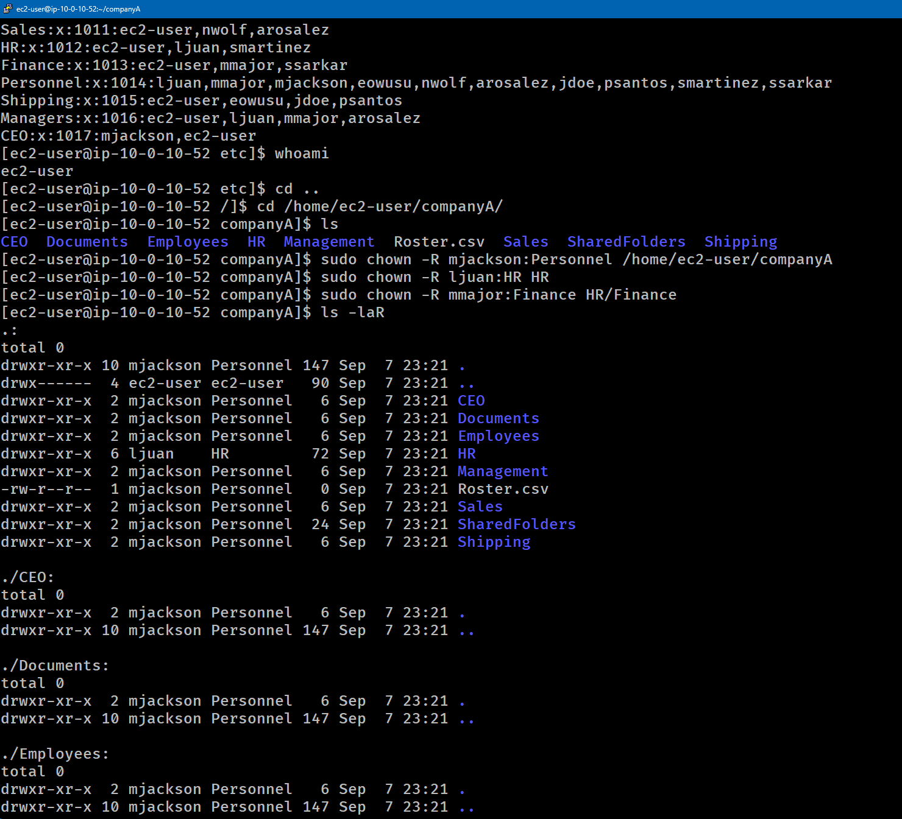
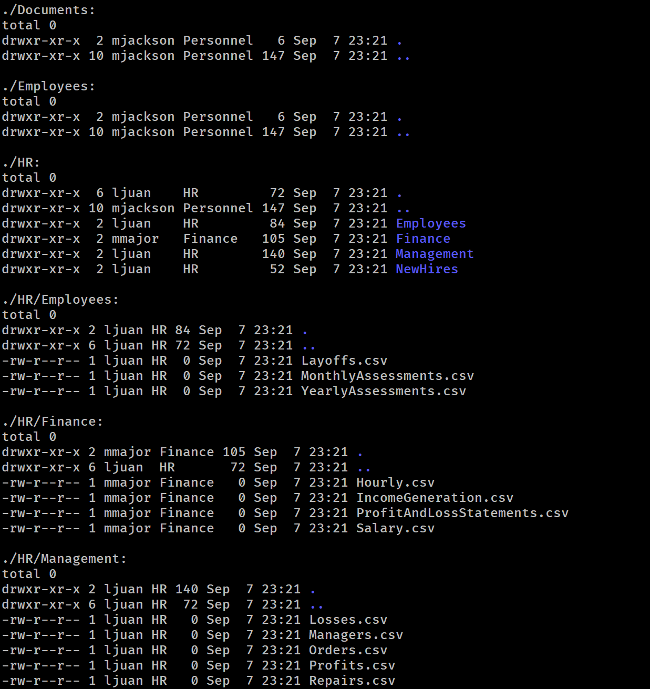
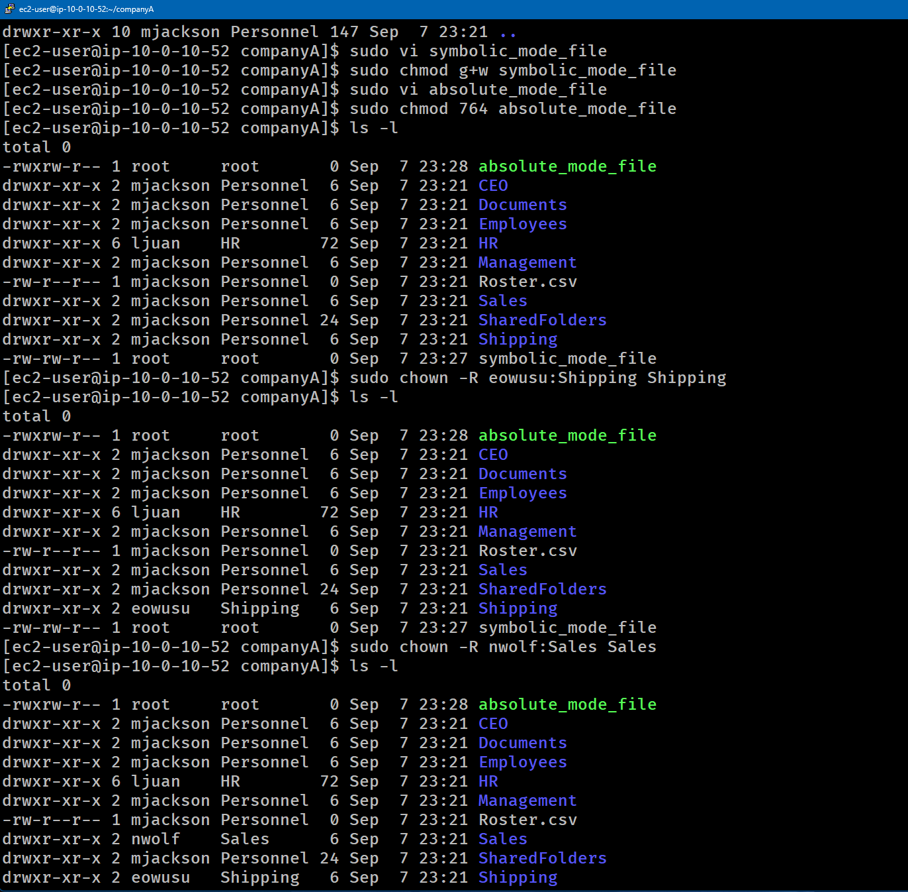

# Lab-237 Permisos y Propiedad en Linux: Comandos `chown` y `chmod` (Modo Simbólico y Absoluto)


## 📌 Descripción General

Este laboratorio práctico aborda la administración de seguridad en sistemas de archivos Linux mediante la asignación de propiedad de archivos/directorios (`chown`) a usuarios y grupos específicos, junto con el control de accesos mediante el comando `chmod`. Se ejercita la modificación de permisos utilizando tanto la notación simbólica (`u`, `g`, `o`, `a`) como la notación octal/absoluta (valores numéricos como `764`).

---

## 🎯 Objetivos del Laboratorio

- Modificar recursivamente la propiedad de usuario y grupo en estructuras de carpetas corporativas con `chown -R`.
- Administrar permisos de lectura (`r`), escritura (`w`) y ejecución (`x`) en archivos.
- Aplicar cambios de permisos con el **Modo Simbólico** (`chmod g+w`).
- Aplicar cambios de permisos con el **Modo Absoluto/Octal** (`chmod 764`).
- Verificar jerarquías de archivos, usuarios y grupos mediante `ls -l` y `ls -laR`.

---

## 🛠️ Tarea 1: Reasignación de Propiedad y Grupos (`chown`)

Se ajustó la estructura de propiedad de la empresa `companyA` para reflejar el organigrama corporativo (CEO, Gerentes de Departamento y sus respectivos grupos de trabajo).

### Comandos Ejecutados:

```bash
# Confirmar directorio de trabajo
cd /home/ec2-user/companyA
pwd

# Reasignar propiedad completa a nivel raíz (CEO mjackson y Grupo Personnel)
sudo chown -R mjackson:Personnel /home/ec2-user/companyA

# Asignar propiedad a carpetas departamentales específicas
sudo chown -R ljuan:HR HR
sudo chown -R mmajor:Finance HR/Finance

# Verificar la estructura y permisos asignados
ls -laR
```



_Figura 1 y 2: Comandos ejecutados para la reasignación de propiedad y grupos_

## Tarea 2: Modificación de Permisos (`chmod`)

Se crearon archivos de prueba utilizando `vi` para experimentar con los dos métodos de modificación de permisos en Linux.

### Modo Simbólico:

Con el modo simbólico se modifican permisos específicos sin alterar el resto de la máscara.

```bash
# Crear archivo de prueba
sudo vi symbolic_mode_file

# Conceder permiso de escritura (w) al grupo propietario (g)
sudo chmod g+w symbolic_mode_file
```

### Modo Absoluto (Octal):

Con el modo absoluto se asigna una combinación exacta de tres dígitos (Propietario, Grupo, Otros).

```bash
# Crear archivo de prueba
sudo vi absolute_mode_file

# Asignar permisos 764 (User: rwx, Group: rw-, Others: r--)
sudo chmod 764 absolute_mode_file

# Verificar la máscara de permisos de ambos archivos
ls -l
```

## Tarea 3: Asignación Departamental Adicional

Se configuraron las carpetas operativas de envíos (`Shipping`) y ventas (`Sales`) asignando sus gerentes y grupos responsables.

```bash
# Asignar gerente y grupo a la carpeta Shipping
sudo chown -R eowusu:Shipping Shipping

# Asignar gerente y grupo a la carpeta Sales
sudo chown -R nwolf:Sales Sales

# Confirmar cambios de forma recursiva por departamento
ls -laR Shipping
ls -laR Sales
```


_Figura 3: Comandos ejecutados para la modificación de permisos y asignación departamental adicional_

## Resumen de Comandos y Sintaxis

| Comando      | Opción / Flag     | Descripción / Caso de Uso                                                                                   |
| :----------- | :---------------- | :---------------------------------------------------------------------------------------------------------- |
| `chown`      | `-R`              | Modifica el usuario y/o grupo propietario. Con `-R` aplica el cambio de forma recursiva a subdirectorios.   |
| `chmod`      | Simbólico (`g+w`) | Añade (`+`), remueve (`-`) o asigna (`=`) permisos a Usuario (`u`), Grupo (`g`), Otros (`o`) o Todos (`a`). |
| `chmod`      | Absoluto (`764`)  | Establece permisos mediante notación octal: **7** (rwx=4+2+1), **6** (rw-=4+2+0), **4** (r--=4+0+0).        |
| `ls`         | `-laR`            | Lista en formato largo (`-l`), archivos ocultos (`-a`) de forma recursiva (`-R`).                           |
| `vi` / `vim` | Directa           | Editor de texto en terminal para crear y modificar archivos del sistema.                                    |

## Evidencia en Video

Mira la ejecución de este laboratorio paso a paso en mi canal de YouTube:

# [](https://www.youtube.com/watch?v=ivS0ZlRsWD8)

## Aprendizajes Clave

- **Estructura `chown usuario:grupo`**: Permite cambiar el propietario y el grupo de un directorio en un solo comando.

- **Calculo Octal (`r=4, w=2, x=1`)**: Comprender el peso numérico de cada permiso es esencial para administrar seguridad de forma rápida en entornos de servidores.

- **Diferencia de enfoque en `chmod`**: El modo simbólico es ideal para adiciones puntuales (ej. `+x` para volver ejecutable un script), mientras que el modo absoluto reescribe completamente la matriz de seguridad del archivo.
