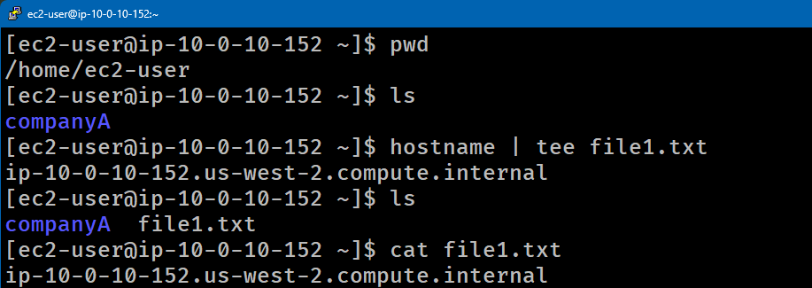
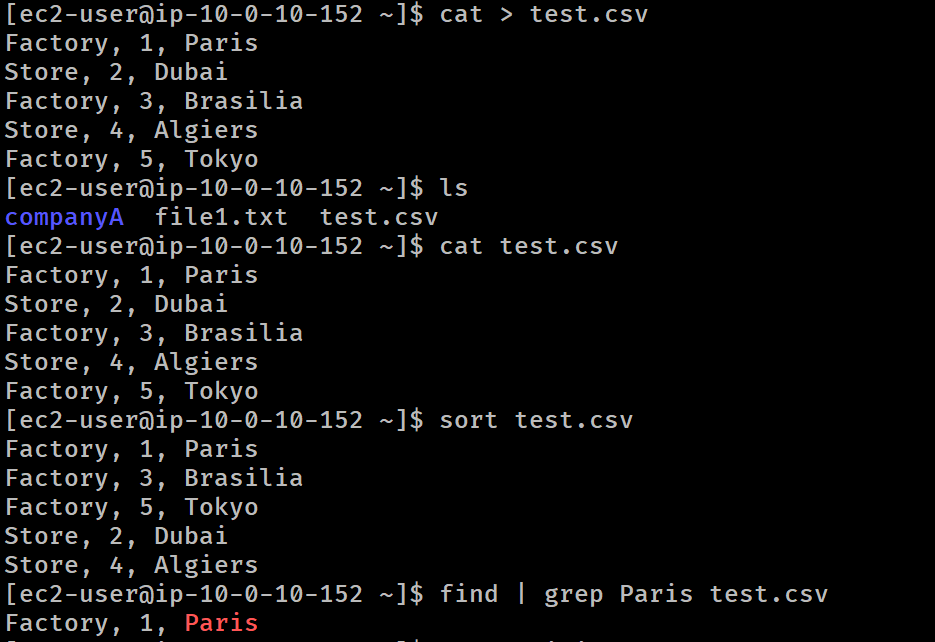
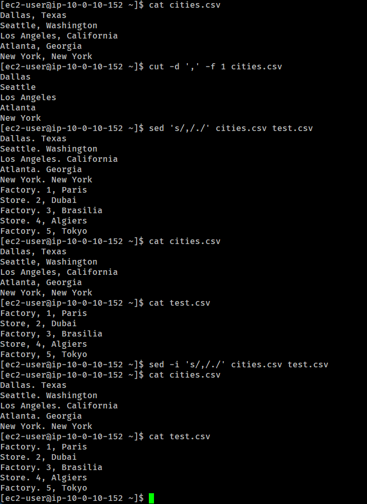

# Lab 247 Procesamiento de Texto, Redirección y Flujos de Datos en Linux


## Descripción General

Este laboratorio aborda el uso de herramientas fundamentales de la línea de comandos de Linux para la manipulación y procesamiento de flujos de texto (_text streams_). Se trabaja con la redirección de salida mediante `tee`, el ordenamiento de datos con `sort`, la extracción de columnas específicas utilizando `cut`, el filtrado por patrones con `grep` mediante tuberías (_pipes_ `|`), y la edición de flujos de texto en línea con `sed`.

## Objetivos del Laboratorio

- Redirigir la salida estándar a la pantalla y a un archivo simultáneamente con el comando `tee`.
- Crear archivos de texto estructurados en formato CSV directamente desde la terminal con `cat`.
- Reordenar alfabéticamente y numéricamente el contenido de archivos mediante `sort`.
- Encadenar comandos utilizando el operador de tubería (_pipe_ `|`).
- Extraer campos específicos de un archivo delimitado utilizando `cut`.
- Reemplazar caracteres y patrones de texto usando expresiones en `sed`.

## Tarea 1: Redirección Dual con `tee`

Se envió el nombre de host del sistema a la salida estándar (consola) y se guardó en un archivo en una sola operación.

```bash
# Confirmar directorio de trabajo
pwd

# Capturar el hostname y escribirlo simultaneamente en pantalla y en file1.txt
hostname | tee file1.txt

# Verificar la creacion del archivo
ls -l
```

\
_Figura 1: Captura de pantalla de los comandos tarea 1_

## Tarea 2: Creación, Ordenamiento y Filtrado de Datos (`cat`, `sort`, `grep`)

Se creó un archivo `.csv` interactivo utilizando `cat` y la combinación de teclas `CTRL+D` para cerrar la entrada de datos.

```bash
# Crear el archivo test.csv
cat > test.csv
Factory, 1, Paris
Store, 2, Dubai
Factory, 3, Brasilia
Store, 4, Algiers
Factory, 5, Tokyo
```

_(Presionar `CTRL+D` para guardar y salir)_

```bash
# Ordenar las lineas del archivo de forma alfabetica y numerica
sort test.csv

# Filtrar lineas especificas mediante el uso de tuberias y grep
cat test.csv | grep Paris
```

\
_Figura 2: Captura de pantalla de los comandos tarea 2_

## Tarea 3: Extracción de Columnas con `cut`

Se generó un archivo de ciudades y estados delimitado por comas y se extrajo únicamente el primer campo.

```bash
# Crear el archivo cities.csv
cat > cities.csv
Dallas, Texas
Seattle, Washington
Los Angeles, California
Atlanta, Georgia
New York, New York
```

_(Presionar `CTRL+D` para guardar y salir)_

```bash
# Extraer la primera columna utilizando la coma como delimitador
cut -d ',' -f 1 cities.csv
```

### Salida Obtenida:

```plaintext
Dallas
Seattle
Los Angeles
Atlanta
New York
```

## Tarea 4: Edición de Flujos de Texto con sed

Se utilizó el editor de flujo `sed` para reemplazar la primera ocurrencia de un carácter específico (coma por punto) en múltiples archivos sin alterar los archivos originales de forma permanente.

```bash
# Reemplazar la primera coma de cada linea por un punto en cities.csv y en test.csv
sed 's/,/./' cities.csv test.csv
```

\
_Figura 3: Captura de pantalla comandos ejecutados tarea 3 y 4_

## Resumen de Comandos y Sintaxis

| Comando | Opción / Flag      | Descripción / Caso de Uso                                                                       |
| :------ | :----------------- | :---------------------------------------------------------------------------------------------- |
| `tee`   | Directa            | Lee la entrada estándar y la escribe tanto en la salida estándar como en uno o varios archivos. |
| `cat`   | `> archivo`        | Redirige la entrada de la terminal para crear o sobrescribir un archivo de texto.               |
| `sort`  | Directa            | Ordena las líneas de archivos de texto alfabética o numéricamente.                              |
| `cut`   | `-d ',' -f 1`      | Corta secciones de cada línea. `-d` especifica el delimitador y `-f` el número de campo.        |
| `sed`   | `'s/viejo/nuevo/'` | Editor de flujo para filtrar y transformar texto (sustitución en este caso).                    |

## Evidencia en Video

Mira la ejecución de este laboratorio paso a paso en mi canal de YouTube: \
[](https://www.youtube.com/watch?v=GJ_JhEvEKIY)

## Aprendizajes Clave

- **Líneas de Tuberías (Pipes)**: El operador `|` conecta la salida estándar de un comando directamente con la entrada estándar del siguiente, permitiendo construir procesamientos complejos en una sola línea.

- **Diferencia entre `>` y `tee`**: Mientras `>` redirige en silencio hacia un archivo, `tee` permite monitorear el flujo en pantalla al mismo tiempo que guarda la información.

- **Procesamiento de Archivos Delimitados**: La combinación de `cut` y `sed` es esencial en automatización y tareas de ciencia de datos/DevOps para parsear registros CSV o limpiar logs antes de su análisis.
