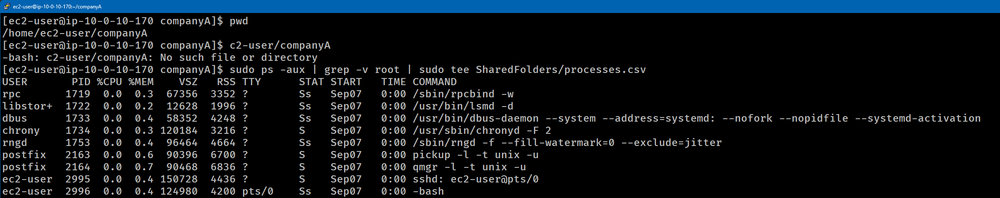
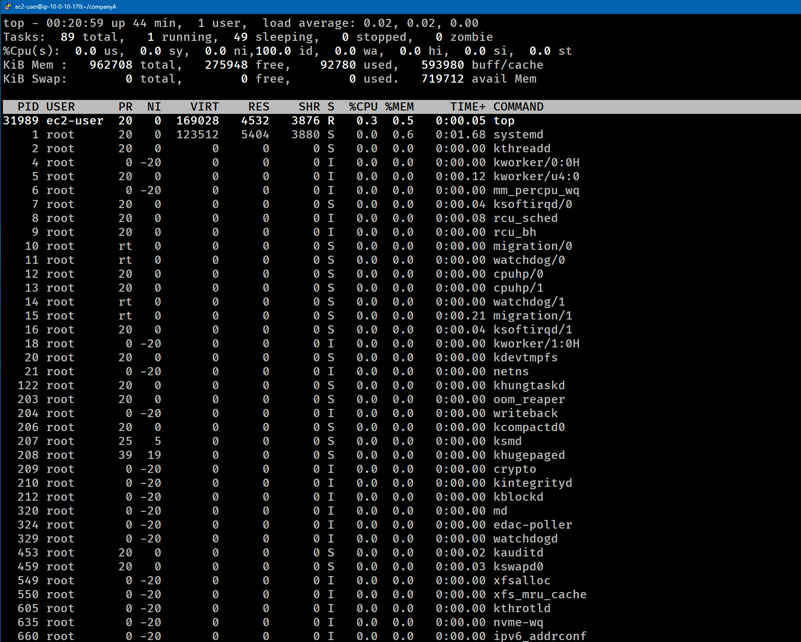
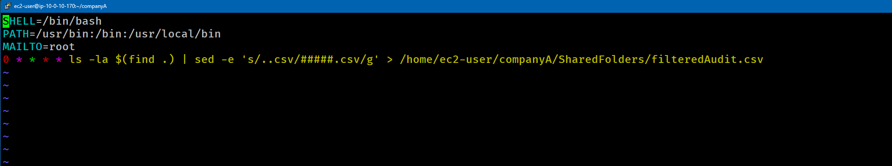
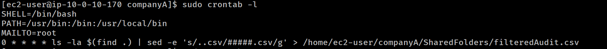

# Lab-239 Monitoreo de Procesos y Automatización en Linux: `ps`, `top` y `crontab`


## Descripción General

Este laboratorio práctico abarca el monitoreo de recursos del sistema, la auditoría de procesos en ejecución (`ps`, `top`) y la automatización de tareas periódicas mediante el demonio de tareas programadas `cron`. Adicionalmente, se integran filtros mediante `grep` y `sed` para manipular flujos de datos y generar reportes de auditoría anonimizados o estructurados de forma periódica.

## Objetivos del Laboratorio

- Exportar la lista de procesos activos excluyendo procesos de sistema/root con `ps aux` y `grep -v`.
- Monitorear en tiempo real el consumo de CPU, memoria y tareas del sistema mediante `top`.
- Programar tareas repetitivas en el sistema utilizando la sintaxis de 6 campos de `crontab`.
- Automatizar la manipulación y enmascaramiento de nombres de archivos (`.csv` a `#####.csv`) usando expresiones regulares con `sed`.

## Tarea 1: Auditoría y Exportación de Procesos (`ps` & `grep`)

Se generó un reporte en formato CSV con los procesos del sistema, filtrando aquellos ejecutados por el usuario `root`.

### Comandos Ejecutados:

```bash
# Confirmar directorio de trabajo
cd /home/ec2-user/companyA
pwd

# Filtrar procesos activos y guardar el resultado en SharedFolders/processes.csv
sudo ps -aux | grep -v root | sudo tee SharedFolders/processes.csv

# Verificar el reporte generado
cat SharedFolders/processes.csv
```


_Figura 1: Captura de pantalla comandos ejecutados para la auditoría y exportación de procesos_

## Tarea 2: Monitoreo en Tiempo Real (`top`)

Inspección de rendimiento del servidor para analizar el consumo de hardware, cantidad de tareas activas, en espera o suspendidas.

```bash
# Iniciar el monitor interactivo de procesos
top

# (Dentro de top: Presionar 'q' para salir)

# Verificar ayuda y versión de la herramienta
top -hv
```


_Figura 2: Captura de pantalla comando top_

## Tarea 3: Programación de Tareas Automatizadas (`cron`)

Se configuró un trabajo automatizado en el archivo `crontab` para ejecutar una auditoría de archivos de forma periódica cada hora a los 0 minutos (`0 * * * *`).

```bash
# Editar la tabla de tareas de cron con privilegios de superusuario
sudo crontab -e
```

### Configuración del archivo `crontab`:

```bash
SHELL=/bin/bash
PATH=/usr/bin:/bin:/usr/local/bin
MAILTO=root
0 * * * * ls -la $(find .) | sed -e 's/..csv/#####.csv/g' > /home/ec2-user/companyA/SharedFolders/filteredAudit.csv
```


_Figura 3: Vim con las instrucciones crontab_

### Verificación de la Tarea Programada:

```bash
# Listar las tareas activas en crontab
sudo crontab -l
```


_Figura 4: Verificación de las instrucciones crontab_

## Resumen de comandos y sintaxis

| Comando   | Opción / Flag             | Descripción / Caso de Uso                                                                                                     |
| :-------- | :------------------------ | :---------------------------------------------------------------------------------------------------------------------------- |
| `ps`      | `-aux`                    | Muestra todos los procesos del sistema (`a`), incluyendo el usuario propietario (`u`) y procesos sin terminal asignada (`x`). |
| `grep`    | `-v`                      | Invierte la coincidencia: excluye del flujo de texto las líneas que contengan el patrón especificado.                         |
| `top`     | Directa                   | Monitor interactivo en tiempo real de consumo de CPU, RAM, swap y estado de procesos.                                         |
| `top`     | `-hv`                     | Muestra la ayuda de opciones (`-h`) y la versión de la utilidad (`-v`).                                                       |
| `crontab` | `-e` / `-l`               | **-e**: Edita la tabla de tareas programadas. **-l**: Lista las tareas programadas configuradas.                              |
| `sed`     | `-e 's/origen/destino/g'` | Editor de flujo para reemplazar o transformar texto utilizando expresiones regulares.                                         |

## Evidencia en Video

Mira la ejecución de este laboratorio paso a paso en mi canal de YouTube:

# [](https://www.youtube.com/watch?v=G7MAC66cp0g)

## Aprendizajes Clave

- **Sintaxis de Cron (`* * * * *`)**: Los campos representan `Minuto (0-59)`, `Hora (0-23)`, `Día del mes (1-31)`, `Mes (1-12)` y `Día de la semana (0-6)`.

- **Variables de entorno en Cron**: Definir `SHELL` y `PATH` dentro del archivo `crontab` garantiza que los scripts o comandos encuentren las dependencias del sistema al ejecutarse en segundo plano.

- **Procesamiento de texto en tuberías**: La combinación de `find`, `ls`, `sed` y redirecciones (`>`) permite crear pipelines potentes para auditoría y tratamiento masivo de archivos.
