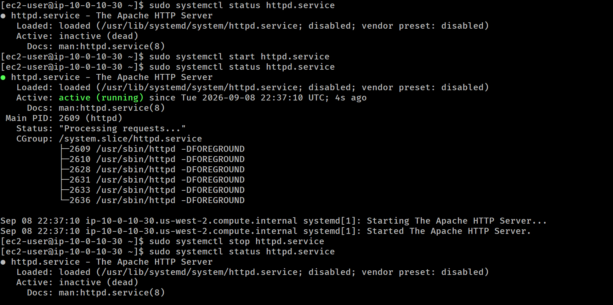
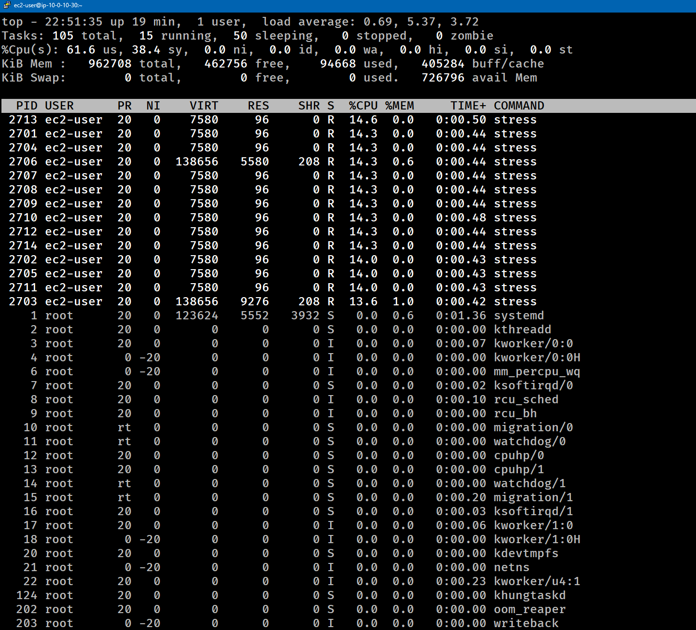
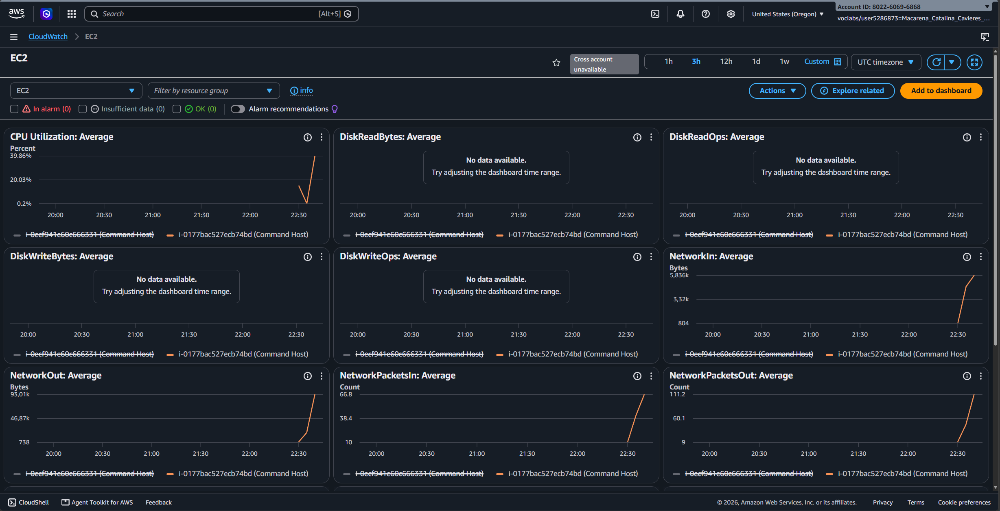

# Lab-241 Gestión de Servicios Web (`httpd`) y Monitoreo de Recursos con `top` y AWS CloudWatch


## Descripción General

Este laboratorio práctico abarca la administración del servidor web Apache (`httpd`) en Linux mediante `systemctl`, la validación de conectividad HTTP y la supervisión de rendimiento de la instancia AWS EC2. Se evalúa el comportamiento de los recursos del sistema combinando herramientas locales de terminal (`top`) con métricas en tiempo real en la nube a través de **AWS CloudWatch**.

## Objetivos del Laboratorio

- Verificar, iniciar y detener el servicio del servidor web `httpd` con `systemctl`.
- Comprobar la disponibilidad del servicio HTTP mediante la IP pública de la instancia.
- Generar una carga de trabajo sintética en la CPU utilizando un script de estrés (`stress.sh`).
- Analizar el impacto de la carga en local usando la herramienta `top`.
- Monitorear métricas de rendimiento (utilización de CPU, I/O de disco y red) desde los **Paneles Automáticos de AWS CloudWatch**.

---

## Tarea 1: Gestión e Inspección del Servicio Apache (`httpd`)

Se validó el estado inicial del demonio `httpd`, se puso en marcha y se comprobó la respuesta del servidor web.

### Comandos Ejecutados:

```bash
# Verificar estado inicial del servicio
sudo systemctl status httpd.service

# Iniciar el servidor web Apache
sudo systemctl start httpd.service

# Confirmar que el servicio está activo (running)
sudo systemctl status httpd.service
```


_Figura 1: Captura de pantalla de los comandos_

## Prueba de Conexión:

Para confirmar el funcionamiento, se abrió un navegador web ingresando la IP pública de la instancia: \
`http://<IP_PUBLICA_EC2>` (Muestra la página de prueba de Apache Test Page).

```bash
# Detener el servicio al finalizar las pruebas
sudo systemctl stop httpd.service
```

## Tarea 2: Prueba de Carga Local (`top`) y Simulación

Se ejecutó un script en segundo plano para estresar el procesamiento de la instancia EC2 y monitorear el consumo de CPU.

```bash
# Inspeccionar procesos antes de la carga
top

# Ejecutar el script de estrés en segundo plano e iniciar el monitor
./stress.sh & top
```


_Figura 2: Captura de pantalla de la carga de ./stress.sh_

_Observación: Se identificó que el proceso stress incrementó el uso de CPU a niveles elevados (14% - 100% de núcleos asignados)._

## Tarea 3: Monitoreo en la Nube con AWS CloudWatch

Se analizó el comportamiento de la infraestructura desde la Consola de Administración de AWS.

Pasos Realizados:

1. Navegación hacia el servicio **CloudWatch**.
2. Selección de Paneles (Dashboards) > Paneles automáticos > EC2.
3. Inspección de los gráficos de métricas:
    - CPUUtilization: Se observó un pico de consumo correspondiente a la ejecución del script stress.sh (alcanzando promedios de hasta 62.6%).

    - DiskReadBytes / DiskWriteBytes: Lecturas y escrituras en el volumen EBS.

    - NetworkIn / NetworkOut: Tráfico de red entrante y saliente.

4. Ajuste del intervalo de tiempo del panel para reducir la latencia de acumulación de datos (de 5 minutos a intervalos de 1 segundo).


_Figura 3: Paneles de Cloudwatch_

## Resumen de Comandos y Sintaxis

| Comando         | Opción / Flag | Descripción / Caso de Uso                                                           |
| :-------------- | :------------ | :---------------------------------------------------------------------------------- |
| `systemctl`     | `status`      | Muestra el estado del servicio (`active`, `inactive`, `dead` o `failed`).           |
| `systemctl`     | `start`       | Inicia la ejecución de un servicio en el sistema.                                   |
| `systemctl`     | `stop`        | Detiene la ejecución de un servicio en segundo plano.                               |
| `top`           | Directa       | Muestra en tiempo real los procesos activos y métricas de CPU/RAM.                  |
| `./script.sh &` | `&`           | Ejecuta un comando o script en segundo plano (_background_), liberando la terminal. |

## Evidencia en Video

Mira la ejecución de este laboratorio paso a paso en mi canal de YouTube:

# [](https://www.youtube.com/watch?v=JbCYbfyTonQ)

## Aprendizajes Clave

- **Gestión de Servicios con `systemctl`**: Permite controlar demonios de Linux de forma estandarizada en distribuciones basadas en `systemd`.

- **Ejecución en segundo plano (`&`)**: Adjuntar `&` al final de una línea de comando permite lanzar un proceso extenso sin bloquear la consola de administración.

- **Monitoreo Híbrido (Local vs. Nube)**: Mientras `top` proporciona una visión instantánea dentro del sistema operativo, AWS CloudWatch ofrece visibilidad histórica, métricas consolidadas y alertas sin necesidad de ingresar por SSH a la instancia.
