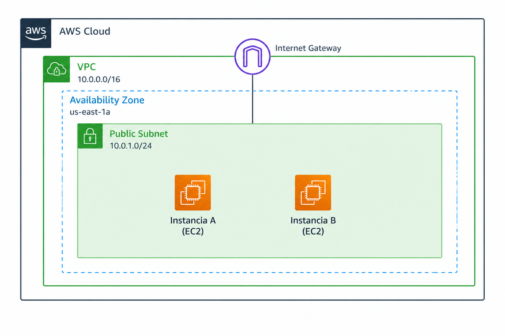
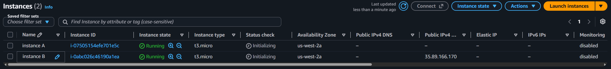
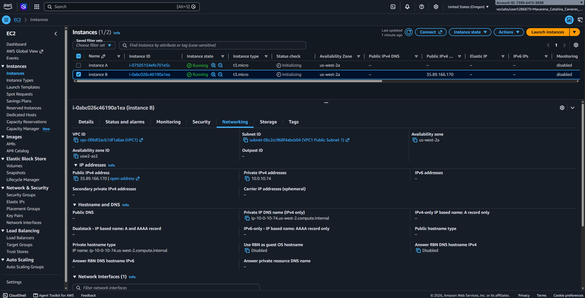
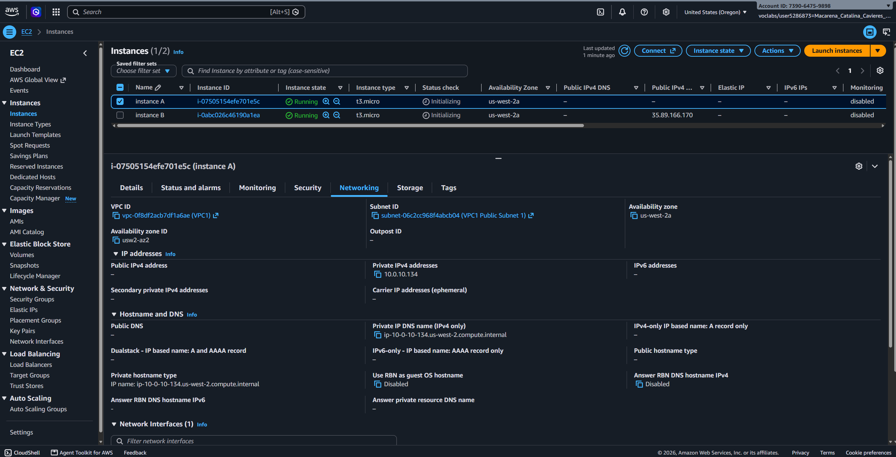
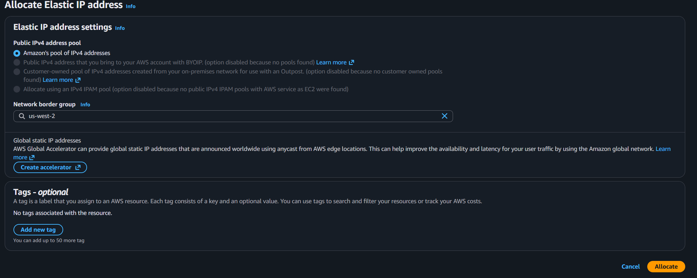
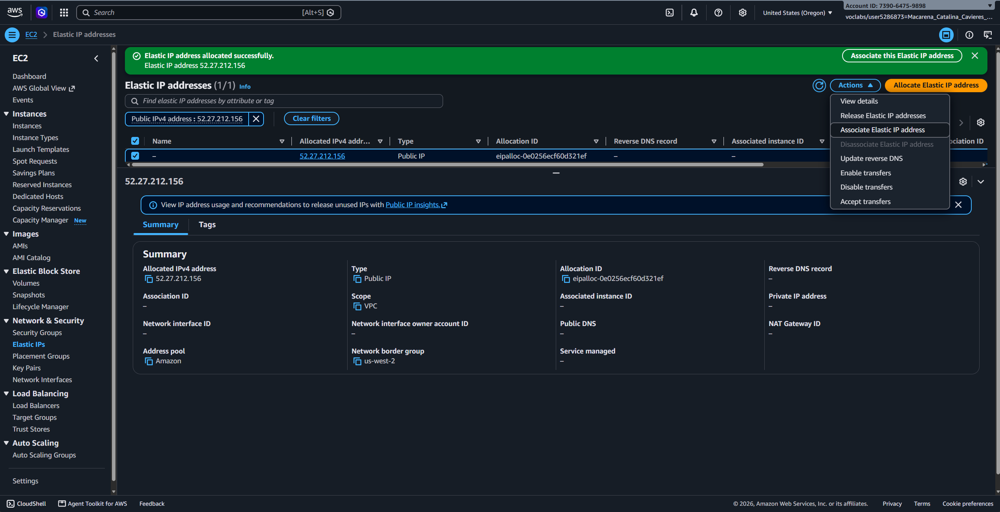
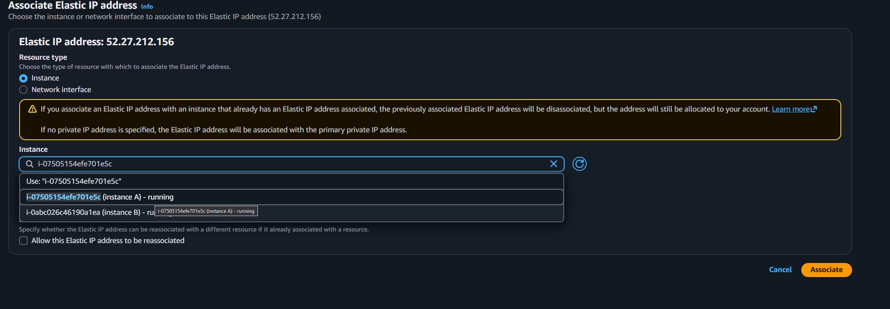
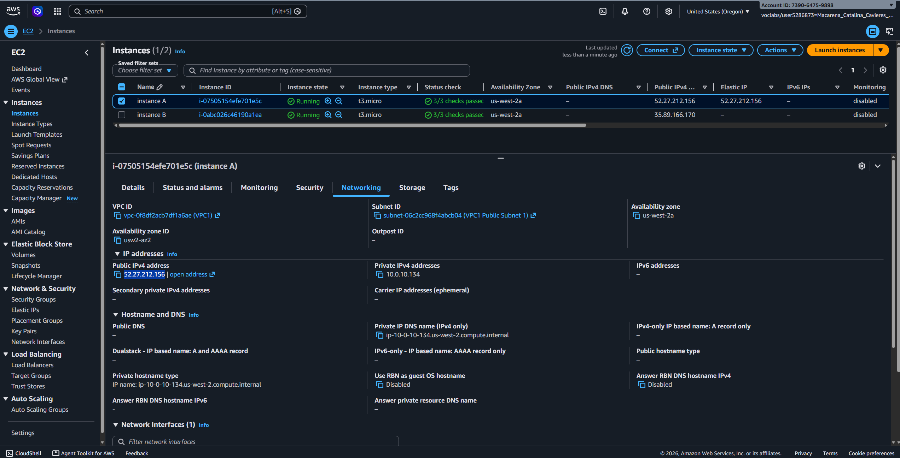

# Lab 261 Diagnóstico y Resolución de Conectividad en AWS EC2: Direcciones IP Públicas y Elásticas

## Descripción General

Este laboratorio aborda un caso de soporte técnico de red en Amazon Web Services (AWS). Se analiza una incidencia donde una instancia de Amazon EC2 (Instancia A) ubicada en una subred pública dentro de una VPC con CIDR `10.0.0.0/16` carece de acceso a Internet, mientras que otra instancia en la misma subred (Instancia B) sí cuenta con conectividad. El análisis determinó que la causa raíz era la ausencia de una dirección IP pública asociada a la Instancia A. La solución implementada consistió en la asignación e asociación de una Elastic IP (EIP).

_Figura 1: Arquitectura del cliente_

## Objetivos del Laboratorio

- Investigar incidencias de conectividad de red evaluando la configuración de red de las instancias EC2.
- Analizar la diferencia entre direcciones IP públicas, privadas e IP Elásticas (EIP).
- Corregir el fallo de conectividad a Internet mediante la asignación de una dirección IP Elástica en Amazon EC2.
- Evaluar el impacto arquitectónico de utilizar rangos IP públicos en direccionamientos de VPC.

## Tarea 1: Investigación del Entorno de Red

Se inspeccionaron las propiedades de red de ambas instancias en la consola de administración de Amazon EC2.

_Figura 2: Captura de las instancias_

### Tabla Comparativa de Direccionamiento

| Instancia   | Subred                         | Dirección IPv4 Privada | Dirección IPv4 Pública | Estado de Conectividad     |
| :---------- | :----------------------------- | :--------------------- | :--------------------- | :------------------------- |
| Instancia A | Subred Pública (`10.0.0.0/24`) | `10.0.0.X`             | _Ausente / None_       | Sin acceso a Internet      |
| Instancia B | Subred Pública (`10.0.0.0/24`) | `10.0.0.Y`             | Asignada (`X.X.X.X`)   | Acceso a Internet correcto |

_Figura 3: Detalles instancia B_

_Figura 4: Detalles instancia A_

### Diagnóstico de Causa Raíz

A pesar de que las rutas hacia el Internet Gateway (IGW) y los grupos de seguridad estaban configurados correctamente en la VPC, la Instancia A no poseía un mapeo de dirección IP pública hacia su IP privada. Sin una dirección IP pública asociada, los paquetes salientes no pueden ser traducidos por el Internet Gateway (NAT bidireccional), impidiendo la comunicación hacia el exterior.

## Tarea 2: Implementación de la Solución (Elastic IP)

Para restablecer la conectividad de la Instancia A sin modificar la configuración de la subred, se reservó y asoció una IP Elástica (EIP).

### Pasos de Configuración:

1. Navegación al panel de Amazon EC2 -> **Network & Security** -> **Elastic IPs**.
2. Selección de **Allocate Elastic IP address** asignada al pool de direcciones de IPv4 de Amazon.
3. Selección de la IP Elástica creada y ejecución de **Associate Elastic IP address**.
4. Elección del tipo de recurso **Instance**, seleccionando la **Instancia A** y su interfaz de red primaria (`eth0`).
5. Confirmación de la asociación.

_Figura 5: Paso 2, Allocate Elastic IP Address_

_Figura 6: Paso 3, Selección de la IP elástica_

_Figura 7: Paso 4, Selección de la instancia_

_Figura 8: Verificación de la asociación de la Ip elástica a la instancia A_

## Tarea 3: Análisis de Direccionamiento IP en VPCs

Respecto a la consulta técnica sobre utilizar un rango de IP público (ejemplo `12.0.0.0/16`) como CIDR de una VPC:

- **Impacto Técnico:** Si se asigna un rango público ruteable a una VPC, la infraestructura interna asumirá que esas IP son locales. En consecuencia, las instancias dentro de la VPC no podrán conectarse a los servidores reales de Internet que utilicen ese rango de direcciones público (`12.0.0.0/8`), debido a que el enrutamiento interno de la VPC interceptará el tráfico.
- **Buena Práctica (RFC 1918):** Siempre se deben utilizar los bloques de direcciones IP privadas reservados para VPCs:
    - `10.0.0.0/8`
    - `172.16.0.0/12`
    - `192.168.0.0/16`

## Resumen de Comandos y Servicios

| Servicio / Recurso | Opción / Componente | Descripción / Caso de Uso                                                                 |
| :----------------- | :------------------ | :---------------------------------------------------------------------------------------- |
| `Amazon EC2`       | Public IPv4         | Dirección IP no persistente asignada automáticamente al iniciar la instancia.             |
| `Amazon EC2`       | Elastic IP (EIP)    | Dirección IP pública estática reservada para la cuenta de AWS y asociada a una instancia. |
| `AWS VPC`          | IPv4 CIDR Block     | Rango de direcciones de red privadas asignadas a la VPC bajo el estándar RFC 1918.        |
| `Internet Gateway` | IGW                 | Componente de VPC que realiza la traducción de direcciones entre IP privada y pública.    |

## Evidencia en Video

Mira la ejecución de este laboratorio paso a paso en mi canal de YouTube: \

## Conclusiones del Laboratorio

- **Requisito de IP Pública:** Un Internet Gateway solo puede enrutar tráfico hacia y desde instancias que posean una IP pública asignada o una IP Elástica asociada.
- **Persistencia con Elastic IP:** Las IP públicas asignadas por defecto cambian cuando una instancia se detiene y se vuelve a iniciar. Las Elastic IP mantienen la dirección fija.
- **Cumplimiento del Estándar RFC 1918:** Evitar el uso de direccionamiento público dentro de las definiciones de bloques CIDR de VPC para prevenir solapamientos de rutas en Internet.
