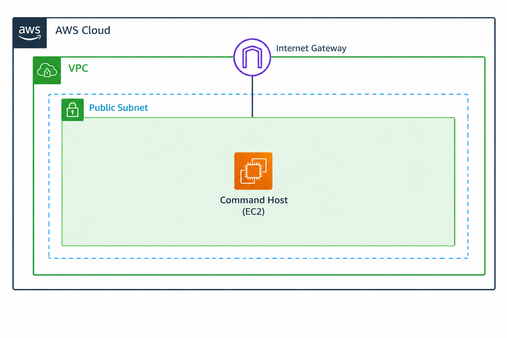
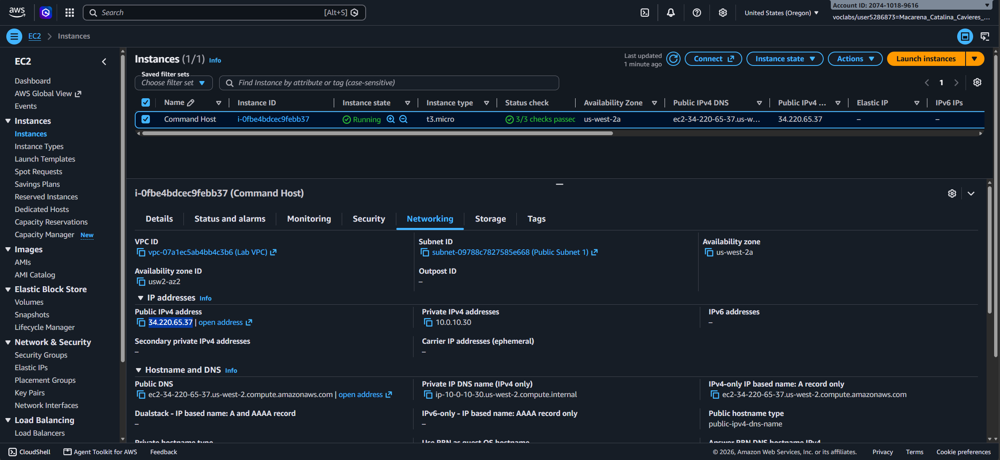
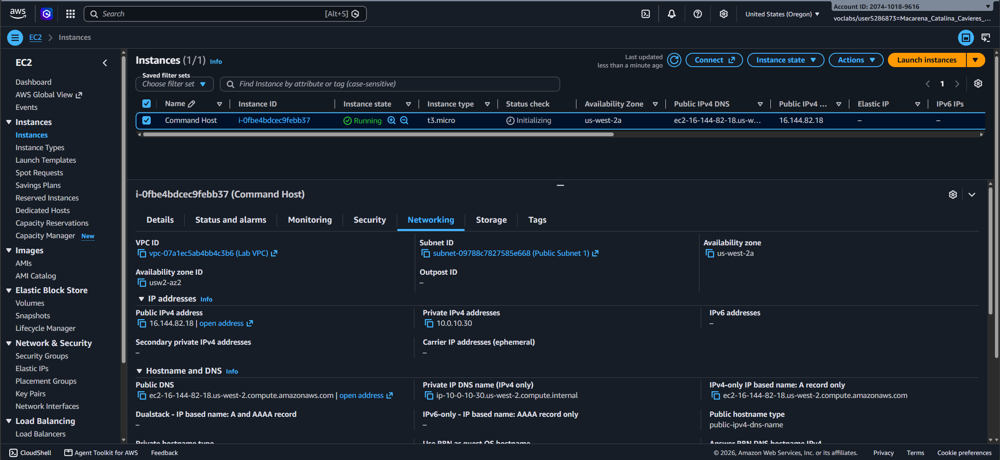
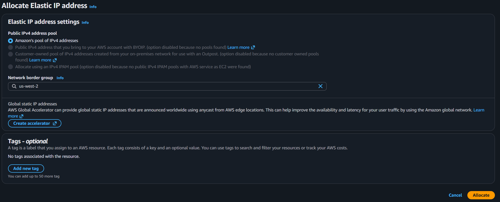
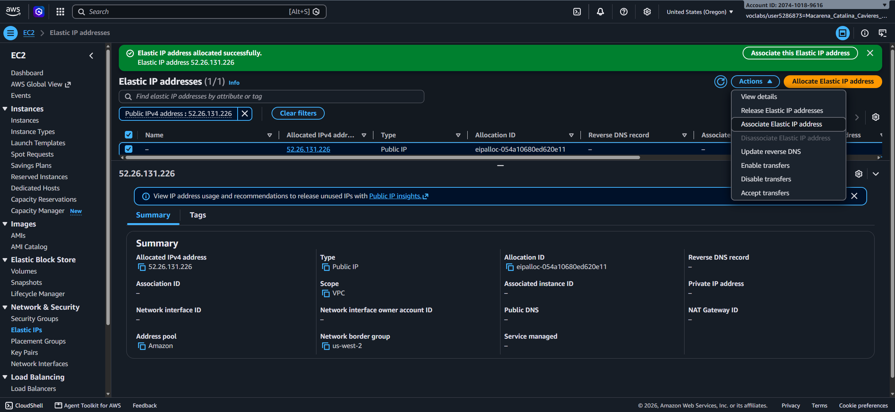
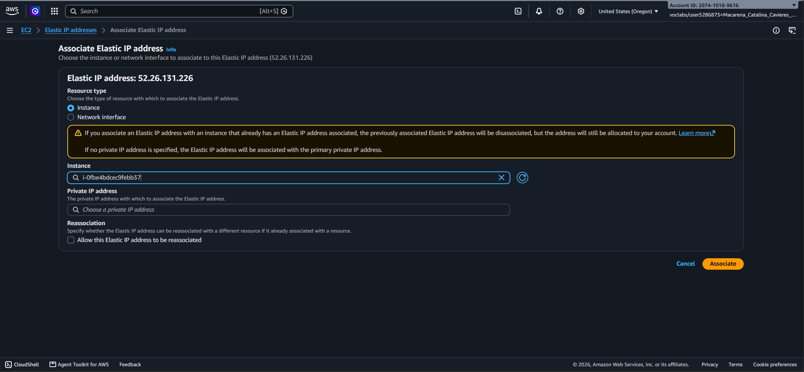
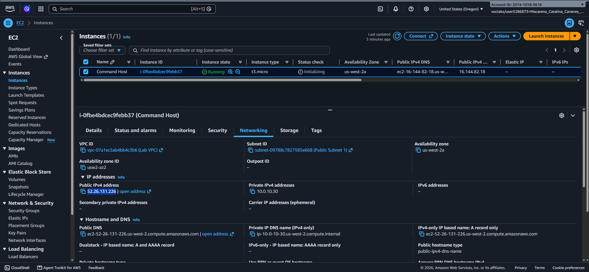
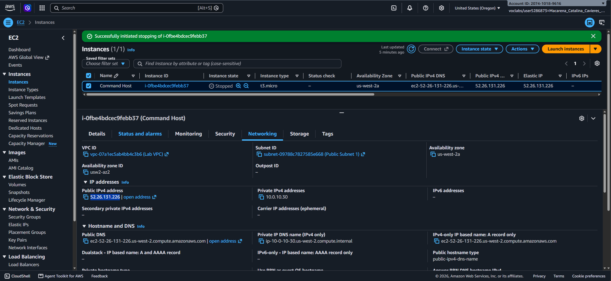

# Lab 262 Persistencia de IP Pública en AWS EC2 Mediante Elastic IP

## Descripción General

Este laboratorio resuelve un problema de arquitectura y red en Amazon EC2 reportado por un cliente. La incidencia principal radica en que la dirección IPv4 pública de una instancia cambia cada vez que el equipo se detiene y se vuelve a iniciar. Este comportamiento dinámico interrumpe los servicios adjuntos que dependen de una dirección de entrada fija. La solución implementada consistió en la reserva y asociación de una dirección IP Elástica (EIP) para garantizar la persistencia de la IP pública sin incrementar los costos de cómputo encendido.

_Figura 1: Arquitectura del cliente_

## Objetivos del Laboratorio

- Investigar la fluctuación de direcciones IP en instancias EC2 tras ciclos de apagado y encendido.
- Comprender la diferencia entre el direccionamiento IPv4 público dinámico por defecto y las direcciones IP estáticas.
- Asignar y asociar una dirección IP Elástica (EIP) a una instancia de Amazon EC2.
- Validar la persistencia de la dirección IP pública tras detener reiniciar la instancia.

## Tarea 1: Reproducción de la Incidencia del Cliente

Se creó una instancia de prueba en la consola de AWS EC2 para analizar el comportamiento del direccionamiento IP por defecto.

### Parámetros de la Instancia de Prueba:

- **Nombre:** `Command Host`
- **AMI:** Amazon Linux 2023 AMI
- **Tipo de Instancia:** `t2.micro` / `t3.micro`
- **Par de Claves:** `vockey`
- **VPC:** VPC del laboratorio
- **Subred:** Subred pública 1
- **Autoasignación de IP pública:** Habilitada
- **Grupo de Seguridad:** `Linux Instance SG`

### Comportamiento Observado durante el Ciclo de Vida:

| Estado de la Instancia   | Dirección IPv4 Privada | Dirección IPv4 Pública   | Observación                                 |
| :----------------------- | :--------------------- | :----------------------- | :------------------------------------------ |
| **Running (Inicial)**    | `10.0.X.X`             | `54.X.X.X` (Dirección A) | Asignada dinámicamente al iniciar.          |
| **Stopped**              | `10.0.X.X`             | _Ninguna / Liberada_     | La IP pública vuelve al pool global de AWS. |
| **Running (Reiniciada)** | `10.0.X.X`             | `34.X.X.X` (Dirección B) | Se asigna una nueva IP pública aleatoria.   |

_Figura 2: IP pública inicial de la instancia_

_Figura 3: IP pública de la instancia luego de detenerla e iniciarla nuevamente_

### Diagnóstico Técnico

La opción **Autoasignación de IP pública** provee una IP pública dinámica proveniente del pool de direcciones públicas de Amazon. Cuando la instancia pasa al estado `Stopped`, AWS libera esa dirección IP. Al volver a iniciar la instancia, AWS asigna una dirección disponible diferente. La dirección IP privada se mantiene constante, pero la IP pública dinámicamente asignada no es persistente.

## Tarea 2: Implementación y Asociación de Elastic IP (EIP)

Para proporcionar un punto de acceso público estático y corregir la falla de conectividad, se utilizó el servicio de Elastic IP.

### Pasos de Configuración:

1. Acceso al menú lateral de EC2 -> **Network & Security** -> **Elastic IPs**.
2. Selección de **Allocate Elastic IP address** manteniendo las opciones por defecto del pool de Amazon.
3. Selección de la dirección IP Elástica generada y apertura del menú **Actions** -> **Associate Elastic IP address**.
4. Configuración del mapeo:
    - **Resource type:** Instance
    - **Instance:** `Command Host`
    - **Private IP address:** IP privada primaria asignada a la interfaz `eth0`.
5. Confirmación mediante **Associate**.

## Tarea 3: Verificación de Persistencia

Se probó la estabilidad de la red ejecutando nuevamente un ciclo de apagado y encendido en la instancia con la Elastic IP asociada.

| Estado de la Instancia | Dirección IPv4 Privada | Dirección IPv4 Pública (EIP) | Resultado del Diagnóstico                      |
| :--------------------- | :--------------------- | :--------------------------- | :--------------------------------------------- |
| **Running (Con EIP)**  | `10.0.X.X`             | `52.X.X.X` (IP Elástica)     | La IP Elástica reemplaza la IP dinámica.       |
| **Stopped**            | `10.0.X.X`             | `52.X.X.X` (IP Elástica)     | La dirección IP pública se conserva reservada. |
| **Running (Reinicio)** | `10.0.X.X`             | `52.X.X.X` (IP Elástica)     | La dirección permanece idéntica sin cambios.   |

_Figura 4: Creación IP Elástica_

_Figura 5: Selección de la IP Elástica creada_

_Figura 6: Asignación de la IP Elástica a la instancia_

_Figura 7: Detalles de la instancia con la IP Elástica_

_Figura 8: Detalles de la instancia con la IP Elástica luego de detenerla y reiniciarla_

## Resumen de Comandos y Servicios

| Servicio / Componente     | Propiedad / Función       | Descripción Téscnica                                                               |
| :------------------------ | :------------------------ | :--------------------------------------------------------------------------------- |
| `Auto-assign Public IP`   | Dinámica / Temporal       | Se asigna al iniciar y se libera al detener la instancia.                          |
| `Elastic IP (EIP)`        | Estática / Persistente    | Dirección IPv4 pública fija reservada para la cuenta que no cambia tras reinicios. |
| `Private IPv4 Address`    | Estática dentro de la VPC | Dirección de red interna que no cambia durante el ciclo de vida de la instancia.   |
| `ENI (Network Interface)` | Mapeo de Red              | Interfaz virtual a la cual se vincula la dirección IP Elástica.                    |

## Evidencia en Video

Mira la ejecución de este laboratorio paso a paso en mi canal de YouTube: \

## Conclusiones del Laboratorio

- **Resolución del Problema:** La asignación de una IP Elástica resuelve el problema del cliente, permitiendo detener la instancia para ahorrar costos de cómputo sin perder la dirección de acceso pública.
- **Mapeo de Red:** La Elastic IP se vincula directamente a la dirección IP privada de la interfaz de red (ENI) de la instancia, garantizando la traducción de direcciones constante.
- **Gestión de Recursos:** Las direcciones Elastic IP no asociadas a instancias en ejecución pueden generar costos adicionales en AWS, por lo que deben ser liberadas si no están en uso.
