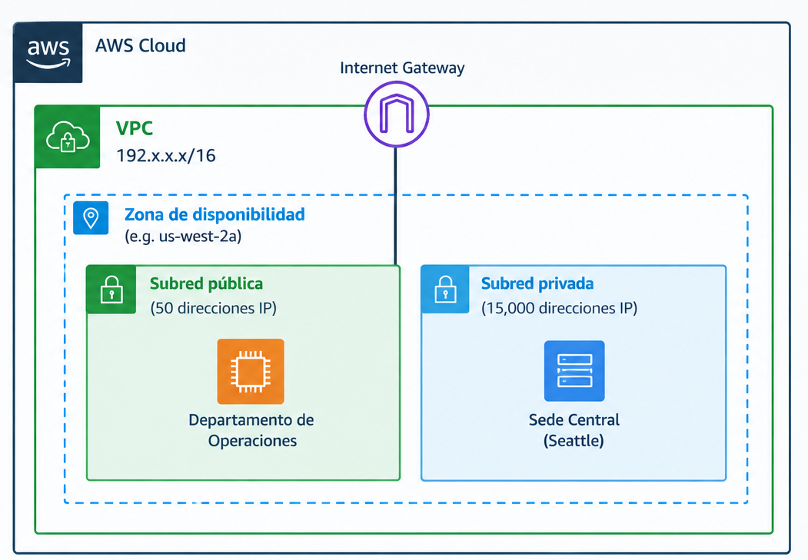
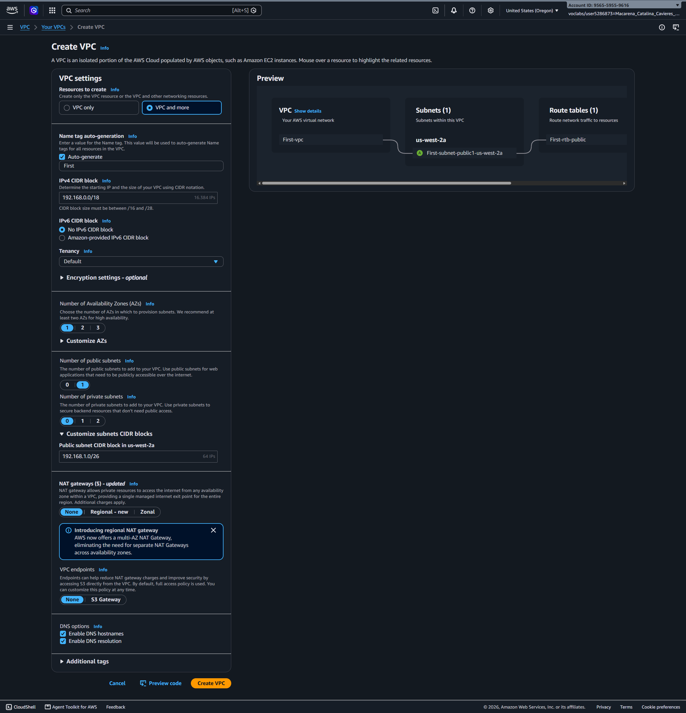
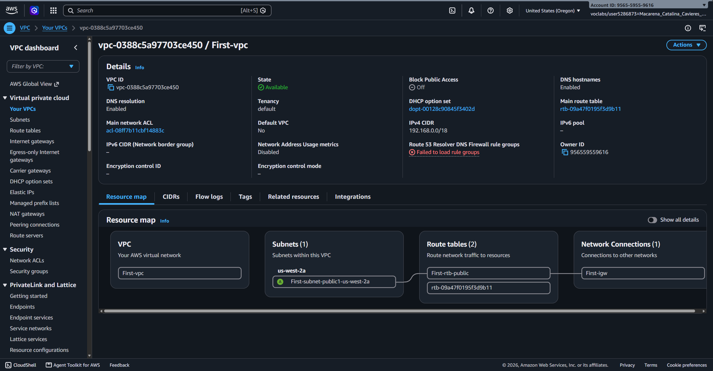
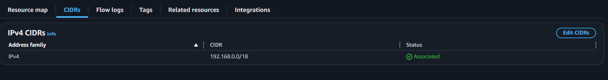

# Lab 263 Diseño de Implementación de Redes en AWS: Creación de VPC y Subredes según RFC 1918

## Descripción General

Este laboratorio atiende una solicitud de arquitectura e implementación de red para una empresa emergente. El requerimiento principal consiste en diseñar y desplegar una Amazon Virtual Private Cloud (Amazon VPC) aislada con un direccionamiento privado en el rango `192.168.0.0/16` (conforme al estándar RFC 1918). El diseño debía garantizar capacidad para al menos 15,000 direcciones IP utilizables en la VPC y aprovisionar una subred pública inicial con capacidad para más de 50 direcciones IP. La solución se desplegó mediante la herramienta de creación estructurada de VPC en la consola de AWS.

_Figura 1: Arquitectura deseada por el cliente_

## Objetivos del Laboratorio

- Analizar los requerimientos de direccionamiento IP de un cliente basándose en el estándar RFC 1918.
- Utilizar notación CIDR para calcular el tamaño de los bloques IP en la VPC y subredes.
- Crear una Amazon VPC personalizada utilizando la opción de configuración modular en la consola.
- Configurar una subred pública inicial asociando un Internet Gateway y una tabla de enrutamiento.
- Validar la capacidad de direcciones IP utilizables tras la reserva técnica de direcciones de AWS.

## Tarea 1: Análisis de Direccionamiento y Cálculo CIDR

El cliente requería un direccionamiento privado bajo el prefijo `192.x.x.x` que cubriera sus requisitos de escalabilidad.

### Definición de Rangos según RFC 1918:

El rango privado reservado bajo la clase C corresponde a `192.168.0.0/16` (192.168.0.0 a 192.168.255.255), proporcionando hasta 65,536 direcciones IP totales.

### Cálculos de Notación CIDR:

| Recurso            | Bloque CIDR      | Direcciones Totales | Direcciones Utilizables | Requerimiento Mínimo | Justificación Técnica                            |
| :----------------- | :--------------- | :------------------ | :---------------------- | :------------------- | :----------------------------------------------- |
| **VPC**            | `192.168.0.0/18` | 16,384              | 16,379                  | ~15,000 IPs          | Cumple holgadamente la demanda del cliente.      |
| **Subred Pública** | `192.168.1.0/26` | 64                  | 59                      | >= 50 IPs            | Proporciona 59 host utilizables para instancias. |

_Nota: AWS reserva automáticamente 5 direcciones IP en cada subred (red, router, DNS, uso futuro y broadcast)._

## Tarea 2: Despliegue de la VPC y la Subred Pública

Se utilizó el flujo de trabajo automatizado de creación de VPC en la consola de administración de AWS.

### Parámetros de Configuración Aplicados:

- **Recursos a crear:** VPC and more
- **Prefijo de Etiqueta (Name tag):** `First`
- **Bloque CIDR IPv4 VPC:** `192.168.0.0/18`
- **Bloque CIDR IPv6:** Sin bloque IPv6
- **Tenencia (Tenancy):** Default
- **Zonas de Disponibilidad (AZs):** 1 (us-west-2a)
- **Subredes Públicas:** 1
- **Subredes Privadas:** 0
- **Bloque CIDR Subred Pública:** `192.168.1.0/26`
- **Endpoints de VPC:** None

_Figura 2: Configuración de la VPC_

## Tarea 3: Inspección Arquitectónica

Tras la creación, la consola generó los siguientes recursos asociados de forma automática para la arquitectura de subred pública única:

1. **VPC (`First-vpc`):** Entorno de red virtual aislado con el bloque `192.168.0.0/18`.
2. **Subred Pública (`First-subnet-public1-us-west-2a`):** Subred asociada a la zona de disponibilidad especificada.
3. **Internet Gateway (`First-igw`):** Puerta de enlace adjunta a la VPC para permitir la comunicación bidireccional con Internet.
4. **Tabla de Enrutamiento (`First-rtb-public`):** Tabla configurada con una ruta por defecto (`0.0.0.0/0`) apuntando al Internet Gateway.

_Figura 3: Inspección VPC_

_Figura 4: CIDRs_

## Resumen de Comandos y Conceptos

| Componente           | Función Principal                                                                         | Ámbito de Uso                                               |
| :------------------- | :---------------------------------------------------------------------------------------- | :---------------------------------------------------------- |
| `Amazon VPC`         | Red virtual privada aislada dentro de la nube de AWS.                                     | Aislamiento lógico de recursos por cliente o entorno.       |
| `RFC 1918`           | Estándar que define rangos IP privados (`10.0.0.0/8`, `172.16.0.0/12`, `192.168.0.0/16`). | Direccionamiento interno sin acceso directo desde Internet. |
| `CIDR Block`         | Notación para representar rangos de direcciones IP contiguas.                             | Definición de tamaño de redes y subredes.                   |
| `Internet Gateway`   | Componente de red que conecta la VPC a la red pública de Internet.                        | Requisito indispensable para subredes públicas.             |
| `AWS IP Reservation` | Reserva de 5 direcciones IP por subred por parte de AWS.                                  | Infraestructura interna de enrutamiento, DNS y DHCP.        |

## Evidencia en Video

Mira la ejecución de este laboratorio paso a paso en mi canal de YouTube: \

## Conclusiones del Laboratorio

- **Cumplimiento de Requerimientos:** El bloque `/18` proporciona 16,384 direcciones IP, superando el objetivo de 15,000 requeridas por el cliente. La subred `/26` provee 59 direcciones libres, superando las 50 requeridas.
- **Aislamiento y Seguridad:** Las direcciones IP privadas impiden el tráfico directo no deseado desde la red pública de Internet hacia los recursos internos de la VPC.
- **Diferencia entre Subredes:** Las subredes públicas disponen de una ruta directa hacia el Internet Gateway, mientras que las subredes privadas requieren dispositivos de traducción de direcciones (NAT Gateway) para salir a Internet sin exponer sus IP internas.
