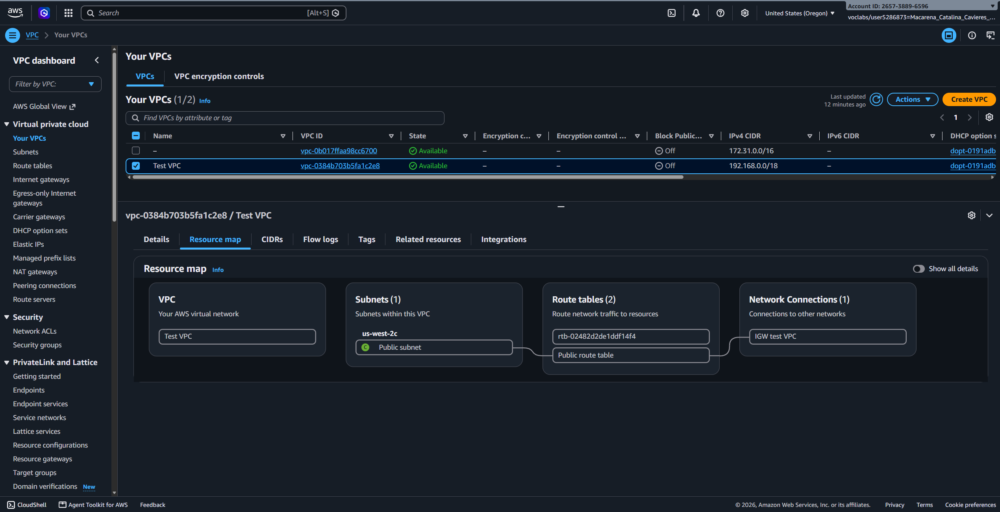
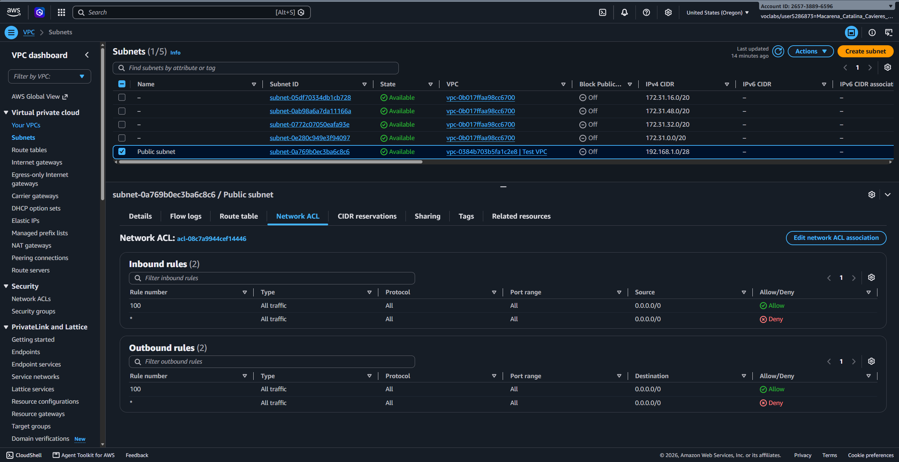
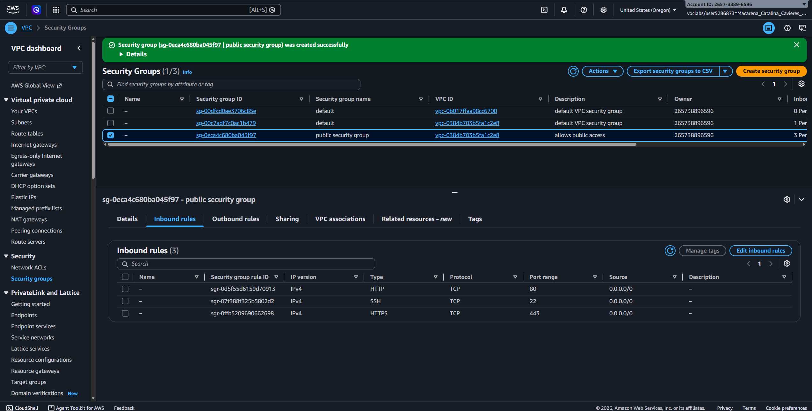
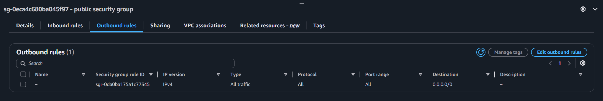
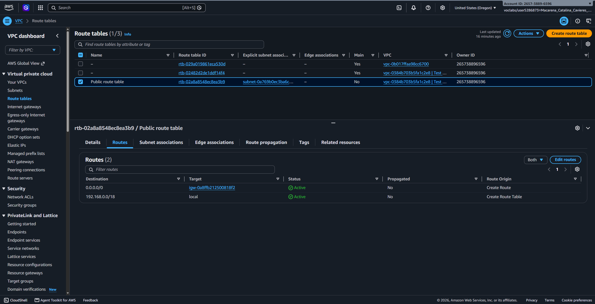
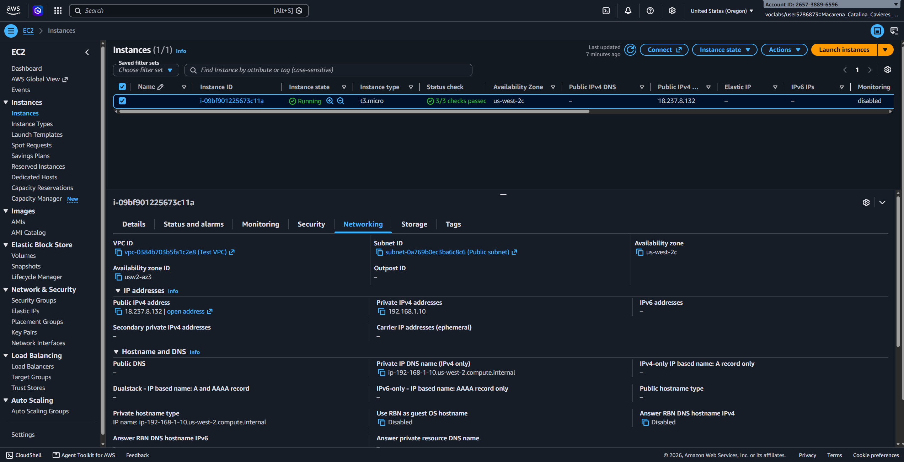
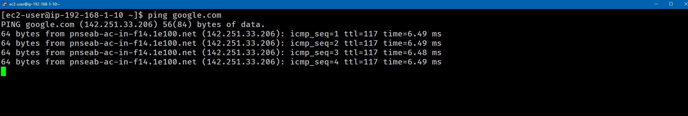

# Lab 264 Construcción e Integración de Recursos de Red en AWS Virtual Private Cloud


## Descripción General

Este laboratorio aborda un problema de conectividad presentado por un cliente empresarial cuya infraestructura no lograba establecer comunicación bidireccional hacia Internet. La solución consistio en la construcción metódica y estructurada desde cero de una Amazon Virtual Private Cloud (Amazon VPC), integrando sus componentes fundamentales: subred publica, Internet Gateway, tablas de enrutamiento, listas de control de acceso a la red (NACL) y grupos de seguridad. La arquitectura se validó mediante el despliegue de una instancia Amazon EC2 y la verificación del flujo de paquetes mediante ICMP (ping) hacia el exterior.

<!-- Falta arquitectura del cliente -->

## Objetivos del Laboratorio

- Diagnosticar fallas de enrutamiento y filtrado de tráfico en entornos Amazon VPC.
- Construir una arquitectura de red modular aplicando el enfoque jerárquico Top-Down desde la consola de AWS.
- Configurar y adjuntar un Internet Gateway (IGW) a una VPC para habilitar acceso a redes externas.
- Modificar tablas de enrutamiento asociando la ruta por defecto (`0.0.0.0/0`) hacia el Internet Gateway.
- Implementar capas de seguridad con estado (Security Groups) y sin estado (NACL) a nivel de instancia y subred.
- Desplegar una instancia Amazon EC2 en la subred pública y validar conectividad de red punto a punto.

## Tarea 1: Diagnostico y Diseño Top-Down de la Red

El cliente contaba con recursos dentro de un bloque IP privado pero carecía del encadenamiento lógico necesario para enrutar tráfico hacia Internet. Para solucionar el problema, se aplicó una secuencia de aprovisionamiento de arriba hacia abajo:

1. **VPC (`Test VPC`):** Definición del espacio de direcciones principal con el bloque CIDR `192.168.0.0/18`.
2. **Subred Pública (`Public Subnet`):** Segmento de red dentro de la VPC configurado con el bloque CIDR `192.168.1.0/26`.
3. **Internet Gateway (`TEST VPC IGW`):** Componente que realiza la traducción de direcciones de red (NAT) y sirve de destino a Internet.
4. **Tabla de Enrutamiento (`Public Route Table`):** Reglas explícitas para direccionar el tráfico saliente.
5. **Control de Acceso (NACL y Security Group):** Reglas de seguridad perimetral e individual.


_Figura 2: VPC creada para el laboratorio._

### Configuración de Seguridad Aplicada:

| Componente                | Nivel de Operación | Tipo de Estado         | Regla de Entrada Configurada                                 | Regla de Salida Configurada                         |
| :------------------------ | :----------------- | :--------------------- | :----------------------------------------------------------- | :-------------------------------------------------- |
| **Public Subnet NACL**    | Subred             | Sin estado (Stateless) | Regla 100: Todo el tráfico (`0.0.0.0/0`) - Permitir          | Regla 100: Todo el trafico (`0.0.0.0/0`) - Permitir |
| **Public Security Group** | Instancia          | Con estado (Stateful)  | Permitir SSH (22), HTTP (80) y HTTPS (443) desde `0.0.0.0/0` | Permitir todo el trafico saliente hacia `0.0.0.0/0` |


_Figura 3: Configuración de seguridad; reglas de entrada y de salida NACL_


_Figura 4: Configuración de seguridad; reglas de entrada SG_


_Figura 5: Configuración de seguridad; reglas de salida SG_

### Configuración de Enrutamiento:

| Destino (Destination) | Objetivo (Target) | Propósito Técnico                                                 |
| :-------------------- | :---------------- | :---------------------------------------------------------------- |
| `192.168.0.0/18`      | `local`           | Enrutamiento interno entre recursos dentro de la VPC.             |
| `0.0.0.0/0`           | `TEST VPC IGW`    | Todo el tráfico no local se redirige a Internet a traves del IGW. |


_Figura 6: Tabla de enrutamiento de la subred pública_

## Tarea 2: Despliegue de Instancia EC2 y Verificacion de Conectividad

Para validar la red enrutable, se inicio una instancia EC2 dentro del segmento configurado.

### Parametros de la Instancia:

- **AMI:** Amazon Linux 2023 AMI
- **Tipo de Instancia:** `t3.micro`
- **Par de Claves:** `vockey` / `labsuser`
- **VPC:** `Test VPC`
- **Subred:** `Public Subnet`
- **Autoasignacion de IP Publica:** Habilitada
- **Grupo de Seguridad:** `Public Security Group`


_Figura 7: Instancia creada_

## Tarea 3: Prueba de Conectividad a Internet

Una vez establecida la sesión SSH en la instancia EC2, se ejecuto la prueba de conectividad hacia un destino externo mediante el protocolo ICMP:

```bash
ping google.com
```

### Resultado de la Prueba:

```text
PING google.com (142.250.217.206) 56(84) bytes of data.
64 bytes from mia07s57-in-f14.1e100.net (142.250.217.206): icmp_seq=1 ttl=104 time=1.42 ms
64 bytes from mia07s57-in-f14.1e100.net (142.250.217.206): icmp_seq=2 ttl=104 time=1.28 ms
64 bytes from mia07s57-in-f14.1e100.net (142.250.217.206): icmp_seq=3 ttl=104 time=1.31 ms
64 bytes from mia07s57-in-f14.1e100.net (142.250.217.206): icmp_seq=4 ttl=104 time=1.25 ms

--- google.com ping statistics ---
4 packets transmitted, 4 received, 0% packet loss, time 3004ms
rtt min/avg/max/mdev = 1.251/1.315/1.423/0.065 ms
```

El diagnostico confirmó un 0% de perdida de paquetes, validando la resolucion DNS, el enrutamiento bidireccional y la correcta apertura de puertos en los firewalls intermedios.


_Figura 8: ping a google.com_

## Resumen de Comandos y Servicios

| Componente / Servicio      | Función dentro de la Red | Descripción Técnica                                                               |
| :------------------------- | :----------------------- | :-------------------------------------------------------------------------------- |
| **Amazon VPC**             | Contenedor de Red        | Espacio virtual aislado donde se definen los rangos de IP y subredes.             |
| **Internet Gateway (IGW)** | Puerta de Enlace         | Conecta la VPC a Internet y ejecuta la traducción NAT para IP públicas.           |
| **Route Table**            | Matriz de Enrutamiento   | Conjunto de reglas que determinan el destino del tráfico de cada subred.          |
| **Network ACL (NACL)**     | Firewall de Subred       | Control de tráfico a nivel de subred sin seguimiento de estado.                   |
| **Security Group**         | Firewall de Instancia    | Control de tráfico a nivel de la interfaz de red (ENI) con seguimiento de estado. |

## Evidencia en Video

Mira la ejecución completa de este laboratorio paso a paso en YouTube:

| Parte       | Tema                                                  | Enlace                                                                                                                                              |
| :---------- | :---------------------------------------------------- | :-------------------------------------------------------------------------------------------------------------------------------------------------- |
| **Parte 1** | Aprovisionamiento de VPC, Subredes e Internet Gateway | [](https://www.youtube.com/watch?v=Qf3uGwysFZA) |
| **Parte 2** | Lanzamiento de EC2 y prueba con EC2                   | [](https://www.youtube.com/watch?v=SNfBxif3gRI) |

## Conclusiones del Laboratorio

- **Importancia del Enrutamiento Completo**: Para que una instancia en una subred publica tenga acceso a Internet, no basta con asignar una IP publica; debe existir un Internet Gateway adjunto a la VPC y una ruta explícita (`0.0.0.0/0`) en la tabla de enrutamiento asociada.

- **Seguridad en Capas**: El tráfico saliente y de entrada está condicionado por la evaluación consecutiva de la NACL (a nivel de subred) y el Grupo de Seguridad (a nivel de la instancia). Una falla en cualquiera de ambos bloquea la comunicación.

- **Validación de Arquitectura**: El éxito en la respuesta ICMP demuestra la operatividad integral de la VPC, permitiendo avanzar en el despliegue de cargas de trabajo en producción.
