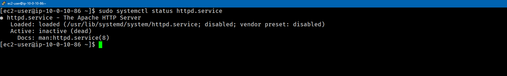
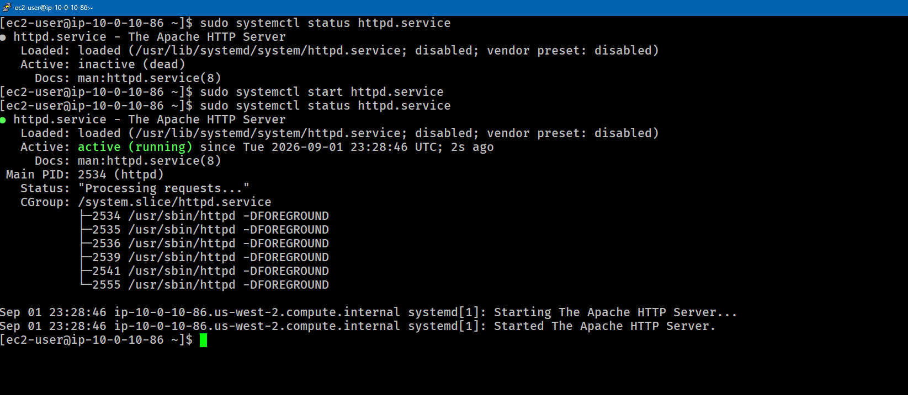
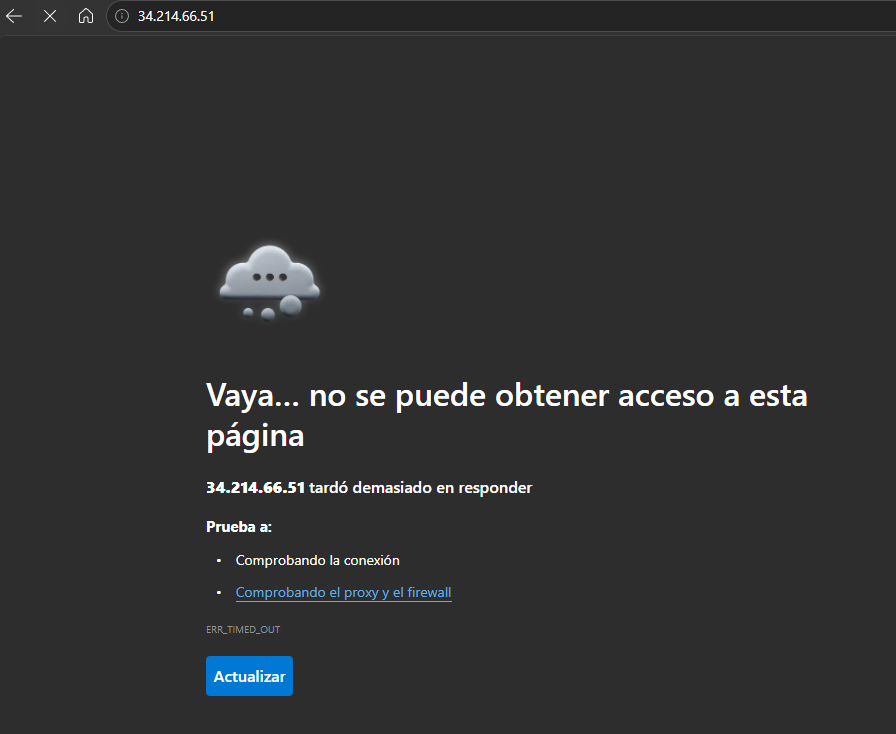
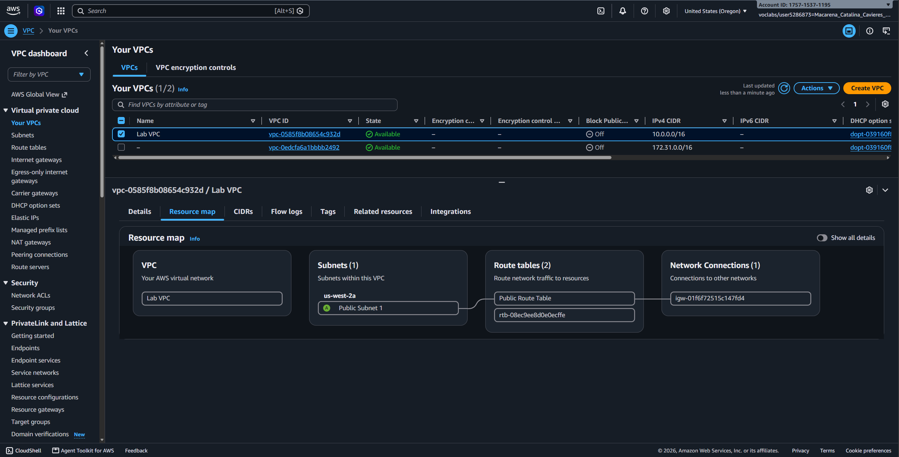
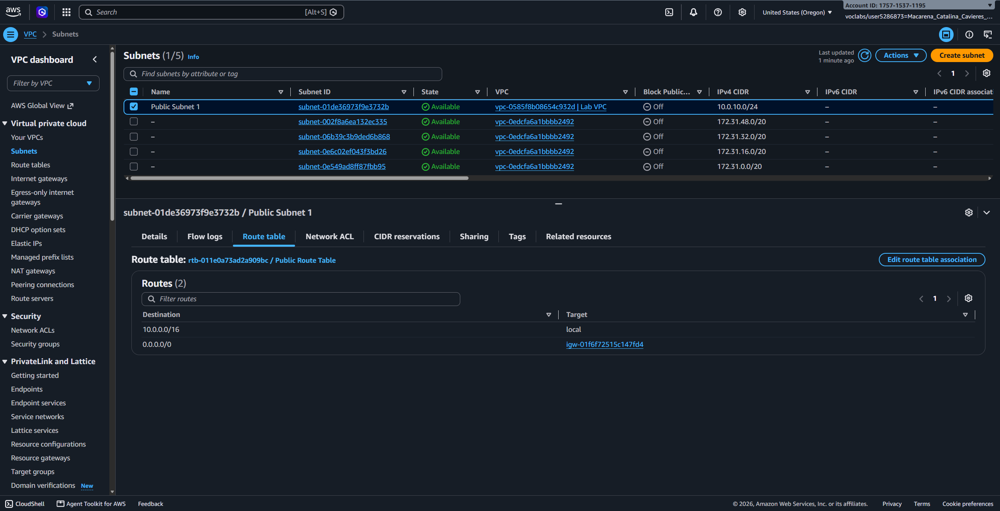
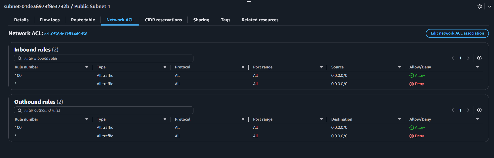
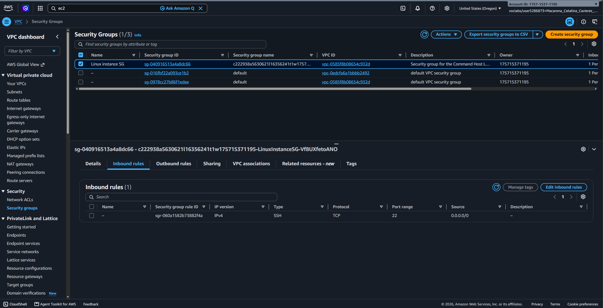
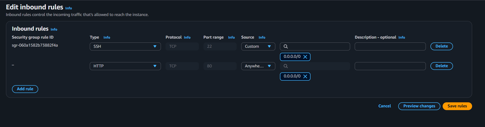
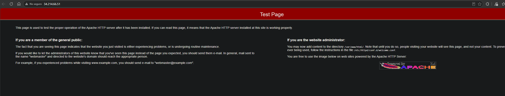

# Lab 266 Solución de Problemas de Red en AWS: Diagnóstico y Configuración de Servidor Web Apache


## Descripción General

Este laboratorio aborda la resolución de un incidente reportado por una empresa de consultoría. La arquitectura presentaba un fallo de accesibilidad web y conectividad perimetral: el servidor web Apache (`httpd`) desplegado en una instancia Amazon EC2 no respondía a las solicitudes HTTP entrantes desde un navegador, ni tampoco a las trazas ICMP (`ping`). La solución requirio el diagnóstico del servicio a nivel del sistema operativo y la auditoría metódica de los componentes de seguridad perimetral e infraestructura de red dentro de la Amazon Virtual Private Cloud (VPC).

<!-- Falta arquitectura del cliente -->

## Objetivos del Laboratorio

- Diagnosticar y gestionar el estado del servicio Apache HTTP Server mediante comandos `systemctl`.
- Auditar la infraestructura de red perimetral en Amazon VPC: subredes, tablas de enrutamiento e Internet Gateway.
- Inspeccionar y corregir las reglas de control de acceso en Grupos de Seguridad (Security Groups) e inspeccionar las Listas de Control de Acceso a la Red (NACL).
- Habilitar el tráfico web (puerto 80 HTTP) e ICMP (ping) para restablecer la conectividad pública.
- Validar la resolución del incidente accediendo a la página de prueba de Apache desde la red pública.

## Tarea 1: Diagnóstico y Activación del Servicio Apache

En la instancia Amazon EC2, el servicio web `httpd` se encontraba instalado pero en estado Inactivo (Inactive / Dead).

### Verificación e Inicio del Servicio:

```bash
# Verificar el estado inicial del servicio httpd
sudo systemctl status httpd.service

# Iniciar el servicio Apache HTTP
sudo systemctl start httpd.service

# Confirmar la ejecucion activa del daemon
sudo systemctl status httpd.service
```


_Figura 2: Comando del estado del servidor_


_Figura 3: Inicio del servidor_

A pesar de que el servicio httpd paso a estado `active (running)`, el acceso via navegador a `http://<IP_PUBLICA>` continuo fallando por tiempo de espera agotado (Timeout), lo que confirmo un bloqueo a nivel de red o firewall.


_Figura 4: Falla de la página_

## Tarea 2: Auditoría de Recursos e Infraestructura de Red en AWS

Se ejecutó un análisis metódico de los componentes de red perimetrales para aislar el punto de falla:

1. **Internet Gateway (IGW)**: Se confirmó la presencia del IGW adjunto de forma correcta a la VPC.
2. **Tablas de Enrutamiento (Route Tables)**: Se verificó que la subred contara con la ruta por defecto (`0.0.0.0/0`) apuntando al Internet Gateway.
3. **NACLs (Network Access Control Lists)**: Se validó que la NACL a nivel de subred permitiera todo el tráfico de entrada y salida (Regla 100 `0.0.0.0/0`).
4. **Grupo de Seguridad (Security Group)**: Se identificó la causa raíz del problema. El grupo de seguridad asociado a la interfaz de red (ENI) de la instancia carecia de reglas de entrada para los protocolos HTTP e ICMP.


_Figura 5: Revisión de la VPC_


_Figura 6: Revisión de la subred pública_


_Figura 7: Revisión de reglas de entrada y salida del NACL_


_Figura 8: Revisión de reglas de entrada del SG e identificación del problema_

### Matriz de corrección de reglas de seguridad:

| Componente         | Protocolo / Puerto | Origen (Source) | Estado Inicial | Acción Correctiva                                 |
| :----------------- | :----------------- | :-------------- | :------------- | :------------------------------------------------ |
| **Security Group** | HTTP (80)          | `0.0.0.0/0`     | Ausente        | Regla agregada para permitir tráfico web público. |
| **Security Group** | All ICMP - IPv4    | `0.0.0.0/0`     | Ausente        | Regla agregada para habilitar respuestas a ping.  |
| **Security Group** | SSH (22)           | `0.0.0.0/0`     | Presente       | Mantenida para administración remota.             |


_Figura 9: Se agrega la regla de entrada HTTP_

## Tarea 3: Verificación y Resolución del Incidente

Posterior a la actualización del Grupo de Seguridad, se realizaron las pruebas de confirmación desde la máquina cliente local:

### Prueba de Conectividad ICMP:

```bash
ping <IP_PUBLICA_INSTANCIA>
```

## Prueba de Acceso HTTP:

Se navegó a la direccion http://<IP_PUBLICA_INSTANCIA>, cargando exitosamente la pagina de prueba de Apache HTTP Server (Test Page).


_Figura 10: Prueba acceso HTTP_

## Resumen de Comandos y Configuraciones

| Comando / Recurso                 | Ámbito de Operación       | Propósito Técnico                                                                   |
| :-------------------------------- | :------------------------ | :---------------------------------------------------------------------------------- |
| **`sudo systemctl start httpd`**  | Sistema Operativo (Linux) | Inicia la ejecución del proceso del servidor web Apache.                            |
| **`sudo systemctl status httpd`** | Sistema Operativo (Linux) | Muestra el estado operacional (activo/inactivo) del proceso.                        |
| **Security Group Rule (Port 80)** | Red AWS (ENI)             | Permite la entrada de paquetes TCP orientados a servicios web.                      |
| **Security Group Rule (ICMP)**    | Red AWS (ENI)             | Permite paquetes del protocolo de mensajes de control de Internet para diagnóstico. |

## Evidencia en Video

Mira la ejecución de este laboratorio paso a paso en mi canal de YouTube: \
[](https://www.youtube.com/watch?v=MLSY4C3_rTs)

## Conclusiones del Laboratorio

- **Inbound Rules y Stateful Firewalls**: Aunque un servicio dentro del sistema operativo este ejecutándose correctamente, el tráfico sera descartado en el perímetro de AWS si el Grupo de Seguridad no define explicitamente la regla de entrada.

- **Estrategia de Diagnóstico Segmentado**: Para aislar fallas complejas de red en AWS, es esencial separar los componentes del sistema operativo (servicios), la infraestructura de enrutamiento (VPC, IGW, Route Tables) y las capas de seguridad (NACL, Security Groups).

- **Alineación con Requerimientos del Cliente**: La adición de reglas HTTP (puerto 80) e ICMP resolvió tanto el problema de despliegue de la página web como las fallas de diagnostico vía comando `ping`.
