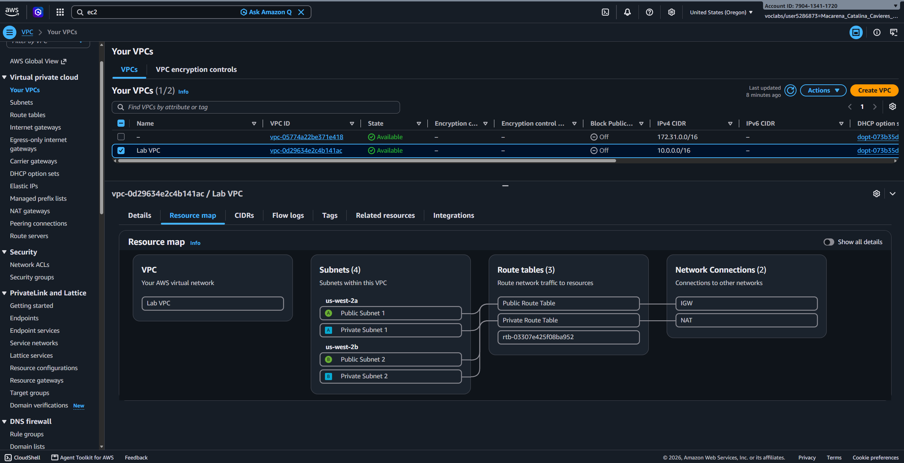
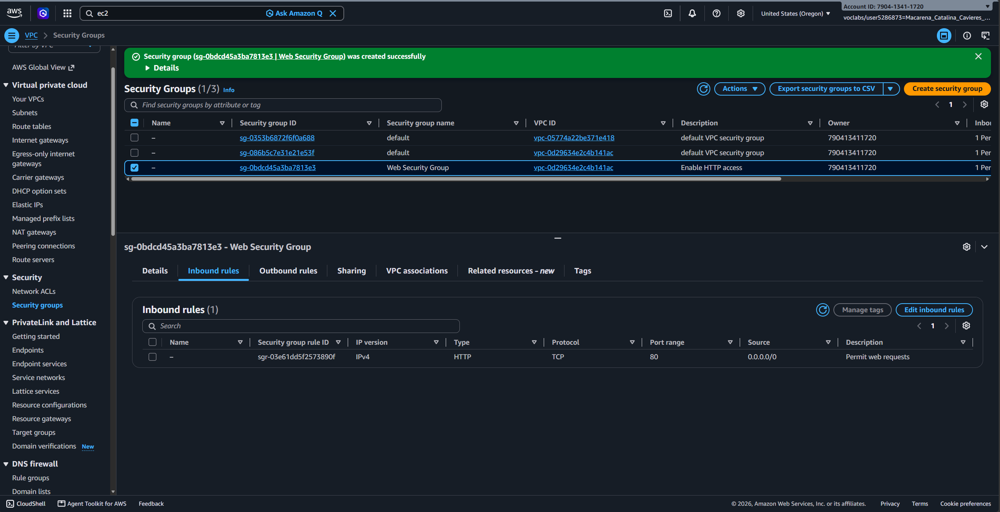
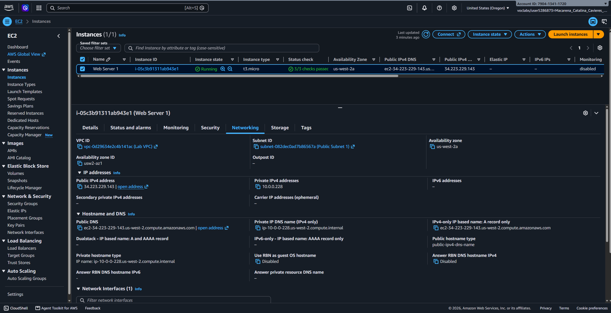
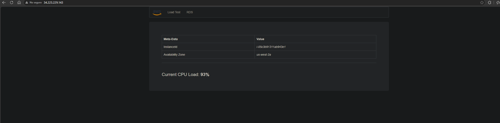

# Lab 267 Creación de una VPC y Lanzamiento de un Servidor Web en AWS


## Descripción General

En este laboratorio práctico se desplegó una infraestructura de red personalizada y tolerante a fallos en Amazon Web Services (AWS). Se configuró una Amazon Virtual Private Cloud (VPC) utilizando el asistente de arquitectura para establecer subredes públicas y privadas, tablas de enrutamiento, una puerta de enlace de Internet (Internet Gateway) y una puerta de enlace NAT (NAT Gateway). Posteriormente, la red se expandió manualmente hacia una segunda zona de disponibilidad para garantizar alta disponibilidad. Finalmente, se aprovisionó una instancia Amazon EC2 en la subred pública, configurada con un grupo de seguridad y un script de automatización (`User Data`) para desplegar un servidor web Apache con PHP.

<!-- Falta arquitectura del cliente -->

## Objetivos del Laboratorio

- Crear una Amazon VPC personalizada utilizando el asistente de configuración avanzada.
- Segmentar la red mediante subredes públicas y privadas distribuidas en múltiples zonas de disponibilidad.
- Configurar y asociar tablas de enrutamiento para gestionar el tráfico perimetral e interno.
- Implementar un grupo de seguridad (Security Group) para permitir tráfico web entrante por el puerto 80 (HTTP).
- Lanzar una instancia Amazon EC2 en una subred pública asignando una dirección IP pública automática.
- Automatizar la instalación de un servidor web Apache, PHP y despliegue de aplicación mediante scripts de `User Data`.

## Tarea 1: Creación de la VPC Base mediante el Asistente

Se utilizó la opción **VPC and more** para aprovisionar la infraestructura inicial de manera automatizada:

- **Nombre de la VPC:** `Lab VPC`
- **Bloque CIDR IPv4:** `10.0.0.0/16`
- **Zonas de Disponibilidad (AZs):** 1 (`us-west-2a`)
- **Subredes:**
    - **Pública (`Public Subnet 1`):** `10.0.0.0/24`
    - **Privada (`Private Subnet 1`):** `10.0.1.0/24`
- **Puertas de Enlace:**
    - **Internet Gateway (IGW):** Vinculado a la VPC para el tráfico saliente y entrante de la subred pública.
    - **NAT Gateway:** Desplegado en la subred pública para ofrecer salida a Internet a los recursos de la subred privada.

## Tarea 2: Expansión de Subredes para Alta Disponibilidad

Para habilitar redundancia en la capa de red, se crearon subredes adicionales en una segunda zona de disponibilidad de forma manual:

| Subred               | Nombre de Recurso  | Bloque CIDR IPv4 | Tipo de Subred | Zona de Disponibilidad |
| :------------------- | :----------------- | :--------------- | :------------- | :--------------------- |
| **Subred Pública 2** | `Public Subnet 2`  | `10.0.2.0/24`    | Pública        | Segunda AZ             |
| **Subred Privada 2** | `Private Subnet 2` | `10.0.3.0/24`    | Privada        | Segunda AZ             |


_Figura 2: Diagrama de la VPC_

## Tarea 3: Configuración y Asociación de Tablas de Enrutamiento

Se asociaron explícitamente las nuevas subredes a sus respectivas tablas de enrutamiento para aplicar las políticas de acceso correspondientes:

1. **Tabla de Enrutamiento Pública (`Public Route Table`):**
    - **Ruta asociada:** `0.0.0.0/0` apuntando al Internet Gateway (IGW).
    - **Subredes asociadas:** `Public Subnet 1` y `Public Subnet 2`.
2. **Tabla de Enrutamiento Privada (`Private Route Table`):**
    - **Ruta asociada:** `0.0.0.0/0` apuntando al NAT Gateway.
    - **Subredes asociadas:** `Private Subnet 1` y `Private Subnet 2`.

## Tarea 4: Creación del Grupo de Seguridad

Se configuró un firewall virtual a nivel de instancia para permitir las solicitudes de los usuarios:

- **Nombre del Grupo de Seguridad:** `Web Security Group`
- **Descripción:** `Enable HTTP access`
- **VPC:** `Lab VPC`


_Figura 3: SG de la VPC_

### Reglas de Entrada (Inbound Rules):

| Tipo     | Protocolo | Puerto | Origen (Source)             | Descripción         |
| :------- | :-------- | :----- | :-------------------------- | :------------------ |
| **HTTP** | TCP       | `80`   | `0.0.0.0/0` (Anywhere IPv4) | Permit web requests |

## Tarea 5: Lanzamiento del Servidor Web EC2

Se desplegó la instancia encargada de prestar el servicio web con la siguiente configuración:

- **Nombre:** `Web Server 1`
- **AMI:** Amazon Linux 2023 AMI
- **Tipo de Instancia:** `t3.micro`
- **Par de Claves:** `vockey`
- **Red:** `Lab VPC` / Subred: `Public Subnet 1`
- **Asignación de IP Pública:** Habilitada
- **Grupo de Seguridad:** `Web Security Group`

### Script de Automatización (`User Data`):

```bash
#!/bin/bash

# Stop the script if a command fails
set -e

# Update package metadata
dnf clean all

# Install Apache, PHP and unzip
# Retry up to 3 times in case of temporary repository/network errors
for i in 1 2 3
do
    echo "Installation attempt $i..."

    if dnf install -y httpd php unzip; then
        echo "Packages installed successfully."
        break
    fi

    echo "Installation failed. Waiting 10 seconds before retrying..."
    sleep 10
done

# Verify that Apache was installed
if ! command -v httpd &> /dev/null
then
    echo "ERROR: Apache could not be installed."
    exit 1
fi

# Create the web directory if it does not exist
mkdir -p /var/www/html

# Download Lab files
wget -O /tmp/lab-app.zip \
[https://aws-tc-largeobjects.s3.us-west-2.amazonaws.com/CUR-TF-100-RESTRT-1/267-lab-NF-build-vpc-web-server/s3/lab-app.zip](https://aws-tc-largeobjects.s3.us-west-2.amazonaws.com/CUR-TF-100-RESTRT-1/267-lab-NF-build-vpc-web-server/s3/lab-app.zip)

# Extract the application files
unzip -o /tmp/lab-app.zip -d /var/www/html/

# Enable Apache at boot
systemctl enable httpd

# Start Apache
systemctl start httpd

# Verify Apache
systemctl is-active --quiet httpd

echo "Web server installation completed successfully."
```


_Figura 4: Instancia EC2_

## Validación de la Solución

Tras completar las comprobaciones de estado (2/2 checks passed), se copió el Public IPv4 DNS de la instancia Web Server 1 y se ingresó en un navegador web, cargando con éxito la aplicación PHP del laboratorio.


_Figura 5: Validación web server_

## Resumen de Recursos Creados

| Servicio / Recurso   | Nombre del Componente                   | Descripción y Función Técnica                                 |
| :------------------- | :-------------------------------------- | :------------------------------------------------------------ |
| **Amazon VPC**       | `Lab VPC`                               | Red virtual aislada con direccionamiento `10.0.0.0/16`.       |
| **Public Subnet**    | `Public Subnet 1` / `Public Subnet 2`   | Subredes con ruta directa hacia Internet Gateway.             |
| **Private Subnet**   | `Private Subnet 1` / `Private Subnet 2` | Subredes protegidas con salida orientada a NAT Gateway.       |
| **Internet Gateway** | `Lab VPC IGW`                           | Permite la comunicación entre la subred pública e Internet.   |
| **NAT Gateway**      | `Lab VPC NAT`                           | Permite salida a Internet a recursos privados sin exponerlos. |
| **Security Group**   | `Web Security Group`                    | Controla el tráfico entrante por el puerto 80 TCP.            |
| **Amazon EC2**       | `Web Server 1`                          | Instancia EC2 que aloja el servidor web Apache y la app PHP.  |

## Evidencia en Video

Mira la ejecución de este laboratorio paso a paso en mi canal de YouTube: \
[](https://www.youtube.com/watch?v=yuf3B1ov4Zg)

## Conclusiones del Laboratorio

- **Diseño Multi-AZ**: La distribución de subredes públicas y privadas en múltiples zonas de disponibilidad establece la base estructural para arquitecturas de alta disponibilidad y tolerancia a fallos.

- **Enrutamiento Segregado**: El uso combinado de Internet Gateway para subredes públicas y NAT Gateway para subredes privadas garantiza conectividad controlada sin comprometer la seguridad de las capas internas.

- **Automatización del Despliegue**: La inclusión de scripts en User Data simplifica el aprovisionamiento de infraestructura como servicio (IaaS), garantizando que los servidores entren en operación totalmente configurados desde su lanzamiento.
