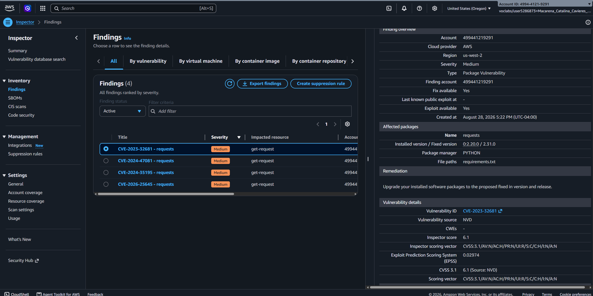
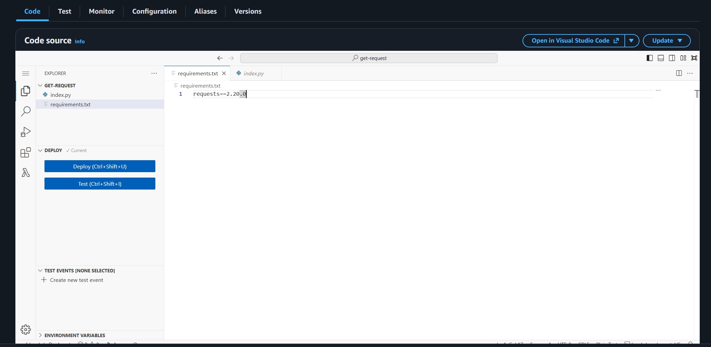
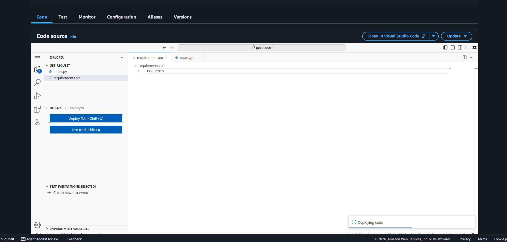
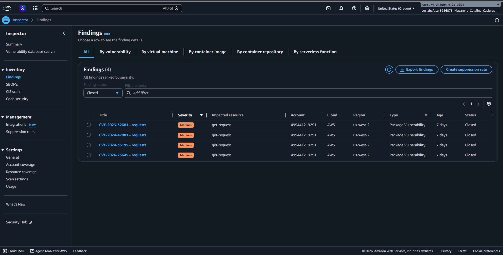

# Lab 276 Evaluación de Vulnerabilidades y Remediación con Amazon Inspector


## Descripción General

En este laboratorio práctico se implementó Amazon Inspector para evaluar, identificar y remediar fallas de seguridad automatizadas en una arquitectura orientada a microservicios. Se simuló un escenario real en el que una empresa de desarrollo desplegó funciones AWS Lambda con dependencias de software vulnerables. Mediante el uso de Amazon Inspector, se realizó un escaneo automatizado del código y sus paquetes asociados, analizando los hallazgos reportados por la Base de Datos Nacional de Vulnerabilidades (NVD/NIST) y aplicando una estrategia de remediación directa sobre las dependencias del proyecto.

## Objetivos del Laboratorio

- Habilitar el servicio de escaneo continuo automatizado con Amazon Inspector a nivel de cuenta.
- Inspeccionar el nivel de cobertura de seguridad sobre funciones AWS Lambda y recursos asociados.
- Analizar e interpretar reportes de vulnerabilidades conocidos (CVE) y recomendaciones de remediación.
- Actualizar dependencias de software desactualizadas dentro del código fuente de funciones Lambda.
- Validar la resolución del hallazgo confirmando el cambio de estado de la vulnerabilidad de Activo a Cerrado.

## Tarea 1: Activación y Cobertura de Amazon Inspector

Se habilitó Amazon Inspector en la consola de AWS para iniciar el escaneo automatizado sobre la infraestructura:

- **Servicio:** Amazon Inspector.
- **Alcance del escaneo:** Cobertura del 100% sobre la funcion AWS Lambda `get-request`.
- **Detección:** Evaluación continua de paquetes de software y dependencias integradas en el entorno de ejecución.

## Tarea 2: Revisión e Interpretación de Hallazgos de Vulnerabilidad

Tras la finalización del escaneo inicial, Amazon Inspector generó alertas asociadas a librerias desactualizadas en la función Lambda:

### Detalle de la Vulnerabilidad Identificada:

| Campo                 | Valor Detectado    | Descripción Técnica                                                                                       |
| :-------------------- | :----------------- | :-------------------------------------------------------------------------------------------------------- |
| **Recurso Afectado**  | `get-request`      | Función AWS Lambda encargada de realizar peticiones HTTP.                                                 |
| **Nivel de Gravedad** | Media (Medium)     | Riesgo moderado según la escala de puntuación CVSS.                                                       |
| **Identificador CVE** | `CVE-2023-32681`   | Vulnerabilidad en la librería `requests` de Python relacionada con fuga de credenciales en redirecciones. |
| **Causa Raíz**        | `requests==2.20.0` | Declaración de versión fija desactualizada y vulnerable en `requirements.txt`.                            |

Se consultó la Base de Datos Nacional de Vulnerabilidades (NVD del NIST) mediante el enlace directo proporcionado por el hallazgo para confirmar las recomendaciones de remediación.


_Figura 1: Vista de Hallazgos de Amazon Inspector_


_Figura 2: Detalle desglosado de un hallazgo_

## Tarea 3: Remediación de Vulnerabilidades en AWS Lambda

Para solucionar la vulnerabilidad, se accedió al editor de codigo de la función AWS Lambda y se modificó el archivo de dependencias `requirements.txt`.

### Cambio Aplicado en las Dependencias:

- **Configuración Inicial (Vulnerable):**

          ```text
          requests==2.20.0
          ```

    
    _Figura 3: Configuración inicial_

- **Configuración Remediada (Segura):**
    ```text
    requests
    ```


_Figura 4: Configuración remediada_

Al remover la restricción de versión explícita, AWS Lambda instala la versión mas reciente y parcheada de la librería requests durante el despliegue. Posterior a la edición, se seleccionó la opción Deploy.

## Tarea 4: Validación y Cierre del Hallazgo

El nuevo despliegue desencadeno automáticamente un reescaneo por parte de Amazon Inspector. Se validó el estado de la vulnerabilidad en el panel de control:

- **Filtro de Estado**: Cambiado de `Active` (Activo) a `Closed` (Cerrado).

- **Resultado**: El hallazgo `CVE-2023-32681` - requests se movió a la lista de hallazgos cerrados.

- **Verificación Temporal**: Se confirmó que la marca de tiempo de la columna Último análisis (Last scanned at) reflejaba la fecha y hora de la nueva ejecución.


_Figura 5: Hallazgos en estado `Closed`_

## Resumen de recursos y componentes

| Servicio / Recurso      | Nombre del Componente           | Descripción y Función Técnica                                                                         |
| :---------------------- | :------------------------------ | :---------------------------------------------------------------------------------------------------- |
| **Amazon Inspector**    | Inspector Engine                | Servicio de gestión automatizada de vulnerabilidades que analiza continuamente EC2, ECR y Lambda.     |
| **AWS Lambda**          | `get-request`                   | Servicio de cómputo sin servidor (Serverless) ejecutando el código de la aplicación.                  |
| **NVD / NIST**          | National Vulnerability Database | Repositorio estandarizado que provee metadatos y recomendaciones sobre registros CVE.                 |
| **Python Requirements** | `requirements.txt`              | Archivo de declaración de dependencias utilizado por el entorno de ejecución para instalar librerías. |

## Evidencia en Video

Mira la ejecución de este laboratorio paso a paso en mi canal de YouTube: \
[](https://www.youtube.com/watch?v=gZvxLuYUfM0)

## Conclusiones del Laboratorio

- **Seguridad Automatizada y Continua**: Amazon Inspector elimina la necesidad de realizar escaneos manuales periódicos, ya que detecta y evalúa los recursos inmediatamente después de ser creados o actualizados.

- **Gestión de Dependencias**: Fijar versiones antiguas de paquetes en archivos de requerimientos (`requirements.txt`) introduce riesgos de seguridad. Mantener las dependencias actualizadas es fundamental para la postura de seguridad en arquitecturas Serverless.

- **Ciclo de Vida de Remediación**: El flujo completo (detección, análisis de impacto, parcheo de código y reescaneo automático) garantiza que las vulnerabilidades se cierren de forma verificable sin interrumpir el ciclo de desarrollo.
