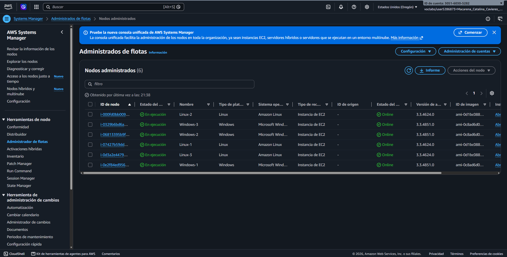
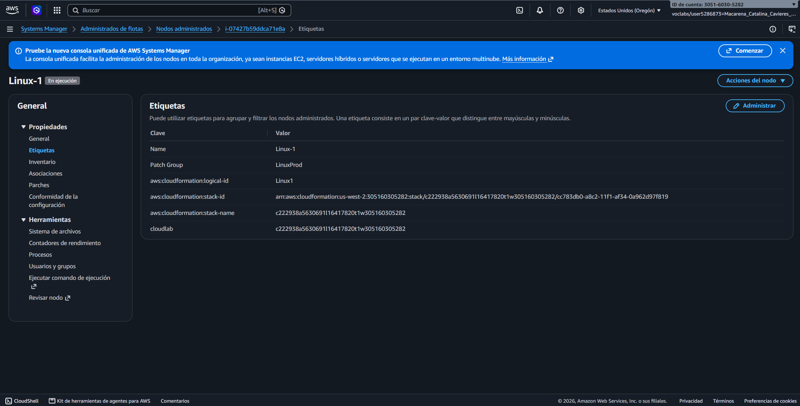
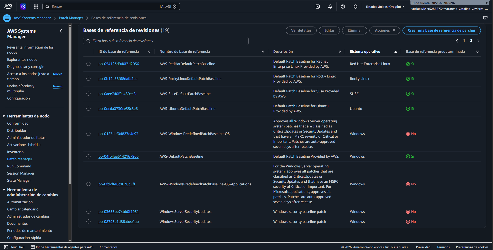
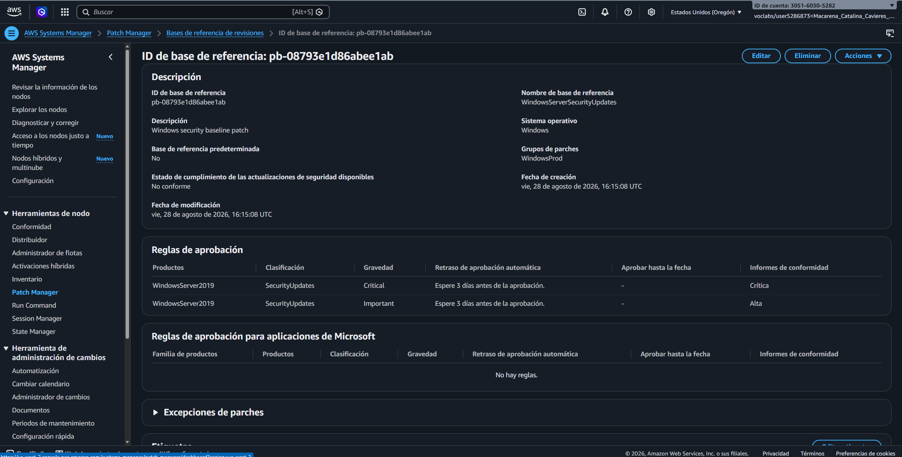
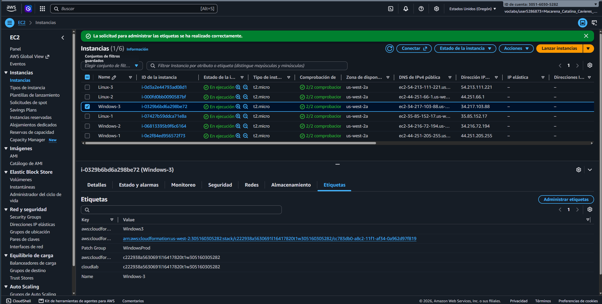
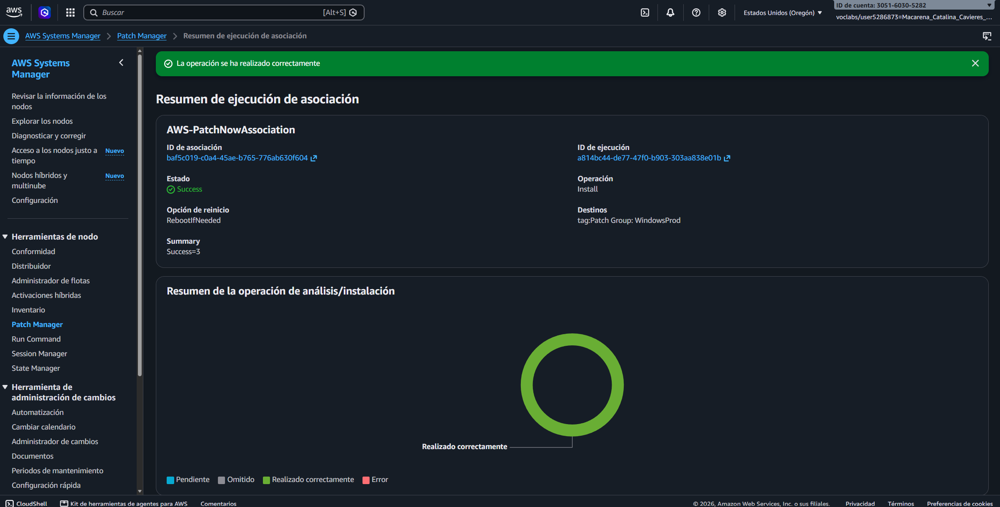
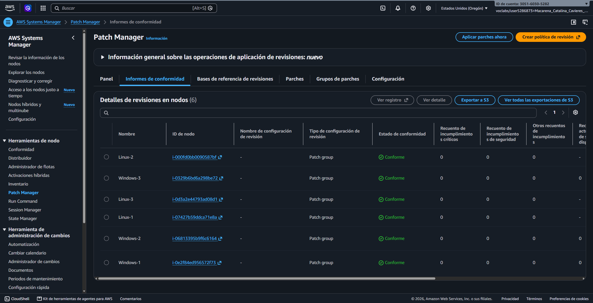

# Lab 277 Reforzamiento de Sistemas y Gestión de Parches con AWS Systems Manager Patch Manager

## Descripción General

En este laboratorio práctico se implementó una estrategia automatizada de gobernanza y mantenimiento de seguridad sobre una flota de instancias Amazon EC2 heterogéneas (Linux y Windows Server). Utilizando **AWS Systems Manager Patch Manager**, se establecieron líneas de base de revisiones (Patch Baselines) tanto predeterminadas como personalizadas, se organizaron las instancias en grupos de parches (Patch Groups) mediante etiquetas, y se ejecutaron operaciones de escaneo e instalación para garantizar el cumplimiento de parches de seguridad y parámetros de cumplimiento operacional en toda la infraestructura.

_Figura 1: Flota de instancias_

## Objetivos del Laboratorio

- Automatizar la aplicación de parches en instancias Amazon Linux 2 utilizando la línea de base predeterminada.
- Diseñar y configurar una línea de base de revisiones personalizada para sistemas Windows Server 2019 con reglas de aprobación automática de parches críticos e importantes.
- Organizar e identificar nodos administrados mediante grupos de parches basados en etiquetas (`Patch Group`).
- Ejecutar tareas de escaneo e instalación bajo demanda mediante la funcionalidad _Patch Now_ respaldada por AWS Systems Manager Run Command.
- Auditar y verificar el reporte de cumplimiento de parches (_Compliance Summary_) sobre la totalidad de la flota de instancias.

## Tarea 1: Aplicación de Parches en Linux con Línea de Base Predeterminada

Se auditaron los nodos administrados en Fleet Manager y se procedió a parchear las instancias Linux utilizando la línea de base nativa del sistema operativo:

- **Instancias Objetivo:** Tres instancias Amazon Linux 2 identificadas mediante la etiqueta `Patch Group: LinuxProd`.
- **Línea de Base Aplicada:** `AWS-AmazonLinux2DefaultPatchBaseline`.
- **Operación Ejecutada:** `Scan and install` (Escanear e instalar) con opción de reinicio condicional (`Reboot if needed`).
- **Mecanismo de Ejecución:** Asociación automática `AWS-PatchNowAssociation` que ejecutó el análisis de parches faltantes e instaló las actualizaciones requeridas.

_Figura 2: Etiquetas de Linux_

## Tarea 2: Creación de Línea de Base Personalizada para Windows Server

Se definió una línea de base de revisiones estricta para controlar las actualizaciones de seguridad en sistemas Windows Server 2019.

### Configuración de la Línea de Base de Parches:

- **Nombre:** `WindowsServerSecurityUpdates`
- **Descripción:** `Windows security baseline patch`
- **Sistema Operativo:** Windows

_Figura 3: Patch Baselines_

_Figura 4: Detalle de la líne base de revisiones `WindowsServerSecurityUpdates`_

### Reglas de Aprobación de Parches:

| Regla       | Producto          | Clasificación   | Gravedad / Severidad   | Aprobación Automática | Reporte de Cumplimiento |
| :---------- | :---------------- | :-------------- | :--------------------- | :-------------------- | :---------------------- |
| **Regla 1** | WindowsServer2019 | SecurityUpdates | Crítica (Critical)     | 3 días                | Crítica                 |
| **Regla 2** | WindowsServer2019 | SecurityUpdates | Importante (Important) | 3 días                | Alta                    |

Posterior a la creación de la línea de base, se configuró el **Patch Group** asignando la clave de asociación `WindowsProd`.

## Tarea 3: Etiquetado y Aplicación de Parches en Flota Windows

### Tarea 3.1: Configuración de Etiquetas en Instancias EC2

Se asignó la etiqueta correspondiente a las tres instancias Windows objetivo (`Windows-1`, `Windows-2`, `Windows-3`) desde la consola de Amazon EC2:

- **Key:** `Patch Group`
- **Value:** `WindowsProd`

_Figura 5: Etiquetado (`WindowsProd`) de las instancias de Windows_

### Tarea 3.2: Ejecución del Proceso de Parcheo (_Patch Now_)

Desde la consola de Patch Manager, se disparó la ejecución inmediata:

- **Operación:** `Scan and install`
- **Criterio de Selección:** Instancias objetivo con etiqueta `Patch Group: WindowsProd`.
- **Ejecución Subyacente:** Systems Manager utilizó **Run Command** invocando el documento `AWS-RunPatchBaseline` para ejecutar las operaciones `PatchBaselineOperations` y aplicar los parches correspondientes segun la linea de base asignada.

_Figura 6: Proceso de parcheo_

## Tarea 4: Auditoria y Verificación de Cumplimiento

Finalizadas las tareas de instalación, se validó el estado de seguridad y parcheo a nivel de flota desde el panel de cumplimiento:

- **Resumen de Conformidad (Compliance Summary):** 6 de 6 instancias registradas con estado **Conforme** (Compliant) (3 Linux, 3 Windows).
- **Reportes de Conformidad (Compliance Reports):** Se verificó que el contador de incumplimientos críticos (`Critical non-compliant count`) y de seguridad permaneciera en `0`.
- **Inspección Individual:** Se revisó el historial de parches instalados por nodo, confirmando la marca temporal de instalación y la asignación correcta del ID de la línea de base.

_Figura 7: Verificación a nivel de flota_

## Resumen de Recursos y Componentes

| Servicio / Recurso      | Nombre del Componente          | Descripción y Función Técnica                                                                                 |
| :---------------------- | :----------------------------- | :------------------------------------------------------------------------------------------------------------ |
| **AWS Systems Manager** | Fleet Manager                  | Panel centralizado para visualizar y gestionar la identidad e información de nodos administrados.             |
| **Patch Manager**       | Patch Manager Engine           | Herramienta de Systems Manager que automatiza el proceso de parcheo de sistemas operativos y aplicaciones.    |
| **Patch Baseline**      | `WindowsServerSecurityUpdates` | Definición de reglas de aprobación que especifica qué parches se consideran aprobados para su instalación.    |
| **Patch Group**         | `LinuxProd` / `WindowsProd`    | Mecanismo de agrupación lógica basado en etiquetas que asocia instancias con líneas de base específicas.      |
| **SSM Document**        | `AWS-RunPatchBaseline`         | Documento de comandos ejecutado por Run Command para realizar las tareas de escaneo e instalación de parches. |

## Evidencia en Video

Mira la ejecución de este laboratorio paso a paso en mi canal de YouTube: \

## Conclusiones del Laboratorio

- **Estandarización de Flotas Heterogéneas:** AWS Systems Manager Patch Manager simplifica la administración de parches permitiendo gestionar simultáneamente entornos Linux y Windows mediante políticas unificadas.
- **Control Gradual mediante Patch Baselines:** La creación de líneas de base personalizadas otorga a los administradores control preciso sobre la severidad, clasificación y periodos de gracia (aprobación automática) antes de desplegar parches en entornos de producción.
- **Visibilidad y Auditoría Continuas:** El desglose del reporte de cumplimiento (_Compliance Reports_) facilita evidencia clara para auditorías de seguridad, asegurando que todos los nodos cumplan con los estándares de seguridad requeridos.
