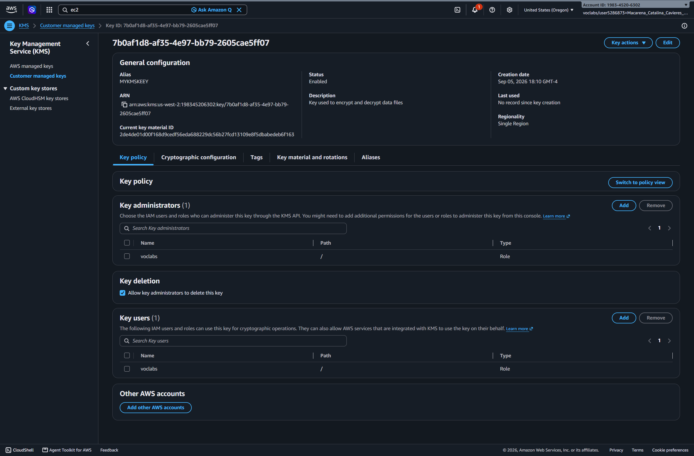
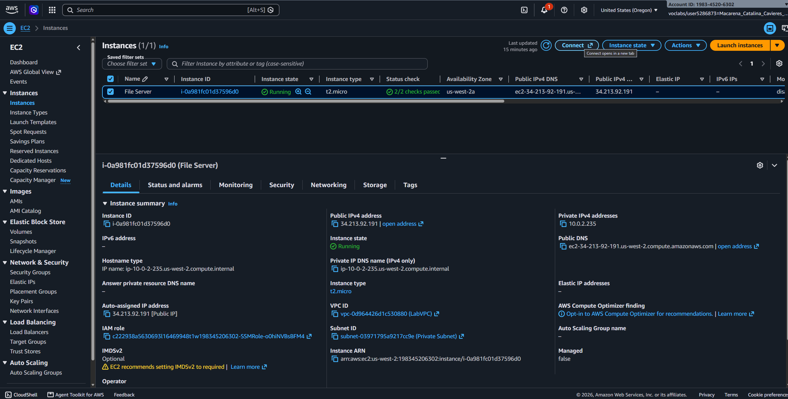
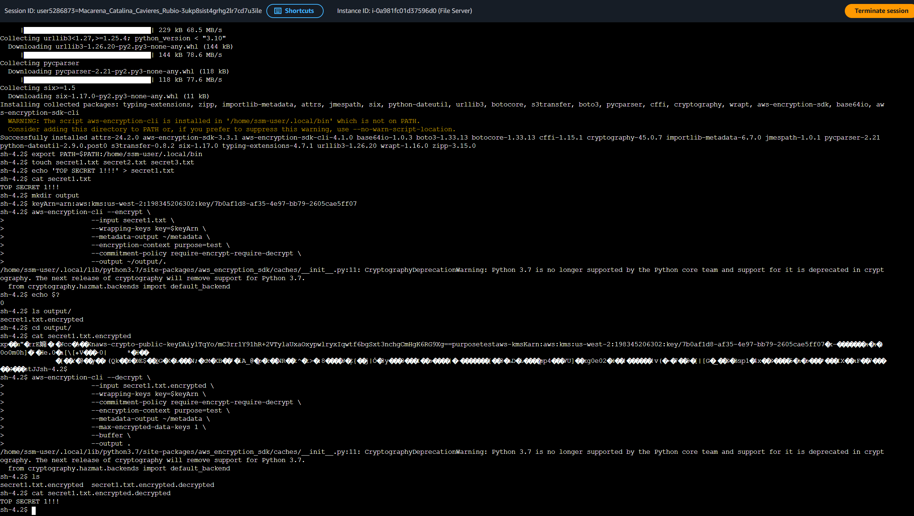

# Lab 278 Protección de Datos mediante Cifrado con AWS KMS y AWS Encryption CLI


## Descripción General

En este laboratorio practico se implementó una solución integral de protección de datos en reposito utilizando **AWS Key Management Service (AWS KMS)** y la herramienta **AWS Encryption CLI**. Se creó una clave de cifrado simétrica gestionada por el cliente (KMS Key), se configuró un servidor de archivos alojado en una instancia de Amazon EC2 mediante AWS Systems Manager Session Manager, y se llevaron a cabo operaciones avanzadas de cifrado y descifrado de archivos de texto plano utilizando contexto de cifrado y políticas de compromiso de clave.

## Objetivos del Laboratorio

- Crear y administrar una clave de cifrado simétrica personalizada en AWS Key Management Service (AWS KMS).
- Configurar credenciales y entorno de ejecución en una instancia de Amazon EC2 desde la línea de comandos.
- Instalar y parametrizar la interfaz de línea de comandos de cifrado (`aws-encryption-sdk-cli`).
- Cifrar archivos de texto plano utilizando contexto de cifrado (`encryption context`) y políticas de compromiso (`commitment policy`).
- Descifrar texto cifrado (_ciphertext_) para validar la integridad y confidencialidad original de los datos.

## Tarea 1: Creación de una Clave Simétrica en AWS KMS

Se aprovisionó una clave de cifrado simétrica administrada en la consola de AWS Key Management Service:

- **Tipo de Clave:** Simétrica (Symmetric). Se utiliza la misma clave para los procesos de cifrado y descifrado.
- **Alias de la Clave:** `MyKMSKey`
- **Descripción:** `Key used to encrypt and decrypt data files.`
- **Permisos Administrativos y de Uso:** Asignados al rol de IAM `voclabs`.
- **Identificador Único:** Se extrajo el Amazon Resource Name (ARN) de la clave para su posterior invocación via CLI.


_Figura 1: Detalles de la Clave simétrica de AWS KMS_

## Tarea 2: Configuración del Servidor de Archivos (Amazon EC2)

Se realizó la conexión a la instancia `File Server` mediante **AWS Systems Manager Session Manager** y se preparó el entorno de trabajo:

1.  **Configuración de Credenciales de AWS:**
    Se actualizaron las credenciales temporales de acceso en el archivo `~/.aws/credentials` con las claves proveídas por el entorno de laboratorio.

2.  **Instalación de AWS Encryption CLI:**
    Para asegurar la compatibilidad de dependencias, se instaló la versión específica de la herramienta mediante el siguiente comando:

        ```bash
        python3 -m pip install --user aws-encryption-sdk-cli==4.1.0
        export PATH=$PATH:/home/ssm-user/.local/bin
        ```


_Figura 2: Instancia EC2_

## Tarea 3: Cifrado y Descifrado de Datos

### Tarea 3.1: Generación de Datos y Variable de Entorno

Se crearon archivos de texto con información confidencial simulada y se configuró el ARN de la clave en la variable de entorno $keyArn:

```bash
touch secret1.txt secret2.txt secret3.txt
echo 'TOP SECRET 1!!!' > secret1.txt
keyArn="arn:aws:kms:region:account-id:key/key-id"
```

### Tarea 3.2: Cifrado de Archivos Plano

Se creó la carpeta de salida output y se ejecutó el comando de cifrado especificando el contexto y la política de compromiso:

```bash
mkdir output
aws-encryption-cli \
  --encrypt \
  --input secret1.txt \
  --wrapping-keys key=$keyArn \
  --metadata-output ~/metadata \
  --encryption-context purpose=test \
  --commitment-policy require-encrypt-require-decrypt \
  --output ~/output/.
```

- Operación Validada: Se verificó la salida exitosa del comando (`echo $?` arrojando `0`).
- Resultado: Se generó el archivo cifrado de salida `secret1.txt.encrypted` en formato ilegible (ciphertext).

### Tarea 3.3: Descifrado de Archivos

Se aplico la operación inversa para recuperar el texto plano original a partir del texto cifrado:

```bash
cd output
aws-encryption-cli \
  --decrypt \
  --input secret1.txt.encrypted \
  --wrapping-keys key=$keyArn \
  --commitment-policy require-encrypt-require-decrypt \
  --encryption-context purpose=test \
  --metadata-output ~/metadata \
  --max-encrypted-data-keys 1 \
  --buffer \
  --output .
```

- Resultado: Se genero el archivo `secret1.txt.encrypted.decrypted`.
- Verificación: La inspección del contenido mediante cat confirmó la recuperación exacta de la cadena `TOP SECRET 1!!!`.


_Figura 3: Comandos ejecutados para el cifrado y descifrado del mensaje_

## Resumen de Recursos y Componentes

| Servicio / Recurso      | Nombre del Componente    | Descripción y Función Técnica                                                                                                  |
| :---------------------- | :----------------------- | :----------------------------------------------------------------------------------------------------------------------------- |
| **AWS KMS**             | `MyKMSKey`               | Clave de cifrado simétrica administrada por el cliente respaldada por módulos de seguridad de hardware (HSM) FIPS 140-2.       |
| **Amazon EC2**          | File Server              | Instancia de cómputo Linux utilizada como servidor de archivos local para procesar los datos.                                  |
| **AWS Systems Manager** | Session Manager          | Mecanismo de acceso seguro por consola a la instancia de EC2 sin exponer puertos SSH.                                          |
| **AWS Encryption CLI**  | `aws-encryption-sdk-cli` | Librería y cliente de línea de comandos para implementar cifrado del lado del cliente alineado a las mejores prácticas de AWS. |

## Conclusiones del Laboratorio

- **Cifrado del Lado del Cliente**: El uso de AWS Encryption CLI permite realizar las operaciones criptográficas localmente en la instancia antes de transmitir o almacenar datos, garantizando máxima privacidad.

- **Contexto de Cifrado (Encryption Context)**: Al incluir un contexto clave-valor (`purpose=test`), se añade autenticación adicional que previene ataques de manipulación o sustitución de datos.

- **Política de Compromiso de Claves**: Configurar `--commitment-policy require-encrypt-require-decrypt` asegura que solo se puedan descifrar archivos que incluyan un compromiso de clave criptográfico válido, protegiendo contra ataques de reordenamiento de claves.
