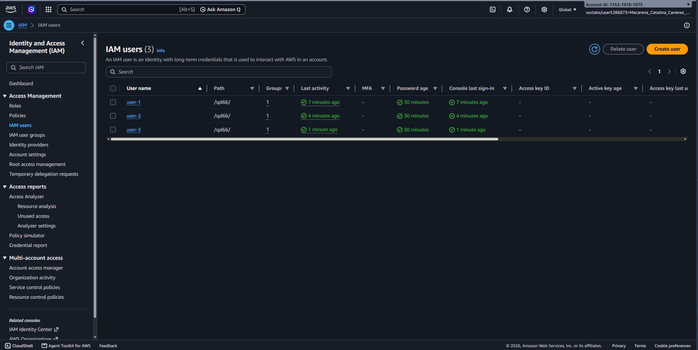
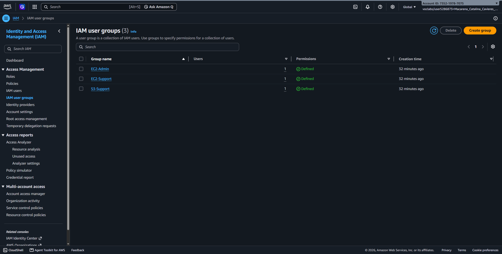
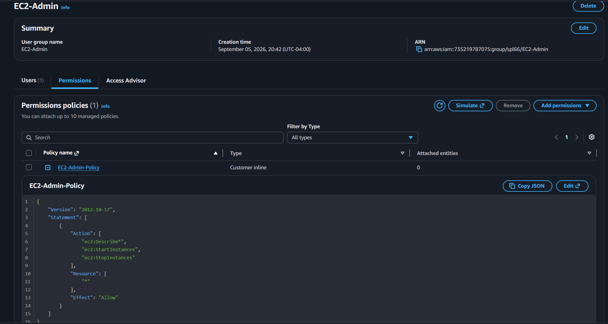
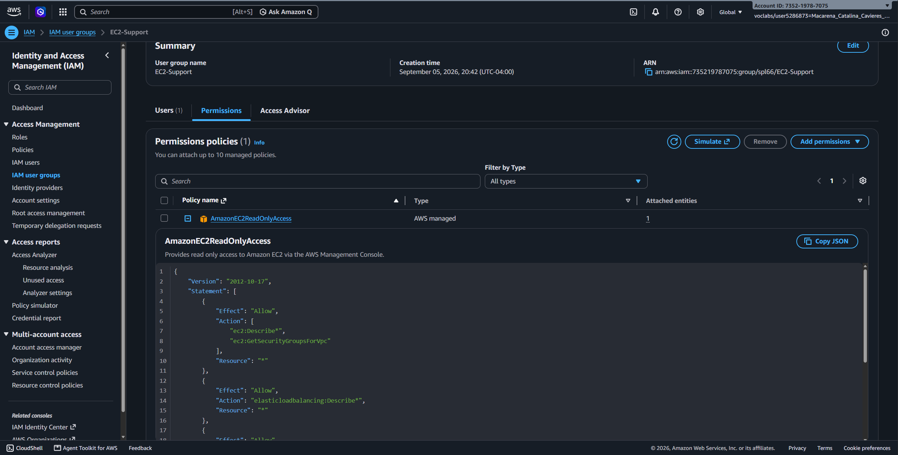
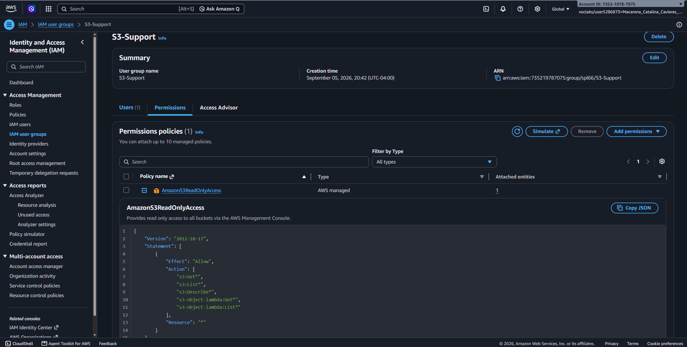
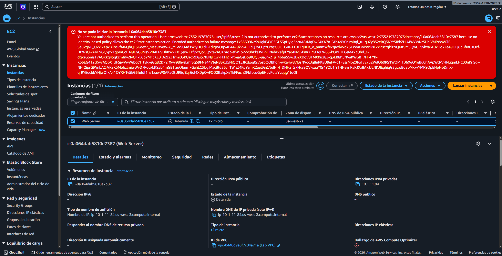

# Introducción a AWS Identity and Access Management (IAM)

## Descripción General

En este laboratorio práctico se configuraron y evaluaron los componentes fundamentales de **AWS Identity and Access Management (IAM)** para implementar el principio de menor privilegio (_Least Privilege_) y fortalecer las políticas de seguridad en una cuenta de AWS. Se definió una política de contraseñas rigurosa a nivel de cuenta, se analizaron políticas administradas por AWS y políticas integradas (_inline policies_), se organizaron usuarios en grupos según sus roles operativos y se validaron experimentalmente los permisos de acceso mediante pruebas de inicio de sesión con distintas identidades.

## Objetivos del Laboratorio

- Establecer y aplicar una política de contraseñas personalizada a nivel de cuenta global en AWS IAM.
- Inspeccionar la estructura JSON de políticas administradas (`Managed Policies`) e integradas (`Inline Policies`).
- Asociar usuarios de IAM a grupos funcionales (`User Groups`) para simplificar la gestión de permisos.
- Utilizar la URL personalizada de inicio de sesión de la consola de IAM.
- Probar y verificar en la consola el efecto del control de acceso basado en el rol (RBAC) sobre Amazon EC2 y Amazon S3.

## Tarea 1: Creación de una Política de Contraseña de Cuenta

Se endurecieron los requisitos de seguridad para la creación de credenciales de usuario dentro de la cuenta mediante la personalización de la política de contraseñas en **Account Settings**:

- **Longitud Mínima de Contraseña:** 10 caracteres.
- **Complejidad:** Exigencia de al menos un carácter en mayúscula, un carácter en minúscula, un número y un símbolo no alfanumérico.
- **Expiración de Contraseña:** Habilitada a los 90 días.
- **Prevención de Reutilización:** Restricción de reutilizar las últimas 5 contraseñas.
- **Autoservicio de Contraseña:** Permitido a los usuarios cambiar su propia contraseña.

## Tarea 2: Análisis de Usuarios, Grupos de Usuarios y Políticas

Se inspeccionó la estructura inicial de identidades y permisos dentro del servicio IAM:

### Usuarios Existentes:

- `user-1`: Sin permisos asignados ni pertenencia a grupos.
- `user-2`: Sin permisos asignados ni pertenencia a grupos.
- `user-3`: Sin permisos asignados ni pertenencia a grupos.

_Figura 1: Usuarios IAM creados para el laboratorio_

### Grupos de Usuarios y Políticas Asociadas:

| Grupo de Usuarios | Nombre de la Política     | Tipo de Política                          | Acciones Permitidas                                                        |
| :---------------- | :------------------------ | :---------------------------------------- | :------------------------------------------------------------------------- |
| **S3-Support**    | `AmazonS3ReadOnlyAccess`  | Administrada por AWS (_Managed_)          | Acceso de solo lectura a recursos y listado de objetos en Amazon S3.       |
| **EC2-Support**   | `AmazonEC2ReadOnlyAccess` | Administrada por AWS (_Managed_)          | Inspección y descripción de recursos en Amazon EC2, ELB y CloudWatch.      |
| **EC2-Admin**     | `EC2-Admin-Policy`        | Integrada del cliente (_Customer Inline_) | Visualización, inicio y detención (_Start/Stop_) de instancias Amazon EC2. |

_Figura 2: Grupos de usuarios IAM creados para el laboratorio_

### Estructura de una Declaración (_Statement_) de Política IAM:

- **Effect:** Define si se autoriza (`Allow`) o deniega (`Deny`) la acción.
- **Action:** Especifica las operaciones de API permitidas (ejemplo: `ec2:DescribeInstances`, `s3:ListBucket`).
- **Resource:** Identifica los recursos de AWS específicos sobre los cuales aplica la regla.

_Figura 3: Políticas de permisos para el grupo EC2-Admin_

_Figura 4: Políticas de permisos para el grupo EC2-Support_

_Figura 5: Políticas de permisos para el grupo S3-Support_

## Tarea 3: Asignación de Usuarios a Grupos Funcionales

Para cumplir con el escenario empresarial de segregación de funciones, se agregaron los usuarios a sus respectivos grupos funcionales:

- **user-1:** Asignado al grupo **S3-Support** (Soporte de almacenamiento S3).
- **user-2:** Asignado al grupo **EC2-Support** (Soporte de infraestructura EC2).
- **user-3:** Asignado al grupo **EC2-Admin** (Administrador de cómputo EC2).

## Tarea 4: Validación de Permisos e Inicios de Sesión

Se utilizó la URL de inicio de sesión de la cuenta en ventanas privadas de navegador para autenticar a cada usuario y validar la efectividad de sus políticas de acceso:

1. **Pruebas con `user-1` (S3-Support):**
    - **Amazon S3:** Acceso exitoso para listar buckets e inspeccionar archivos.
    - **Amazon EC2:** Acceso denegado con mensaje de no autorización (_You are not authorized to perform this operation_).

2. **Pruebas con `user-2` (EC2-Support):**
    - **Amazon EC2:** Acceso exitoso para visualizar las instancias en ejecución. Intento de detener una instancia rechazado con error de autorización.
    - **Amazon S3:** Acceso denegado para listar buckets (_You don't have permissions to list buckets_).

3. **Pruebas con `user-3` (EC2-Admin):**
    - **Amazon EC2:** Acceso exitoso para listar instancias y ejecutar la detención (_Stop Instance_) de la instancia EC2 de prueba.

_Figura 6: Validación de permisos del usuario user-2_

## Resumen de Recursos y Componentes

| Servicio / Recurso | Nombre del Componente    | Descripción y Función Técnica                                                                      |
| :----------------- | :----------------------- | :------------------------------------------------------------------------------------------------- |
| **AWS IAM**        | User Groups              | Contenedores lógicos que agrupan usuarios para aplicar políticas de permisos homogéneas.           |
| **AWS IAM**        | Managed Policies         | Políticas reusables diseñadas por AWS o administradores para aplicar a múltiples identidades.      |
| **AWS IAM**        | Customer Inline Policies | Políticas de acceso embebidas directamente en un único usuario o grupo para casos específicos.     |
| **AWS IAM**        | Account Password Policy  | Conjunto de reglas globales que exigen requisitos de complejidad y caducidad para las contraseñas. |

## Evidencia en Video

Mira la ejecución de este laboratorio paso a paso en mi canal de YouTube: \

## Conclusiones del Laboratorio

- **Centralización y Escalabilidad:** Asignar permisos a grupos de usuarios (_User Groups_) en lugar de a identidades individuales simplifica enormemente la gestión del control de acceso a medida que la organización crece.
- **Principio de Menor Privilegio:** Separar el acceso de lectura (_ReadOnly_) de los permisos de administración u operaciones destructivas (_Start/Stop_) evita modificaciones accidentales y reduce la superficie de ataque.
- **Auditoría y Granularidad:** Las políticas JSON de IAM permiten especificar exactamente qué llamadas de API (`Action`) están autorizadas sobre qué recursos específicos (`Resource`).
