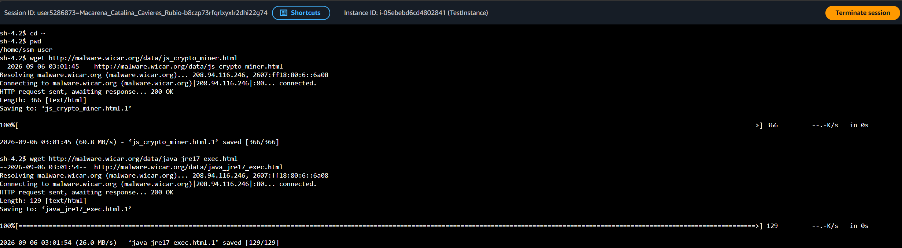
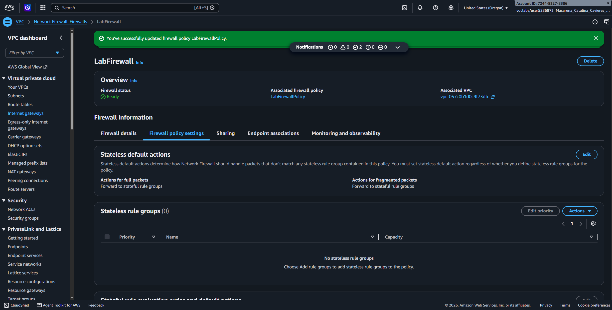
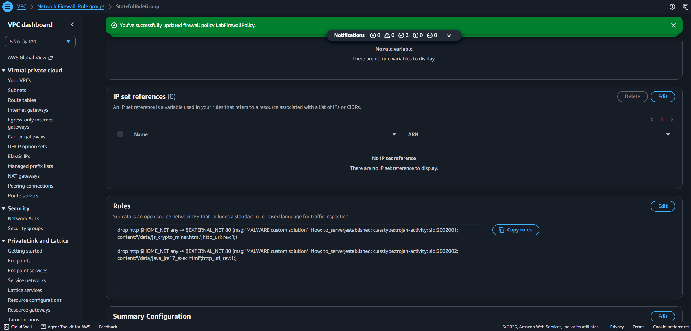
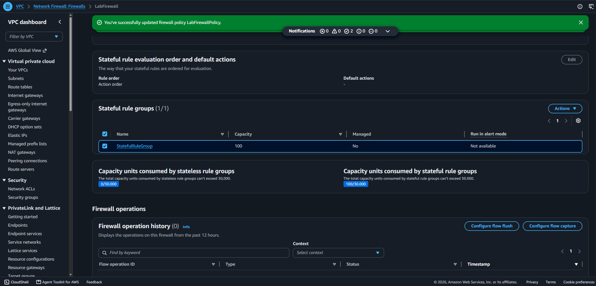
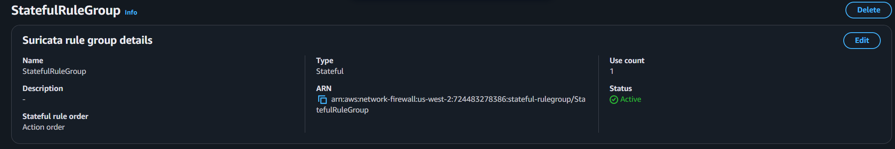
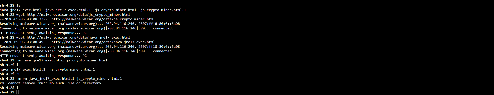

# Lab 280 Protección contra Malware mediante AWS Network Firewall y Reglas Suricata


## Descripcion General

En este laboratorio practico se implemento una solucion de inspeccion profunda de trafico de red utilizando **AWS Network Firewall** para mitigar la descarga accidental de software malicioso en una infraestructura corporativa sobre **Amazon VPC**. Se inspeccionaron las politicas del firewall, se habilitaron motores de inspeccion con estado (_stateful inspection_) y se escribieron reglas personalizadas con sintaxis de **Suricata IPS** para bloquear peticiones HTTP salientes dirijidas a recursos y archivos de malware especificos.

## Objetivos del Laboratorio

- Inspeccionar y actualizar politicas de inspeccion sin estado (_stateless_) y con estado (_stateful_) en AWS Network Firewall.
- Crear un grupo de reglas con estado (_Stateful Rule Group_) utilizando sintaxis compatible con Suricata IPS.
- Definir reglas criptograficas y de red para bloquear descargas especificas a nivel de aplicacion (HTTP URI).
- Vincular el grupo de reglas a la politica activa del firewall de la red corporativa.
- Validar experimentalmente la denegacion de trafico saliente desde una instancia de Amazon EC2 expuesta mediante AWS Systems Manager Session Manager.

## Tarea 1: Confirmacion de Accesibilidad Inicial

Se inicio sesion en la instancia de prueba `TestInstance` mediante **AWS Systems Manager Session Manager** para simular la descarga no autorizada de artefactos maliciosos mediante comandos `wget`:

```bash
cd ~
pwd
wget [http://malware.wicar.org/data/js_crypto_miner.html](http://malware.wicar.org/data/js_crypto_miner.html)
wget [http://malware.wicar.org/data/java_jre17_exec.html](http://malware.wicar.org/data/java_jre17_exec.html)
ls
```

- **Resultado:** El firewall predeterminado permitió el paso del tráfico HTTP saliente y se confirmaron los archivos descargados en el sistema local, evidenciando la brecha de seguridad a resolver.


_Figura 1: Llamado a los artefactos maliciosos_

## Tarea 2: Inspección y Configuración de la Política del Firewall

Se navegó a la consola de Amazon VPC para evaluar la configuración de `LabFirewall` y su política `LabFirewallPolicy`:

- **Acción por Defecto Sin Estado (Stateless Default Action)**: Se modificó el comportamiento predeterminado de los paquetes no fragmentados y fragmentados.

- **Configuración Aplicada**: Se estableció el reenvío obligatorio de todo el tráfico saliente hacia los grupos de reglas con estado (_Forward to stateful rule groups_), permitiendo una evaluación contextualmente profunda del tráfico HTTP.


_Figura 2: Inspección de la política del Firewall_

## Tarea 3: Creación del Grupo de Reglas con Estado (Suricata IPS)

Se creó un nuevo grupo de reglas con estado denominado `StatefulRuleGroup` con una capacidad reservada de 100 unidades y configurado para procesar reglas compatibles con Suricata IPS.

### Reglas de Inspección Aplicadas:

```bash
drop http $HOME_NET any ->$EXTERNAL_NET 80 (msg:"MALWARE custom solution"; flow: to_server,established; classtype:trojan-activity; sid:2002001; content:"/data/js_crypto_miner.html";http_uri; rev:1;)

drop http $HOME_NET any ->$EXTERNAL_NET 80 (msg:"MALWARE custom solution"; flow: to_server,established; classtype:trojan-activity; sid:2002002; content:"/data/java_jre17_exec.html";http_uri; rev:1;)
```

- **Funcionamiento**: Estas reglas inspeccionan el encabezado de aplicación `http_uri`. Si una petición desde `$HOME_NET` dirigida al puerto 80 externo contiene las rutas especificadas, la conexión es descartada de inmediato (drop).


_Figura 3: Regla Suricata_

## Tarea 4: Vinculación del Grupo de Reglas al Firewall

Se asoció el grupo de reglas `StatefulRuleGroup` a la política `LabFirewallPolicy` dentro de la sección de grupos de reglas con estado, propagando de manera automática y sin interrupciones el nuevo conjunto de políticas a la infraestructura de `LabFirewall`.


_Figura 4: Detalles del grupo de reglas con Estado_


_Figura 5: Detalle de la Regla Suricata_

## Tarea 5: Validación y Prueba de la Solución

Se retornó a la consola de la instancia `TestInstance` para reintentar la descarga de los archivos maliciosos:

```bash
cd ~
wget [http://malware.wicar.org/data/js_crypto_miner.html](http://malware.wicar.org/data/js_crypto_miner.html)
# Resultado: HTTP request sent, awaiting response... (Bloqueado por el Firewall)

wget [http://malware.wicar.org/data/java_jre17_exec.html](http://malware.wicar.org/data/java_jre17_exec.html)
# Resultado: HTTP request sent, awaiting response... (Bloqueado por el Firewall)

# Limpieza de artefactos previos
rm java_jre17_exec.html js_crypto_miner.html
ls
```

- Resultado: Las peticiones quedaron suspendidas indefinidamente en espera de respuesta debido a que el paquete fue descartado por el firewall con estado.

- Limpieza: Se removieron exitosamente los archivos descargados durante la Tarea 1.


_Figura 6: Captura de las peticiones y limpieza_

## Resumen de Recursos y Componentes

| Servicio / Recurso       | Nombre del Componente | Descripción y Función Técnica                                                                            |
| :----------------------- | :-------------------- | :------------------------------------------------------------------------------------------------------- |
| **AWS Network Firewall** | `LabFirewall`         | Firewall de red administrado que proporciona inspección de tráfico y protección perimetral para VPC.     |
| **VPC Firewall Policy**  | `LabFirewallPolicy`   | Definición de reglas lógicas que dicta la transición de paquetes entre el motor sin estado y con estado. |
| **Stateful Rule Group**  | `StatefulRuleGroup`   | Conjunto de reglas avanzadas basadas en Suricata para inspección de paquetes con contexto de conexión.   |
| **Amazon EC2**           | `TestInstance`        | Servidor de pruebas Linux en subred privada utilizado para simular las peticiones de descarga.           |

## Evidencia en Video

Mira la ejecución de este laboratorio paso a paso en mi canal de YouTube: \
[](https://www.youtube.com/watch?v=KB1TOUDopuk)

## Conclusiones del Laboratorio

- **Inspección Profunda de Paquetes (DPI)**: La combinación de reglas con estado y motores compatibles con Suricata permite auditar el contenido HTTP URI y no limitarse a filtrar únicamente direcciones IP o puertos.

- **Transición Stateless a Stateful**: Configurar el reenvío dinámico desde el motor sin estado hacia el motor con estado optimiza el procesamiento sin perder la capacidad de analítica avanzada.

- **Proteccion de Red Centralizada**: AWS Network Firewall permite aislar amenazas a nivel de VPC antes de que los vectores de malware alcancen los endpoints o servidores finales de la organización.
