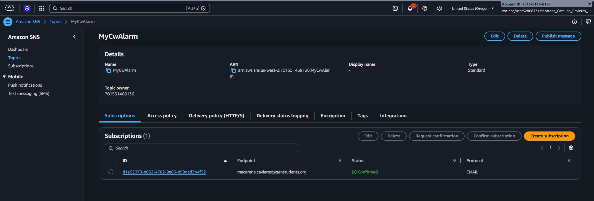
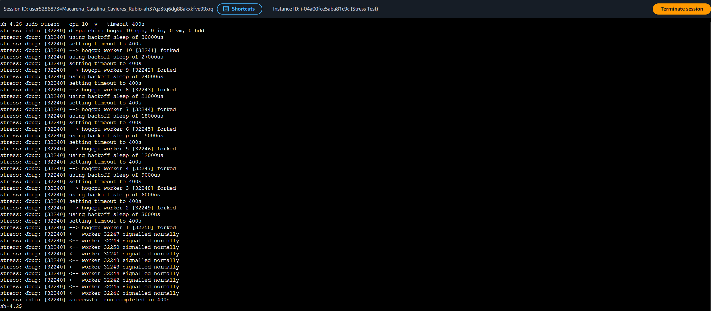
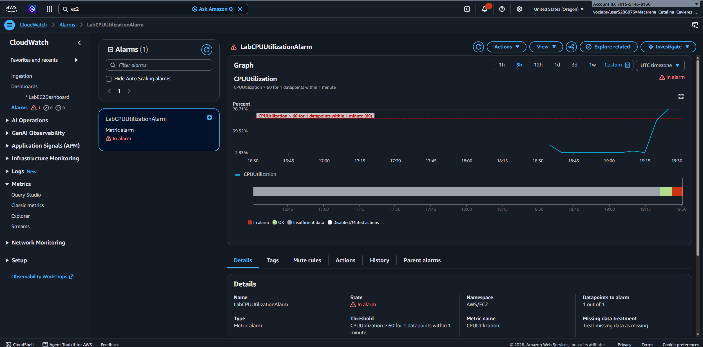
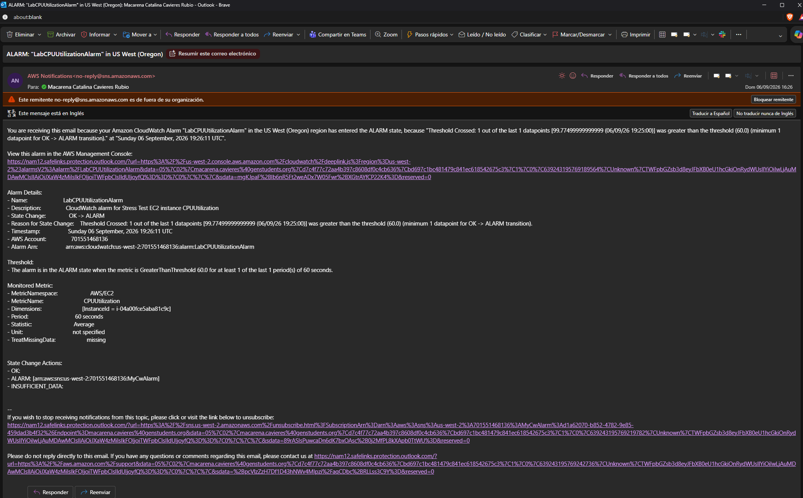
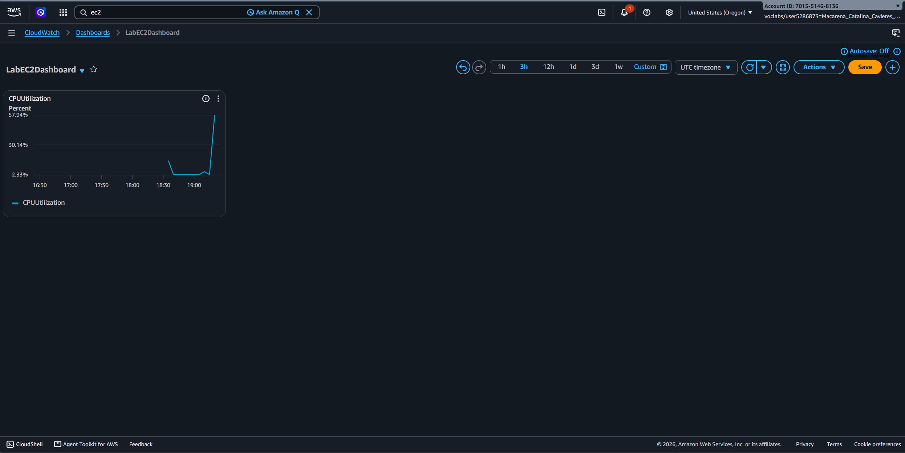

# Lab 281 Supervisión de una Instancia Amazon EC2 con Amazon CloudWatch y Amazon SNS


## Descripción General

En este laboratorio práctico se configuró un sistema de observabilidad y alerta automatizada sobre **Amazon CloudWatch** y **Amazon Simple Notification Service (Amazon SNS)** para supervisar la infraestructura de cómputo en **Amazon EC2**. Se aprovisiono un tema de notificaciones con suscripción por correo electrónico, se definieron alarmas basadas en umbrales estáticos de rendimiento de CPU, se simuló una carga de trabajo anómala mediante una prueba de estres de recursos en Linux y se consolidó un panel de control personalizado (_dashboard_) para monitoreo visual en tiempo real.

## Objetivos del Laboratorio

- Crear y confirmar un tema de notificaciones en Amazon Simple Notification Service (Amazon SNS) mediante protocolo de correo electrónico.
- Configurar métricas personalizadas y alarmas de rendimiento en Amazon CloudWatch para métricas de utilización de CPU.
- Simular consumo extremo de recursos en la instancia de Amazon EC2 utilizando la herramienta de línea de comandos `stress`.
- Validar la transición de estado de la alarma a `In alarm` y la llegada automática de notificaciones P2A (_Application-to-Person_).
- Construir un panel de control (_CloudWatch Dashboard_) con widgets de líneas temporales para visualización unificada.

## Tarea 1: Configuración de Amazon SNS

Se creó la canalización de notificaciones para emitir alertas operativas:

- **Tipo de Tema:** Standard (Estándar).
- **Nombre del Tema:** `MyCwAlarm`.
- **Protocolo de Suscripción:** Email.
- **Punto de Enlace (Endpoint):** Se especificó la dirección de correo electrónico del administrador.
- **Validación de Suscripcion:** Se confirmó la suscripción mediante el enlace enviado por el servicio, pasando el estado de `Pending confirmation` a `Confirmed`.

## Tarea 2: Creación de la Alarma de Amazon CloudWatch

Se configuró una alarma de metrica sobre la instancia `Stress Test` para detectar posibles comportamientos anómalos o intrusiones:

- **Métrica:** `CPUUtilization` (Servicio EC2 -> Métricas por instancia).
- **Estadística:** Promedio (_Average_).
- **Período:** 1 minuto.
- **Tipo de Umbral:** Estático (`Greater > 60%`).
- **Acción de Alarma:** Notificar al tema de Amazon SNS `MyCwAlarm` al entrar en estado `In alarm`.
- **Nombre de Alarma:** `LabCPUUtilizationAlarm`.


_Figura 1: Alarma de Amazon CloudWatch_

## Tarea 3: Ejecución de Prueba de Estrés y Validación de Alerta

Se realizó la conexión a la instancia de Amazon EC2 mediante **AWS Systems Manager Session Manager** y se ejecutó una simulación de consumo de recursos:

```bash
sudo stress --cpu 10 -v --timeout 400s
```

En una segunda terminal conectada vía Session Manager, se válido la carga en vivo del procesador:

```bash
top
```


_Figura 2: Prueba de estrés_

- **Resultado Operativo:** El comando `stress` elevó la carga de procesamiento al 100% durante 400 segundos.
- **Transición de Estado:** El gráfico de CloudWatch reflejó el incremento por encima del umbral del 60%, cambiando el estado de la alarma a `In alarm`.
- **Notificación:** Se confirmó la recepción de la alerta enviada por correo electrónico por parte de Amazon SNS notificando la desviación de la métrica.


_Figura 3: Resultado operativo en la alarma CloudWatch_


_Figura 4: Notificación por correo de la alarma_

## Tarea 4: Creación de un Panel de Control en Amazon CloudWatch

Se construyó una interfaz gráfica centralizada (_Dashboard_) para la visualización continua de las métricas del servidor:

- **Nombre del Panel:** `LabEC2Dashboard`.
- **Tipo de Widget:** Línea (_Line Chart_).
- **Métrica Incorporada:** `CPUUtilization` asociada a la instancia `Stress Test`.


_Figura 5: Panel de CloudWatch creado_

## Resumen de Recursos y Componentes

| Servicio / Recurso    | Nombre del Componente    | Descripción y Función Técnica                                                                     |
| :-------------------- | :----------------------- | :------------------------------------------------------------------------------------------------ |
| **Amazon SNS**        | `MyCwAlarm`              | Tema de notificaciones estándar utilizado para la distribución de alertas por correo electrónico. |
| **Amazon CloudWatch** | `LabCPUUtilizationAlarm` | Regla de monitoreo configurada para evaluar la métrica de utilización de CPU cada minuto.         |
| **Amazon CloudWatch** | `LabEC2Dashboard`        | Panel de control gráfico para monitoreo unificado de rendimiento en tiempo real.                  |
| **Amazon EC2**        | `Stress Test`            | Instancia Linux sometida a sobrecarga computacional simulada mediante la utilidad `stress`.       |

## Evidencia en Video

Mira la ejecución de este laboratorio paso a paso en mi canal de YouTube: \
[](https://www.youtube.com/watch?v=bsqoQtlttAI)

## Conclusiones del Laboratorio

- **Respuesta Automática a Incidentes:** La integración nativa entre CloudWatch Alarms y Amazon SNS permite detectar patrones inusuales de uso de procesador (como minería no autorizada o ejecución de malware) de forma reactiva e inmediata.
- **Granularidad de Observabilidad:** Reducir el período de evaluación a intervalos de 1 minuto acorta el tiempo medio de detección (MTTD) ante fallas o ataques en la infraestructura.
- **Centralización Visiva:** La creación de paneles personalizados facilita el seguimiento continuo de los indicadores clave de rendimiento (KPI) sin necesidad de consultar registros o métricas aisladas.
