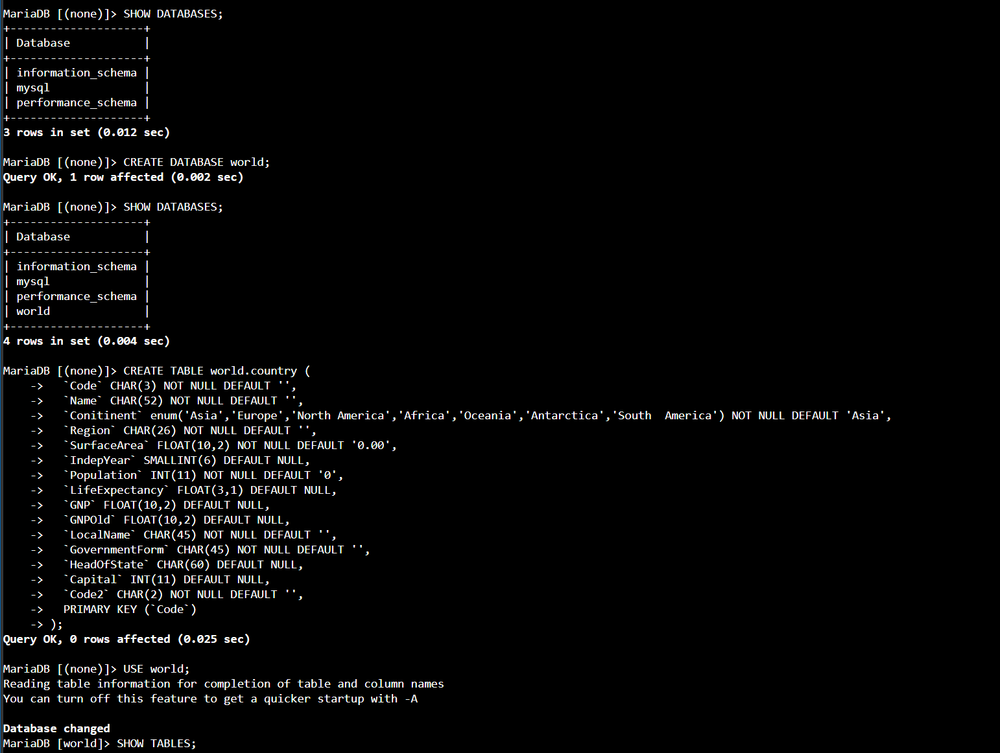
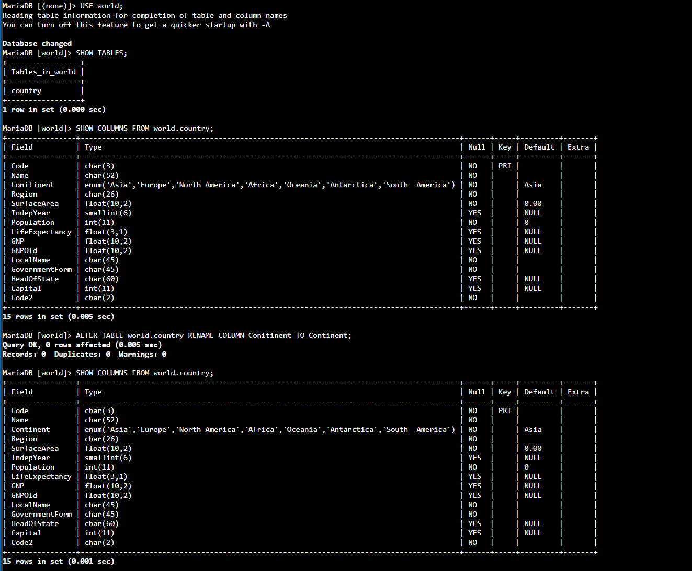
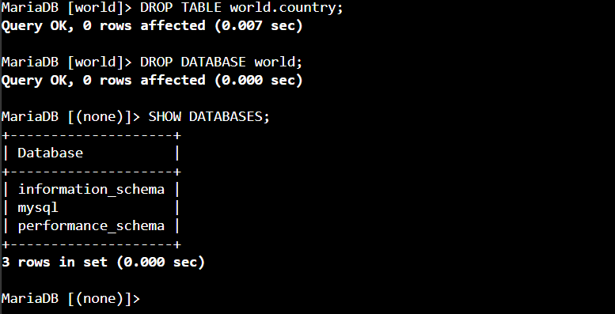

# Lab 268 Módulo de Bases de Datos - Operaciones de Tabla


## Descripción del Laboratorio

En este laboratorio práctico se realizaron operaciones fundamentales de administración y gestión de esquemas en una base de datos relacional MySQL sobre la infraestructura de AWS. Se accedió a una instancia Amazon EC2 (Command Host) mediante AWS Systems Manager Session Manager, interactuando directamente con el cliente de línea de comandos de MySQL para ejecutar sentencias de lenguaje de definición de datos (DDL). Durante la práctica se aprovisionó una nueva base de datos, se crearon y modificaron estructuras de tablas relacionales para corregir errores tipográficos en el esquema, y se practicó el borrado definitivo de tablas y bases de datos.

## Objetivos del Laboratorio

- Establecer conexión remota a una instancia de Amazon EC2 e interactuar con el motor de base de datos MySQL desde la línea de comandos.
- Usar el enunciado `CREATE` para la creación de bases de datos y tablas relacionales con tipos de datos bien definidos.
- Usar el enunciado `SHOW` para inspeccionar bases de datos, tablas y la estructura de columnas existentes.
- Usar el enunciado `ALTER` para modificar y corregir el esquema de una tabla en producción.
- Usar el enunciado `DROP` para realizar la eliminación segura y definitiva de tablas y bases de datos.

## Tarea 1: Creación e Inspección de la Base de Datos y Tabla

Inspección inicial de las bases de datos disponibles en la instancia:

```sql
SHOW DATABASES;
```

Creación de la base de datos `world` y verificación de su existencia:

```sql
CREATE DATABASE world;
SHOW DATABASES;
```

A continuación, se definió el esquema de la tabla `country` conteniendo múltiples tipos de datos (`CHAR`, `ENUM`, `FLOAT`, `SMALLINT`, `INT`) y una clave primaria (`PRIMARY KEY`):

```sql
CREATE TABLE world.country (
  `Code` CHAR(3) NOT NULL DEFAULT '',
  `Name` CHAR(52) NOT NULL DEFAULT '',
  `Conitinent` enum('Asia','Europe','North America','Africa','Oceania','Antarctica','South America') NOT NULL DEFAULT 'Asia',
  `Region` CHAR(26) NOT NULL DEFAULT '',
  `SurfaceArea` FLOAT(10,2) NOT NULL DEFAULT '0.00',
  `IndepYear` SMALLINT(6) DEFAULT NULL,
  `Population` INT(11) NOT NULL DEFAULT '0',
  `LifeExpectancy` FLOAT(3,1) DEFAULT NULL,
  `GNP` FLOAT(10,2) DEFAULT NULL,
  `GNPOld` FLOAT(10,2) DEFAULT NULL,
  `LocalName` CHAR(45) NOT NULL DEFAULT '',
  `GovernmentForm` CHAR(45) NOT NULL DEFAULT '',
  `HeadOfState` CHAR(60) DEFAULT NULL,
  `Capital` INT(11) DEFAULT NULL,
  `Code2` CHAR(2) NOT NULL DEFAULT '',
  PRIMARY KEY (`Code`)
);
```


_Figura 1: Sentencias ejecutados para mostrar las bases de datos, crear la base de datos `world` y crear la tabla `world.country`_

Selección de la base de datos y validación de las tablas creadas:

```sql
USE world;
SHOW TABLES;
```

Inspección de las columnas y propiedades de la tabla `country`:

```sql
SHOW COLUMNS FROM world.country;
```

Corrección de un error tipográfico en la columna `Conitinent` modificando el esquema mediante `ALTER TABLE`:

```sql
ALTER TABLE world.country RENAME COLUMN Conitinent TO Continent;
SHOW COLUMNS FROM world.country;
```


_Figura 2: Sentencias para mostrar las tablas, mostrar las columnas de la tabla y corregir el nombre de la columna_

### Desafío 1: Creación de Tabla

Creación de la tabla `city` dentro de la base de datos `world` definiendo las columnas `Name` y `Region` con el tipo de datos `CHAR`:

```sql
CREATE TABLE world.city (
  `Name` CHAR(52),
  `Region` CHAR(26)
);
```

## Tarea 2: Eliminación de Tablas y Base de Datos

Eliminación de la tabla `city` mediante el comando `DROP TABLE`:

```sql
DROP TABLE world.city;
```

### Desafío 2: Eliminación de Tabla

Eliminación de la tabla `country` mediante el comando `DROP TABLE`:

```sql
DROP TABLE world.country;
```

### Verificación Final de Limpieza

Verificación de que no existen tablas remanentes dentro de la base de datos:

```sql
SHOW TABLES;
```

Eliminación definitiva de la base de datos `world` y verificación de la instancia:

```sql
DROP DATABASE world;
SHOW DATABASES;
```

 \
_Figura 3: Limpieza de las tablas y bases de datos_

## Resumen de Recursos y Componentes

| Servicio / Recurso      | Nombre del Componente | Descripción y Función Técnica                                                                                  |
| :---------------------- | :-------------------- | :------------------------------------------------------------------------------------------------------------- |
| **Amazon EC2**          | `Command Host`        | Instancia Linux que actúa como host cliente con las herramientas de MySQL CLI preinstaladas.                   |
| **AWS Systems Manager** | `Session Manager`     | Herramienta de gestión que permite la conexión segura por terminal a la instancia sin exponer puertos SSH.     |
| **MySQL Engine**        | Base de Datos `world` | Base de datos relacional creada para hospedar los esquemas y las tablas del laboratorio.                       |
| **MySQL Engine**        | Tabla `country`       | Tabla relacional principal estructurada con llaves primarias, valores predeterminados y restricciones de tipo. |
| **MySQL Engine**        | Tabla `city`          | Tabla auxiliar creada para ejercitar la definición de campos de texto y eliminación de objetos.                |

## Evidencia en Video

Mira la ejecución de este laboratorio paso a paso en mi canal de YouTube: \
[](https://www.youtube.com/watch?v=W1F6r7Ny5sU)

## Conclusiones del Laboratorio

- **Gestión Precisa de Esquemas (DDL)**: El conocimiento de las sentencias `CREATE`, `ALTER` y `DROP` es fundamental para mantener la integridad y la evolución continua del modelo de datos sin necesidad de reconstruir las tablas desde cero.

- **Auditoría e Inspección Directa**: El uso de comandos como `SHOW COLUMNS` permite validar detalladamente las restricciones, valores por defecto y tipos de datos configurados, facilitando la detección temprana de errores tipográficos antes de insertar información.

- **Acceso Seguro a Bases de Datos**: La combinación de AWS Session Manager junto con el cliente MySQL proporciona un método seguro de administración en la nube, evitando la apertura de puertos públicos para la gestión de infraestructura de base de datos.
