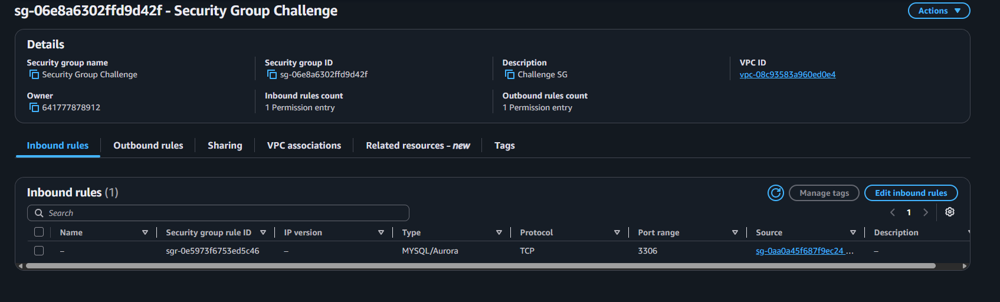
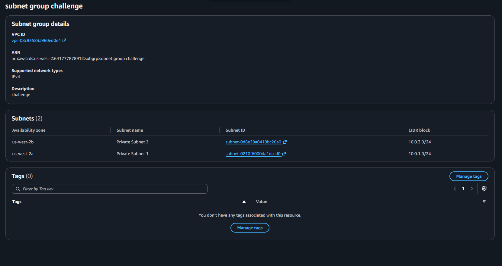
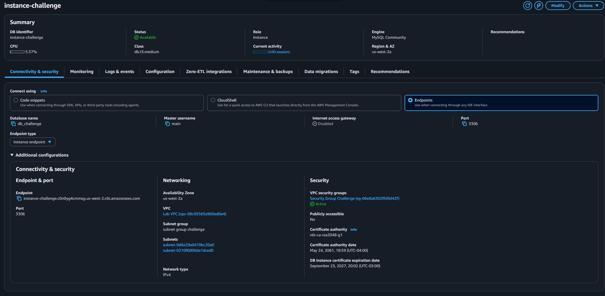
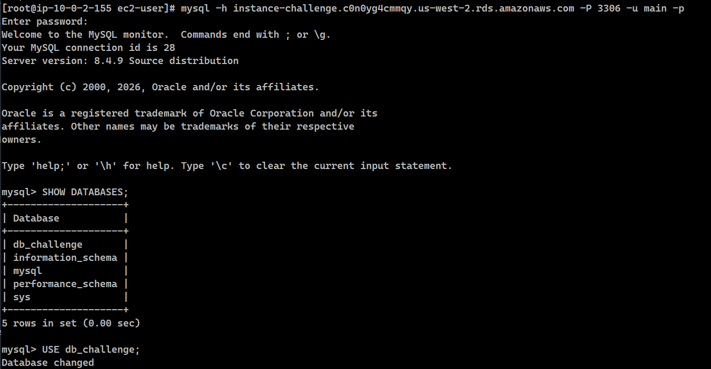
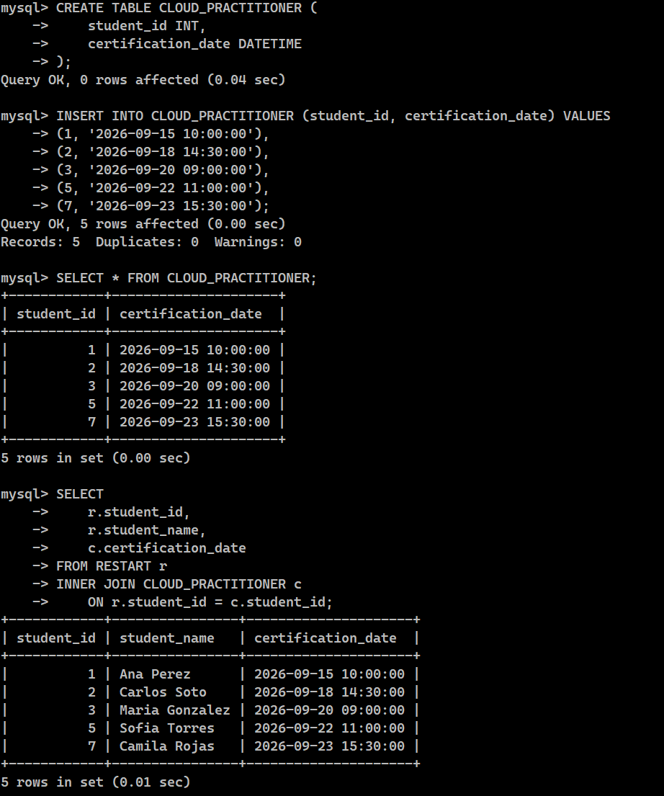

# Lab 162 Desafío: Creación y Gestión de Servidor de Base de Datos Amazon RDS MySQL


## Descripción General

En este laboratorio de desafío práctico se diseñó, aprovisionó y configuró una base de datos relacional administrada utilizando **Amazon RDS (MySQL)** dentro de un entorno aislado de red. Se establecieron las reglas de control de acceso mediante grupos de seguridad (_Security Groups_) y grupos de subredes (_DB Subnet Groups_) para garantizar que la base de datos no permanezca expuesta directamente a Internet. Posteriormente, se realizó la conexión segura desde una instancia cliente **Amazon EC2** mediante la interfaz de línea de comandos de MySQL (`mysql-cli`), creando tablas relacionales (`RESTART` y `CLOUD_PRACTITIONER`), insertando datos de prueba y ejecutando consultas complejas con operaciones de combinación relacional (`INNER JOIN`).

## Arquitectura de Red y Conectividad

La arquitectura implementa el principio de mínimo privilegio en red: la instancia **Amazon RDS** reside en subredes privadas y únicamente acepta tráfico entrante en el puerto `3306` procedente explícitamente del grupo de seguridad de la instancia **Amazon EC2**.

```text
+------------------+         Security Group (Puerto 3306)         +--------------------+
|   Amazon EC2     | -------------------------------------------> |   Amazon RDS       |
| (MySQL Client)   |  [Origen: Web Security Group (EC2 SG)]       | (MySQL Engine)     |
+------------------+                                              +--------------------+
```

## Objetivos del Laboratorio

- Crear y configurar un **Security Group** y un **DB Subnet Group** para restringir y aislar el tráfico de la base de datos dentro de la VPC.
- Aprovisionar una instancia de base de datos relacional **Amazon RDS MySQL** (Single-AZ) con acceso público desactivado.
- Establecer conexión remota desde una instancia **Amazon EC2** usando la línea de comandos de MySQL.
- Diseñar esquemas relacionales ejecutando sentencias DDL (`CREATE TABLE`, `DESCRIBE`).
- Insertar registros de prueba mediante sentencias DML (`INSERT INTO`) y consultar su almacenamiento (`SELECT`).
- Realizar consultas relacionales cruzadas entre múltiples tablas aplicando operadores `INNER JOIN`.

## Paso 1: Configurar la Capa de Red y Seguridad

### 1. Crear el Grupo de Seguridad para RDS

1. En la consola de AWS, navegar a **VPC** > **Security Groups** > **Create security group**.
2. Configurar los detalles principales:
   - **Security group name:** `rds-sg-challenge`
   - **VPC:** Seleccionar `Lab VPC`.
3. Configurar la regla de entrada (**Inbound rules**):
   - **Type:** `MySQL/Aurora` (Puerto `3306`).
   - **Source:** Custom -> Seleccionar el **Web Security Group** (asociado a la EC2).


_Figura 1: Detalles del Security Group_

### 2. Crear el DB Subnet Group

1. Navegar a **RDS** > **Subnet groups** > **Create DB subnet group**.
2. Definir los parámetros:
   - **Name:** `subnet-group-challenge`
   - **VPC:** `Lab VPC`
3. Seleccionar las subredes privadas asociadas a dos zonas de disponibilidad (`us-west-2a` y `us-west-2b`) utilizando los bloques CIDR `10.0.1.0/24` y `10.0.3.0/24`.


_Figura 2: Detalles del Subred Group_

## Paso 2: Aprovisionar la Instancia Amazon RDS

1. En la consola de **RDS**, seleccionar **Databases** > **Create database**.
2. Configurar los parámetros del motor y la instancia:
   - **Engine type:** `MySQL`
   - **Templates:** `Dev/Test`
   - **Availability and durability:** Single-AZ (Sin instancia Standby).
   - **DB instance identifier:** `instance-challenge`
   - **Master username:** `main`
   - **Master password:** _Configurar contraseña segura_
   - **DB instance class:** Instancias Burstable (`db.t3.micro` o `db.t3.small`).
   - **Storage type:** General Purpose SSD (gp2) de hasta 100 GB.
3. Configuración de conectividad y seguridad:
   - **Virtual Private Cloud (VPC):** `Lab VPC`
   - **DB subnet group:** `subnet-group-challenge`
   - **Public access:** `No`
   - **VPC security group:** Choose existing -> Seleccionar `rds-sg-challenge` y remover el `default`.
4. Configuración adicional:
   - **Initial database name:** `db_challenge`
   - **Enhanced Monitoring:** Desactivar.


_Figura 3: Aprovisionamiento de la isntancia de Amazon RDS_

## Paso 3: Conexión SSH y Cliente MySQL desde EC2

1. Conectarse a la instancia **LinuxServer (EC2)** mediante SSH (utilizando la clave `.pem` o `.ppk`).
2. Obtener el **Endpoint** asignado a la instancia RDS desde la consola de AWS.
3. Ejecutar el comando para conectarse al servidor MySQL administrado:

```bash
mysql -h <ENDPOINT_RDS> -P 3306 -u main -p
```

4. Tras ingresar la contraseña, seleccionar la base de datos inicial:

```sql
USE db_challenge;
```


_Figura 4: Conexión SSH y Cliente desde EC2_

## Paso 4: Creación de Esquemas DDL y Modificación DML

1. Tabla `RESTART`
   Creación de la tabla principal de estudiantes:

```sql
CREATE TABLE RESTART (
    student_id INT PRIMARY KEY,
    student_name VARCHAR(100),
    restart_city VARCHAR(100),
    graduation_date DATETIME
);

DESCRIBE RESTART;
```

Inserción de 10 filas de muestra:

```sql
INSERT INTO RESTART (student_id, student_name, restart_city, graduation_date) VALUES
(1, 'Ana Perez', 'Santiago', '2026-12-15 10:00:00'),
(2, 'Carlos Soto', 'Valparaiso', '2026-11-20 14:30:00'),
(3, 'Maria Gonzalez', 'Concepcion', '2027-01-10 09:00:00'),
(4, 'Diego Ramirez', 'Santiago', '2026-12-05 11:30:00'),
(5, 'Sofia Torres', 'La Serena', '2027-02-18 15:00:00'),
(6, 'Javier Morales', 'Temuco', '2027-01-25 10:30:00'),
(7, 'Camila Rojas', 'Santiago', '2026-11-30 13:00:00'),
(8, 'Felipe Castro', 'Puerto Montt', '2027-03-05 09:30:00'),
(9, 'Valentina Silva', 'Rancagua', '2027-02-10 16:00:00'),
(10, 'Sebastian Munoz', 'Antofagasta', '2027-03-20 12:00:00');

SELECT * FROM RESTART;
```


_Figura 5: Creación tabla Restart e inserción de datos_

2. Tabla `CLOUD_PRACTITIONER`
   Creación de la tabla de certificaciones:

```sql
CREATE TABLE CLOUD_PRACTITIONER (
    student_id INT PRIMARY KEY,
    certification_date DATETIME
);

DESCRIBE CLOUD_PRACTITIONER;
```

Inserción de 5 filas de muestra:

```sql
INSERT INTO CLOUD_PRACTITIONER (student_id, certification_date) VALUES
(1, '2026-09-15 10:00:00'),
(2, '2026-09-18 14:30:00'),
(3, '2026-09-20 09:00:00'),
(5, '2026-09-22 11:00:00'),
(7, '2026-09-23 15:30:00');

SELECT * FROM CLOUD_PRACTITIONER;
```

## Paso 5: Consultas Relacionales Avanzadas (`INNER JOIN`)

Ejecución de un `INNER JOIN` para obtener la información consolidada de los estudiantes que cuentan con la certificación AWS Certified Cloud Practitioner:

```sql
SELECT
    r.student_id,
    r.student_name,
    c.certification_date
FROM RESTART r
INNER JOIN CLOUD_PRACTITIONER c
    ON r.student_id = c.student_id;
```


_Figura 6: Creación tabla `Cloud_Practitioner`, inserción de datos e `INNER JOIN`_

## Resumen de Recursos y Componentes

| Servicio / Recurso     | Nombre del Componente    | Descripción y Función Técnica                                                                                       |
| :--------------------- | :----------------------- | :------------------------------------------------------------------------------------------------------------------ |
| **Amazon RDS**         | `instance-challenge`     | Instancia de base de datos relacional administrada ejecutando el motor MySQL.                                       |
| **VPC Security Group** | `rds-sg-challenge`       | Reglas del firewall virtual que abren únicamente el puerto `3306` para tráfico proveniente de la instancia EC2.     |
| **DB Subnet Group**    | `subnet-group-challenge` | Agrupación de subredes privadas en múltiples zonas de disponibilidad para el despliegue del motor de base de datos. |
| **Amazon EC2**         | `LinuxServer`            | Instancia cliente que ejecuta la utilidad `mysql-cli` para gestionar de forma remota la base de datos RDS.          |
| **Tabla DDL 1**        | `RESTART`                | Tabla relacional para registrar datos demográficos y fechas de graduación de estudiantes.                           |
| **Tabla DDL 2**        | `CLOUD_PRACTITIONER`     | Tabla relacional para almacenar las fechas de obtención de la certificación Cloud Practitioner.                     |

## Conclusiones del Laboratorio

- **Administración Simplificada:** Amazon RDS automatiza la gestión de la infraestructura subyacente, el aprovisionamiento del SO y los parches de seguridad, permitiendo enfocar los esfuerzos exclusivamente en el diseño del modelo de datos y las consultas SQL.
- **Aislamiento y Mínimo Privilegio en Red:** Configurar el acceso público como `No` y limitar el tráfico en el puerto `3306` mediante la referencia explícita al Security Group cliente (EC2 SG) garantiza que la base de datos nunca sea accesible desde Internet público.
- **Flexibilidad Relacional:** Las operaciones `INNER JOIN` demuestran la capacidad de vincular conjuntos de datos distribuidos en distintas tablas mediante el uso de claves primarias y foráneas (`student_id`), optimizando la estructura del modelo de datos relacional.
