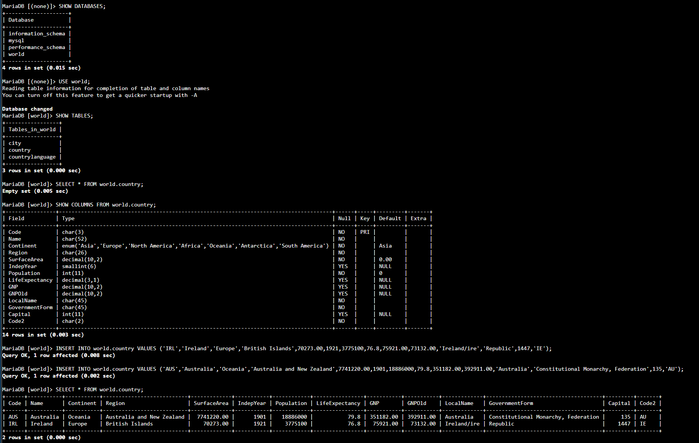
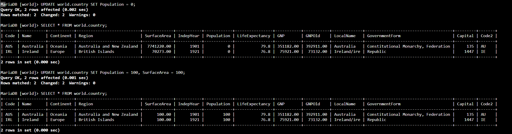
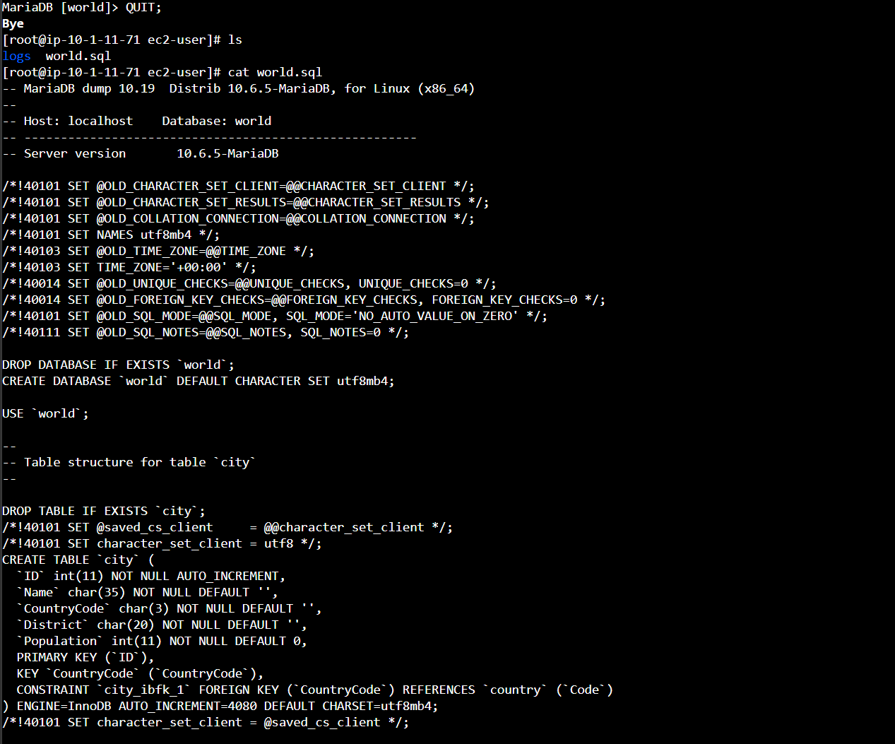
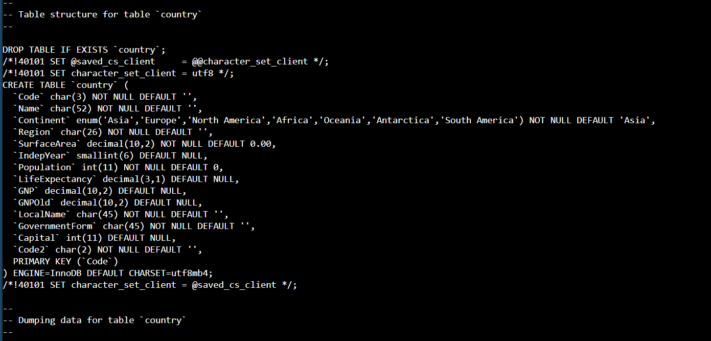
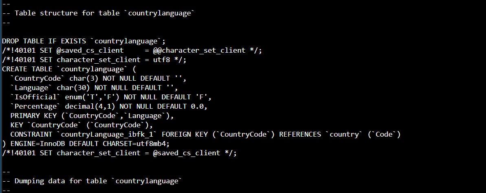
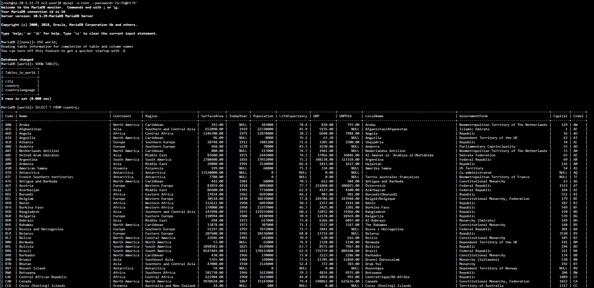

# Lab 269 Manipulación e Importación de Datos en MySQL


## Descripción General

En este laboratorio práctico se realizaron operaciones fundamentales de Lenguaje de Manipulación de Datos (DML) sobre una base de datos relacional MySQL en AWS. Se practicó la inserción directa de registros, la actualización masiva de filas, el borrado de datos y la restauración automatizada de información mediante la importación de un archivo de respaldo SQL (`.sql`) a través de la línea de comandos en una instancia Amazon EC2.

## Objetivos del Laboratorio

- Insertar registros en una tabla relacional mediante el enunciado `INSERT INTO`.
- Modificar el contenido de múltiples filas utilizando el enunciado `UPDATE`.
- Eliminar conjuntos de datos de una tabla mediante el enunciado `DELETE`.
- Importar y poblar tablas masivamente utilizando un archivo de respaldo SQL mediante redirección de entrada.

## Tarea 1: Conexión al Command Host e Instancia de Base de Datos

Se estableció conexión con la instancia _Command Host_ mediante **AWS Systems Manager Session Manager** y se accedió al motor MySQL.

## Tarea 2: Insertar Datos en una Tabla

Se verificó que la tabla `country` se encontrara vacía mediante el enunciado `SELECT`:

```sql
SELECT * FROM world.country;
```

A continuación, se insertaron dos filas de muestra con la instrucción `INSERT INTO`:

```sql
INSERT INTO world.country VALUES ('IRL','Ireland','Europe','British Islands',70273.00,1921,3775100,76.8,75921.00,73132.00,'Ireland/Éire','Republic',1447,'IE');

INSERT INTO world.country VALUES ('AUS','Australia','Oceania','Australia and New Zealand',7741220.00,1901,18886000,79.8,351182.00,392911.00,'Australia','Constitutional Monarchy, Federation',135,'AU');
```

Se validó la correcta inserción de los registros:

```sql
SELECT * FROM world.country;
```


_Figura 1: Captura de la tarea 2 en la terminal_

## Tarea 3: Actualizar Filas en una Tabla

Se ejecutó un enunciado `UPDATE` sin cláusula `WHERE` para modificar la columna `Population` en todas las filas existentes:

```sql
UPDATE world.country SET Population = 0;
SELECT * FROM world.country;
```

Posteriormente, se actualizaron múltiples columnas simultáneamente (`Population` y `SurfaceArea`):

```sql
UPDATE world.country SET Population = 100, SurfaceArea = 100;
SELECT * FROM world.country;
```


_Figura 2: Captura de la tarea 3 en la terminal_

## Tarea 4: Eliminar Filas de una Tabla

Se ejecutó la instrucción `DELETE` para remover la totalidad de los registros almacenados en la tabla country:

```sql
DELETE FROM world.country;
SELECT * FROM world.country;
```


_Figura 3: Captura de la tarea 4 en la terminal_

## Tarea 5: Importar Datos con un Archivo SQL

Se finalizó la sesión actual de MySQL para retornar al intérprete de comandos de Linux:

```sql
QUIT;
```

Se verificó la existencia del archivo de respaldo `/home/ec2-user/world.sql`.


_Figura 4: Captura de pantalla de la verificación del archivo `.sql`_


_Figura 5: Captura de pantalla de la verificación del archivo `.sql` (continuación)_


_Figura 6: Captura de pantalla de la verificación del archivo `.sql` (continuación)_

Se ejecutó la importación masiva mediante la herramienta CLI de MySQL:

```bash
ls /home/ec2-user/world.sql
mysql -u root --password='re:St@rt!9' < /home/ec2-user/world.sql
```

Finalmente, se reestableció la conexión al motor de base de datos para validar la creación de nuevas tablas (`city`, `country`, `countrylanguage`) y el correcto cargamento masivo de información:

```bash
mysql -u root --password='re:St@rt!9'
```

```sql
USE world;
SHOW TABLES;
SELECT * FROM country;
SELECT * FROM city;
SELECT * FROM countrylanguage;
```


_Figura 7: Verificación de la tabla `country` creada_

## Resumen de Recursos y Componentes

| Servicio / Recurso      | Nombre del Componente | Descripción y Función Técnica                                                                 |
| :---------------------- | :-------------------- | :-------------------------------------------------------------------------------------------- |
| **Amazon EC2**          | `Command Host`        | Instancia Linux utilizada como entorno de ejecución cliente para la gestión de base de datos. |
| **AWS Systems Manager** | `Session Manager`     | Servicio de acceso remoto seguro a la terminal interactiva de la instancia EC2.               |
| **MySQL Engine**        | Base de Datos `world` | Esquema relacional objeto de las operaciones DML y destino del archivo de respaldo.           |
| **Linux Shell**         | Archivo `world.sql`   | Script con sentencias SQL predefinidas para la reconstrucción e importación masiva de datos.  |

## Conclusiones del Laboratorio

- **Impacto de Sentencias DML sin Filtro:** La ejecución de comandos `UPDATE` o `DELETE` sin una cláusula `WHERE` afecta a la totalidad de las filas de una tabla, lo que resalta la importancia de validar las condiciones antes de aplicar modificaciones destructivas.
- **Eficiencia en Carga Masiva de Datos:** El uso de archivos de respaldo `.sql` combinados con la redirección de entrada en CLI permite restaurar estructuras y registros masivos de manera más ágil y automatizada que la inserción manual fila por fila.
- **Verificación de Esquemas Relacionales:** La consulta continua del estado de las tablas asegura el control de calidad tras operaciones de manipulación o migración de datos.
