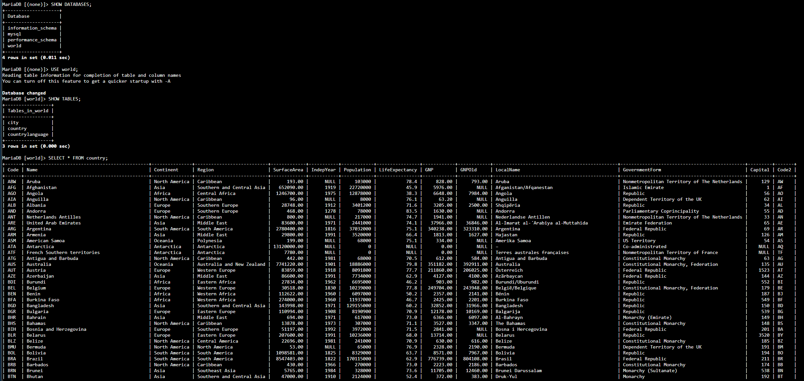
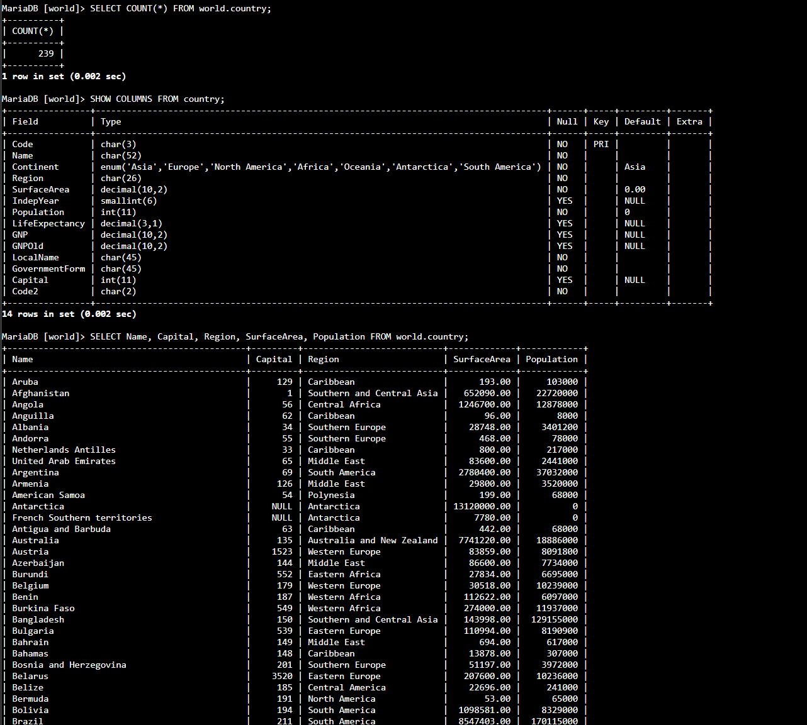
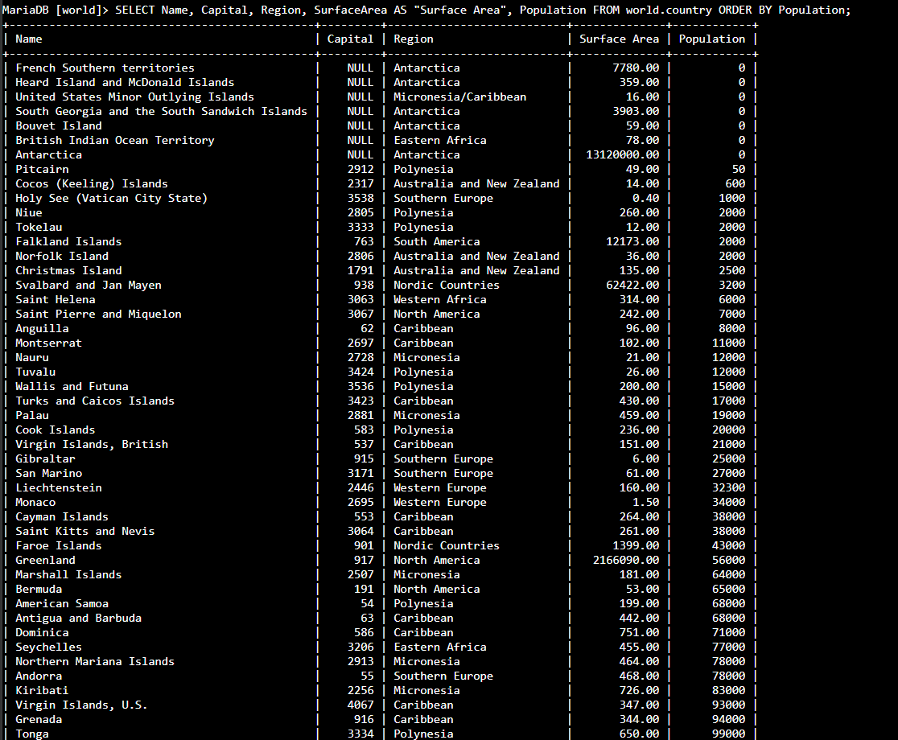
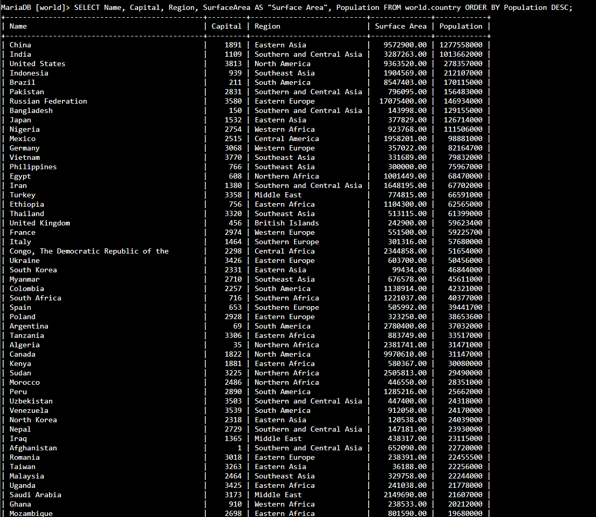
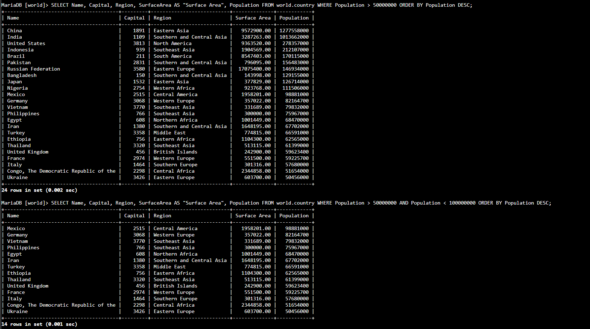
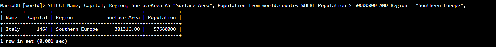

# Lab 270 Consulta de Datos con Enunciados SELECT en MySQL


## Descripción General

En este laboratorio práctico se ejecutaron operaciones de consulta y filtrado sobre una base de datos relacional MySQL en AWS. Para realizar las actividades, se accedió a la instancia _Command Host_ mediante **AWS Systems Manager Session Manager** y se utilizaron sentencias de lenguaje de consulta (`SELECT`), funciones de agregación (`COUNT`), alias de columnas (`AS`), ordenamiento (`ORDER BY`) y filtrado avanzado mediante operadores lógicos y de comparación (`WHERE`, `>`, `<`, `=`, `AND`).

## Objetivos del Laboratorio

- Consultar registros en una base de datos relacional mediante la sentencia `SELECT`.
- Contar el volumen total de filas almacenadas en una tabla con la función de agregación `COUNT()`.
- Proyectar columnas específicas y renombrar campos en la salida mediante la opción `AS`.
- Ordenar los conjuntos de resultados de forma ascendente y descendente mediante `ORDER BY` y `DESC`.
- Aplicar filtros con condiciones múltiples utilizando la cláusula `WHERE` y los operadores `>`, `<`, `=` y `AND`.

## Tarea 1: Conexión al Command Host e Instancia de Base de Datos

Se estableció conexión con la instancia _Command Host_ mediante **AWS Systems Manager Session Manager** y se accedió al motor MySQL.

## Tarea 2: Consultar la Base de Datos World

Previo a la ejecución de consultas, se realizó la conexión al _Command Host_ mediante Session Manager, se elevaron privilegios a usuario root (`sudo su`) y se ingresó al motor MySQL (`mysql -u root --password='re:St@rt!9'`).

1. Inspección de las bases de datos disponibles en la instancia:

```sql
SHOW DATABASES;
```

2. Consulta de la totalidad de registros almacenados en la tabla `country`:

```sql
SELECT * FROM world.country;
```


_Figura 1: Captura de pantalla de los comandos pasos 1 y 2_

3. Conteo de filas de la tabla mediante la función agregada `COUNT()`:

```sql
SELECT COUNT(*) FROM world.country;
```

4. Inspección de la estructura y propiedades de las columnas en la tabla `country`:

```sql
SHOW COLUMNS FROM world.country;
```

5. Proyección de campos específicos (`Name`, `Capital`, `Region`, `SurfaceArea`, `Population`) desde la tabla `country`:

```sql
SELECT Name, Capital, Region, SurfaceArea, Population FROM world.country;
```


_Figura 2: Captura de pantalla de los comandos de los pasos del 3 al 5_

6. Uso de alias de columna mediante la opción `AS` para renombrar campos en el resultado:

```sql
SELECT Name, Capital, Region, SurfaceArea AS "Surface Area", Population FROM world.country;
```

7. Ordenamiento de resultados en orden ascendente según el campo `Population`:

```sql
SELECT Name, Capital, Region, SurfaceArea AS "Surface Area", Population FROM world.country ORDER BY Population;
```


_Figura 3: Captura de pantalla de los comandos del paso 7_

8. Ordenamiento de resultados en orden descendente mediante la opción `DESC`:

```sql
SELECT Name, Capital, Region, SurfaceArea AS "Surface Area", Population FROM world.country ORDER BY Population DESC;
```


_Figura 4: Captura de pantalla de los comandos del paso 8_

9. Aplicación de filtrado simple mediante la cláusula `WHERE` para listar países con una población superior a 50 000 000:

```sql
SELECT Name, Capital, Region, SurfaceArea AS "Surface Area", Population FROM world.country WHERE Population > 50000000 ORDER BY Population DESC;
```

10. Construcción de filtros con múltiples condiciones utilizando el operador lógico `AND` para evaluar un rango poblacional entre 50 000 000 y 100 000 000:

```sql
SELECT Name, Capital, Region, SurfaceArea AS "Surface Area", Population FROM world.country WHERE Population > 50000000 AND Population < 100000000 ORDER BY Population DESC;
```


_Figura 5: Captura de pantalla de los comandos de los pasos 9 y 10_

## Desafío: Consulta de Registros Específicos

Resolución de la consulta orientada a identificar países pertenecientes al Sur de Europa (`Southern Europe`) con una población superior a 50 000 000:

```sql
SELECT Name, Capital, Region, SurfaceArea AS "Surface Area", Population FROM world.country WHERE Population > 50000000 AND Region = "Southern Europe";
```


_Figura 6: Captura de pantalla de los comandos del desafío_

## Resumen de Recursos y Componentes

| Servicio / Recurso      | Nombre del Componente | Descripción y Función Técnica                                                                  |
| :---------------------- | :-------------------- | :--------------------------------------------------------------------------------------------- |
| **Amazon EC2**          | `Command Host`        | Instancia Linux cliente conectada mediante Session Manager para ejecutar el cliente MySQL.     |
| **AWS Systems Manager** | `Session Manager`     | Servicio de gestión de acceso seguro a la instancia EC2 sin apertura de puertos SSH públicos.  |
| **MySQL Engine**        | Base de Datos `world` | Base de datos relacional utilizada para la ejecución de consultas DQL (_Data Query Language_). |
| **MySQL Engine**        | Tabla `country`       | Tabla sobre la cual se aplicaron proyecciones, alias, ordenamientos y filtros lógicos.         |

## Conclusiones del Laboratorio

- **Optimización de Consultas de Lectura:** La proyección explícita de columnas sobre un conjunto de datos previene el sobrecoste de transferencia asociado al uso indistinto de `SELECT *`.
- **Flexibilidad en el Análisis de Datos:** El uso combinado de alias (`AS`), ordenamiento (`ORDER BY`) y filtros lógicos (`WHERE` con `AND`) permite extraer información precisa según los requerimientos operativos del negocio.
- **Auditoría e Inspección Rápida:** La función `COUNT()` y la inspección de esquemas con `SHOW COLUMNS` son herramientas fundamentales para validar la integridad del volumen de datos almacenado en bases relacionales.
