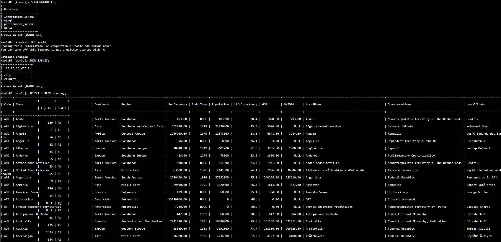
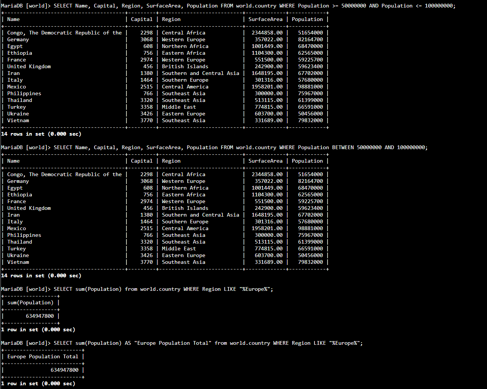
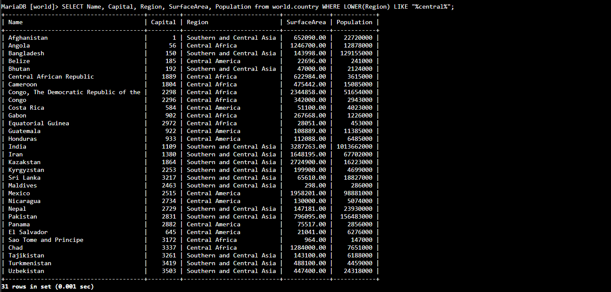
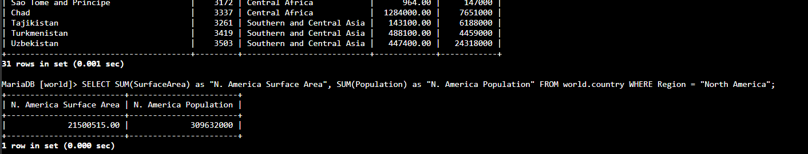

# Lab 271 Realización de una Búsqueda Condicional en MySQL


## Descripción General

En este laboratorio práctico se aplicaron técnicas de búsqueda condicional y filtrado avanzado sobre una base de datos relacional MySQL en AWS. Accediendo al _Command Host_ vía **AWS Systems Manager Session Manager**, se ejecutaron consultas SQL utilizando la cláusula `WHERE` combinada con el operador de rango `BETWEEN`, búsquedas por patrones de texto con `LIKE` y comodines (`%`), funciones de agregación (`SUM`), conversión de texto (`LOWER`) y asignación de alias de columna (`AS`).

## Objetivos del Laboratorio

- Filtrar registros mediante condiciones simples y compuestas usando la cláusula `WHERE`.
- Implementar el operador `BETWEEN` para realizar búsquedas dentro de un rango inclusivo de valores.
- Utilizar el operador `LIKE` con caracteres comodín (`%`) para la coincidencia de patrones en cadenas de texto.
- Asignar nombres descriptivos a los campos calculados mediante alias de columna (`AS`).
- Aplicar funciones de agregación (`SUM`) y de manipulación de cadenas (`LOWER`) tanto en el enunciado `SELECT` como en la cláusula `WHERE`.

## Tarea 1: Conexión al Command Host e Instancia de Base de Datos

Se estableció conexión con la instancia _Command Host_ mediante **AWS Systems Manager Session Manager** y se accedió al motor MySQL.

## Tarea 2: Consulte la Base de Datos World

1. Inspección de las bases de datos disponibles en el servidor:

```sql
SHOW DATABASES;
```

2. Consulta de la totalidad de registros almacenados en la tabla `country`:

```sql
SELECT * FROM world.country;
```


_Figura 1: Captura de pantalla de los comandos pasos 1 y 2_

3. Filtrado de datos aplicando operadores relacionales (`>=`, `<=`) y el operador lógico `AND` para evaluar un rango poblacional:

```sql
SELECT Name, Capital, Region, SurfaceArea, Population FROM world.country WHERE Population >= 50000000 AND Population <= 100000000;
```

4. Sustitución de operadores de comparación por el operador `BETWEEN` para simplificar la lectura de la consulta de rango:

```sql
SELECT Name, Capital, Region, SurfaceArea, Population FROM world.country WHERE Population BETWEEN 50000000 AND 100000000;
```

5. Uso del operador `LIKE` con comodines (`%`) y la función de agregación `SUM()` para calcular la población total de los países de Europa:

```sql
SELECT sum(Population) from world.country WHERE Region LIKE "%Europe%";
```

6. Inclusión de un alias de columna mediante la opción `AS` para formatear el encabezado del resultado devuelto:

```sql
SELECT sum(population) as "Europe Population Total" from world.country WHERE region LIKE "%Europe%";
```


_Figura 2: Captura de pantalla de los comandos pasos 3, 4, 5, 6_

7. Estandarización de búsquedas de texto insensibles a mayúsculas o minúsculas utilizando la función de cadena `LOWER()` dentro de la cláusula `WHERE`:

```sql
SELECT Name, Capital, Region, SurfaceArea, Population from world.country WHERE LOWER(Region) LIKE "%central%";
```


_Figura 3: Captura de pantalla de los comandos paso 7_

## Desafío: Consulta de la Superficie y Población de Norteamérica

Resolución de la consulta orientada a calcular la suma del área de superficie y la población total perteneciente a la región de Norteamérica (North America), asignando alias descriptivos a cada resultado:

```sql
SELECT SUM(SurfaceArea) as "N. America Surface Area", SUM(Population) as "N. America Population" FROM world.country WHERE Region = "North America";
```


_Figura 4: Captura de pantalla de los comandos del desafío_

## Resumen de Recursos y Componentes

| Servicio / Recurso      | Nombre del Componente | Descripción y Función Técnica                                                                                  |
| :---------------------- | :-------------------- | :------------------------------------------------------------------------------------------------------------- |
| **Amazon EC2**          | `Command Host`        | Instancia Linux cliente conectada mediante Session Manager para ejecutar el cliente MySQL.                     |
| **AWS Systems Manager** | `Session Manager`     | Servicio de gestión para acceso seguro a la CLI de la instancia EC2 sin exponer puertos públicos.              |
| **MySQL Engine**        | Base de Datos `world` | Base de datos relacional sobre la cual se ejecutaron las operaciones de filtrado y agregación.                 |
| **MySQL Engine**        | Tabla `country`       | Tabla sobre la que se aplicaron filtros condicionales (`BETWEEN`, `LIKE`), funciones (`SUM`, `LOWER`) y alias. |

## Conclusiones del Laboratorio

- **Expresividad y Lectura con `BETWEEN`:** El uso del operador `BETWEEN` simplifica la sintaxis en comparaciones de rango inclusivo en lugar de encadenar operadores `>=` y `<=` con `AND`.
- **Flexibilidad en Búsquedas de Texto:** La combinación de `LIKE` con comodines (`%`) y la función `LOWER()` permite realizar consultas robustas ante variaciones de formato o mayúsculas en datos tipo cadena.
- **Formateo de Salida con Alias:** La asignación de alias (`AS`) y el uso de funciones de agregación como `SUM()` permiten transformar datos crudos en reportes o resúmenes ejecutivos legibles.
