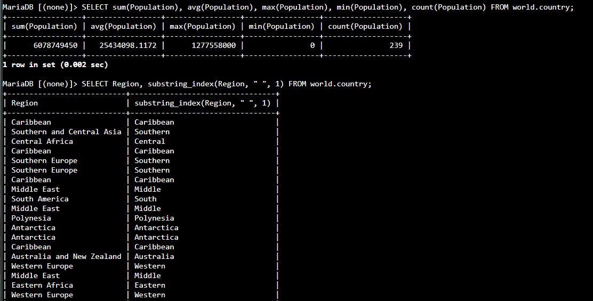
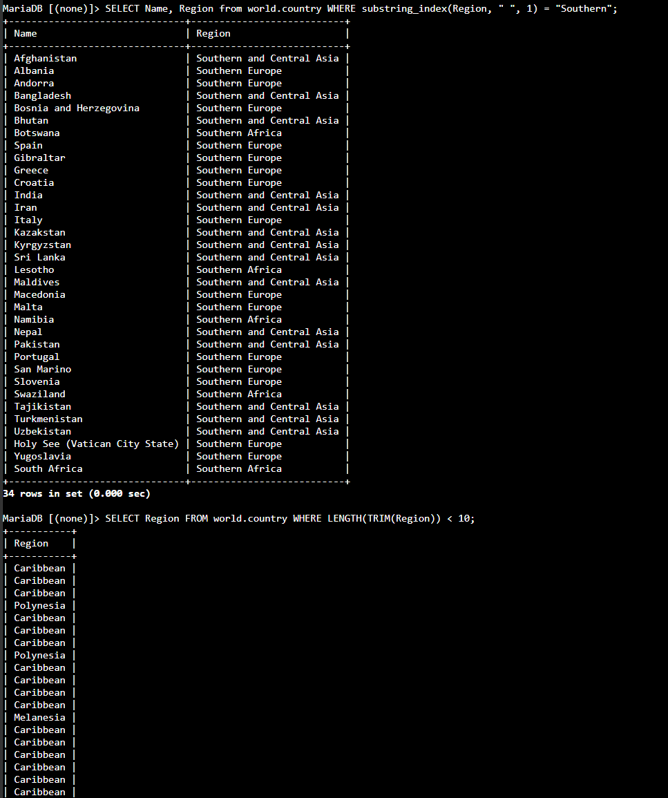

# Lab 272 Trabajar con Funciones en MySQL


## Descripción General

En este laboratorio práctico se implementaron funciones SQL integradas en MySQL para la agregación de datos, manipulación de cadenas de texto y depuración de registros. Conectándose al _Command Host_ mediante **AWS Systems Manager Session Manager**, se ejecutaron consultas avanzadas empleando funciones agregadas (`SUM`, `AVG`, `MAX`, `MIN`, `COUNT`), división de cadenas de caracteres (`SUBSTRING_INDEX`), medición y limpieza de texto (`LENGTH`, `TRIM`) y eliminación de duplicados mediante `DISTINCT`, aplicadas tanto en el enunciado `SELECT` como en la cláusula `WHERE`.

## Objetivos del Laboratorio

- Resumir datos numéricos utilizando las funciones agregadas `SUM()`, `AVG()`, `MAX()`, `MIN()` y `COUNT()`.
- Segmentar y extraer partes específicas de cadenas de texto con la función `SUBSTRING_INDEX()`.
- Medir la longitud de cadenas de texto y eliminar espacios en blanco sobrantes combinando `LENGTH()` y `TRIM()`.
- Descartar valores duplicados en los conjuntos de resultados mediante el uso de `DISTINCT()`.
- Aplicar funciones de manipulación de texto dentro de la cláusula `WHERE` para filtrar datos dinámicamente.

## Tarea 1: Conexión al Command Host e Instancia de Base de Datos

Se estableció conexión con la instancia _Command Host_ mediante **AWS Systems Manager Session Manager** y se accedió al motor MySQL.

## Tarea 2: Consulte la Base de Datos World

1. Inspección de las bases de datos disponibles en el servidor:

```sql
SHOW DATABASES;
```

2. Consulta de la totalidad de registros almacenados en la tabla `country`:

```sql
SELECT * FROM world.country;
```

3. Ejecución de funciones agregadas para calcular el total, promedio, máximo, mínimo y conteo de filas sobre la columna `Population`:

```sql
SELECT sum(Population), avg(Population), max(Population), min(Population), count(Population) FROM world.country;
```

4. Extracción de la primera palabra del campo `Region` utilizando la función `SUBSTRING_INDEX()` con el espacio en blanco como delimitador:

```sql
SELECT Region, substring_index(Region, " ", 1) FROM world.country;
```


_Figura 1: Captura de pantalla de los comandos del paso 3 y 4_

5. Uso de `SUBSTRING_INDEX()` dentro de la cláusula `WHERE` para filtrar países cuya región comience con el término `Southern`:

```sql
SELECT Name, Region from world.country WHERE substring_index(Region, " ", 1) = "Southern";
```

6. Combinación de las funciones `TRIM()` y `LENGTH()` para obtener únicamente las regiones cuyos nombres sin espacios tengan menos de 10 caracteres:

```sql
SELECT Region FROM world.country WHERE LENGTH(TRIM(Region)) < 10;
```


_Figura 2: Captura de pantalla de los comandos del paso 5 y 6_

7. Uso de la función `DISTINCT()` para eliminar valores duplicados en la lista de regiones filtradas:

```sql
SELECT DISTINCT(Region) FROM world.country WHERE LENGTH(TRIM(Region)) < 10;
```

## Desafío: División y Filtrado de Cadenas Compuestas

Resolución del desafío para segmentar el nombre de regiones compuestas como `Micronesia/Caribbean` en dos columnas independientes (`Region Name 1` y `Region Name 2`), utilizando el delimitador `/` y posiciones positivas/negativas en `SUBSTRING_INDEX()`:

```sql
SELECT Name, substring_index(Region, "/", 1) as "Region Name 1", substring_index(region, "
```

## Resumen de Recursos y Componentes

| Servicio / Recurso      | Nombre del Componente | Descripción y Función Técnica                                                                                  |
| :---------------------- | :-------------------- | :------------------------------------------------------------------------------------------------------------- |
| **Amazon EC2**          | `Command Host`        | Instancia Linux cliente conectada mediante Session Manager para ejecutar el cliente MySQL.                     |
| **AWS Systems Manager** | `Session Manager`     | Servicio de gestión de acceso seguro a la instancia EC2 sin necesidad de exponer puertos SSH.                  |
| **MySQL Engine**        | Base de Datos `world` | Base de datos relacional utilizada para la ejecución de consultas y cálculo de métricas agregadas.             |
| **MySQL Engine**        | Tabla `country`       | Tabla relacional sobre la cual se aplicaron funciones de agregación, segmentación de cadenas y desduplicación. |

## Conclusiones del Laboratorio

- **Agregación Eficiente de Datos:** El uso de funciones como `SUM()`, `AVG()`, `MAX()`, `MIN()` y `COUNT()` permite obtener resúmenes analíticos completos directamente desde el motor de base de datos sin sobrecargar la capa de aplicación.
- **Potencia en Manipulación de Cadenas:** La función `SUBSTRING_INDEX()` combinada con delimitadores positivos y negativos simplifica la extracción de fragmentos de texto complejos tanto en la selección de columnas como en la cláusula `WHERE`.
- **Calidad y Limpieza de Resultados:** El uso estratégico de `TRIM()` y `LENGTH()` junto con `DISTINCT()` garantiza la eliminación de inconsistencias por espacios en blanco y evita la redundancia de datos en reportes SQL.
