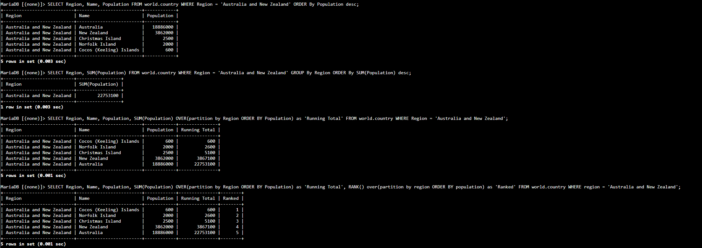

# Lab 273 Organización de Datos en MySQL con GROUP BY y Funciones de Ventana (OVER, RANK)


## Descripción General

En este laboratorio práctico se implementaron técnicas avanzadas de organización y análisis de datos en MySQL utilizando agrupamientos tradicionales con `GROUP BY` y funciones de ventana (_Window Functions_) mediante la cláusula `OVER()`. Conectándose al _Command Host_ vía **AWS Systems Manager Session Manager**, se ejecutaron consultas avanzadas para generar acumulados dinámicos (_Running Totals_), particionamiento de datos por región (`PARTITION BY`) y jerarquización de registros mediante la función de ventana `RANK()`.

## Objetivos del Laboratorio

- Agrupar registros relacionados y aplicar funciones de agregación mediante la cláusula `GROUP BY`.
- Implementar funciones de ventana utilizando la cláusula `OVER()` con `PARTITION BY` y `ORDER BY`.
- Calcular totales continuos (_Running Totals_) combinando la función `SUM()` con la cláusula `OVER()`.
- Clasificar y jerarquizar posiciones de registros en subconjuntos de datos mediante la función `RANK()`.
- Resolver desafíos de ordenamiento regional ordenando métricas de mayor a menor.

## Tarea 1: Conexión al Command Host e Instancia de Base de Datos

Se estableció conexión con la instancia _Command Host_ mediante **AWS Systems Manager Session Manager** y se accedió al motor MySQL.

## Tarea 2: Consulte la Base de Datos World

1. Verificación de disponibilidad de la base de datos `world`:

```sql
SHOW DATABASES;
```

2. Visualización general del contenido de la tabla `country`:

```sql
SELECT * FROM world.country;
```

3. Consulta con ordenamiento explícito utilizando `ORDER BY` en sentido descendente (`DESC`) para analizar la población en una región específica:

```sql
SELECT Region, Name, Population FROM world.country WHERE Region = 'Australia and New Zealand' ORDER BY Population DESC;
```

4. Agrupamiento de registros por región mediante `GROUP BY` para calcular el total consolidado de población con `SUM()`:

```sql
SELECT Region, SUM(Population) FROM world.country WHERE Region = 'Australia and New Zealand' GROUP BY Region ORDER BY SUM(Population) DESC;
```

5. Uso de funciones de ventana con `OVER(PARTITION BY ... ORDER BY ...)` para calcular un total acumulado (Running Total) por país dentro de la región:

```sql
SELECT Region, Name, Population, SUM(Population) OVER(PARTITION BY Region ORDER BY Population) AS 'Running Total' FROM world.country WHERE Region = 'Australia and New Zealand';
```

6. Inclusión de la función de ventana `RANK()` para asignar un número de posición/ranking a cada país dentro de la partición de su región según su población:

```sql
SELECT Region, Name, Population, SUM(Population) OVER(PARTITION BY Region ORDER BY Population) AS 'Running Total', RANK() OVER(PARTITION BY Region ORDER BY Population) AS 'Ranked' FROM world.country WHERE Region = 'Australia and New Zealand';
```


_Figura 1: Captura de pantalla de los comandos de los pasos 3, 4, 5 y 6_

## Desafío: Jerarquización Global de Países por Región y Población

Resolución del desafío para clasificar todos los países dentro de cada región asignándoles un ranking de población de mayor a menor (`DESC`), ordenando la salida por región y posición:

```sql
SELECT Region, Name, Population, RANK() OVER(PARTITION BY Region ORDER BY Population DESC) AS 'Ranked' FROM world.country ORDER BY Region, Ranked;
```

## Resumen de Recursos y Componentes

| Servicio / Recurso      | Nombre del Componente | Descripción y Función Técnica                                                                                |
| :---------------------- | :-------------------- | :----------------------------------------------------------------------------------------------------------- |
| **Amazon EC2**          | `Command Host`        | Instancia Linux cliente conectada mediante Session Manager para ejecutar el cliente MySQL.                   |
| **AWS Systems Manager** | `Session Manager`     | Servicio de gestión para acceso seguro a la CLI de la instancia EC2 sin exponer puertos SSH públicos.        |
| **MySQL Engine**        | Base de Datos `world` | Base de datos relacional sobre la cual se ejecutaron las operaciones de agrupamiento y funciones de ventana. |
| **MySQL Engine**        | Tabla `country`       | Tabla sobre la cual se aplicaron cláusulas `GROUP BY`, particionamientos con `OVER()`, agregados y `RANK()`. |

## Conclusiones del Laboratorio

- **Diferencia entre `GROUP BY` y Window Functions:** `GROUP BY` colapsa múltiples filas en una sola fila resumida por grupo, mientras que las funciones de ventana con `OVER()` conservan el detalle individual de cada fila añadiendo el cálculo agregado en cada registro.
- **Totales Acumulados Dinámicos:** La combinación de `SUM()` con `OVER(PARTITION BY ... ORDER BY ...)` permite generar métricas de acumulación (_Running Totals_) de forma limpia y eficiente directamente en la consulta SQL.
- **Jerarquización Automatizada con `RANK()`:** El uso de `RANK()` facilita el análisis comparativo dentro de categorías o particiones sin requerir subconsultas complejas ni lógica a nivel de código de aplicación.
