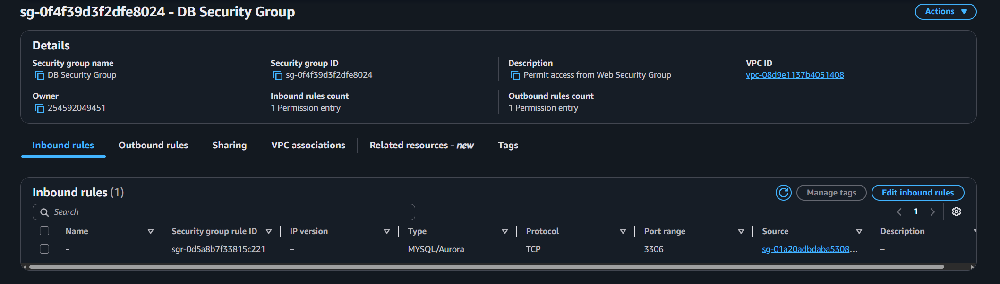
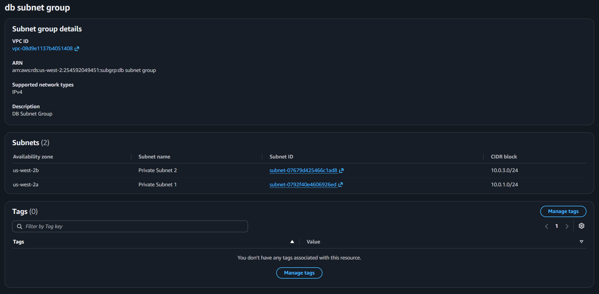
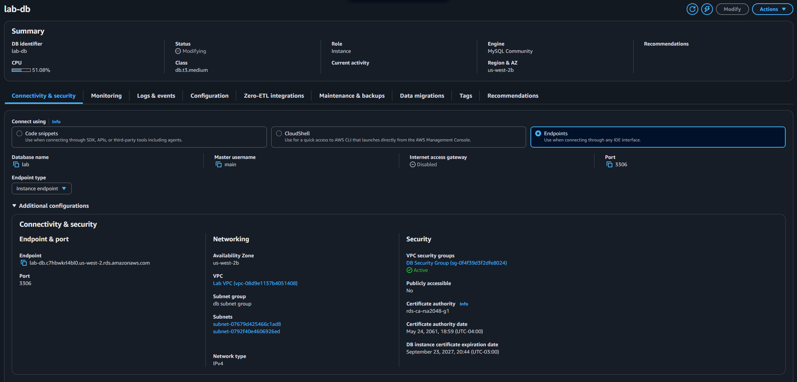
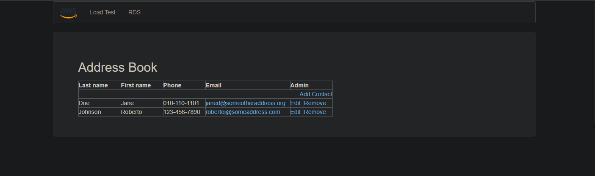

# Lab 160 Crear un Servidor de Base de Datos e Interactuar mediante una Aplicación Web en AWS RDS


## Descripción General

En este laboratorio práctico se aprovisionó e integró una instancia de base de datos relacional administrada **Amazon RDS para MySQL** con despliegue de alta disponibilidad en múltiples zonas de disponibilidad (**Multi-AZ**). Se configuraron las capas de red privadas, grupos de seguridad (_Security Groups_) y grupos de subredes (_Subnet Groups_) necesarios para permitir que una aplicación web alojada en una instancia **Amazon EC2** se conectara de forma segura al endpoint de la base de datos para realizar operaciones de lectura y escritura.

## Objetivos del Laboratorio

- Crear y configurar un grupo de seguridad para la instancia de RDS restringiendo el acceso únicamente al grupo de seguridad del servidor web.
- Configurar un grupo de subredes de base de datos (_DB Subnet Group_) abarcando subredes privadas en dos zonas de disponibilidad diferentes.
- Aprovisionar una instancia de base de datos **Amazon RDS MySQL Multi-AZ** de alta disponibilidad.
- Conectar una aplicación web externa alojada en Amazon EC2 a la base de datos MySQL mediante el endpoint administrado por RDS.

## Tarea 1: Crear un Grupo de Seguridad para la Instancia de Base de Datos RDS

Creación del grupo de seguridad de base de datos dentro de la VPC del laboratorio para aislar el acceso a la capa de datos:

1. Navegación hacia la consola de **VPC** > **Grupos de seguridad**.
2. Selección de **Crear grupo de seguridad** con la siguiente configuración:
   - **Nombre del grupo de seguridad:** `DB Security Group`
   - **Descripción:** `Permit access from Web Security Group`
   - **VPC:** `VPC de laboratorio`
3. Adición de regla entrante (_Inbound Rule_) para autorizar tráfico MySQL proveniente únicamente de las instancias del servidor web:
   - **Tipo:** `MySQL/Aurora (3306)`
   - **Fuente:** `Grupo de seguridad web` (`Web Security Group`)

```text
[Servidor Web (EC2)] ──(Puerto 3306)──> [DB Security Group] ──> [Amazon RDS MySQL]
```

\

_Figura 1: Grupo de seguridad con la regla de entrada del puerto 3306_

## Tarea 2: Crear un Grupo de Subredes de Base de Datos

Definición del grupo de subredes (_DB Subnet Group_) que indica a Amazon RDS en qué subredes privadas de la VPC puede desplegar las instancias primaria y en espera (_standby_):

1. Navegación hacia la consola de **RDS** > **Grupos de subredes**.
2. Selección de **Crear grupo de subredes de base de datos**:
   - **Nombre:** `DB Subnet Group`
   - **Descripción:** `DB Subnet Group`
   - **ID de VPC:** `VPC de laboratorio`
3. Selección de subredes privadas en dos zonas de disponibilidad:
   - **Primera zona de disponibilidad:** Subred privada 1 (`10.0.1.0/24`)
   - **Segunda zona de disponibilidad:** Subred privada 2 (`10.0.3.0/24`)

\

_Figura 2: Grupo de subredes con las subredes privadas_

## Tarea 3: Crear una Instancia de Base de Datos de Amazon RDS

Aprovisionamiento de la base de datos relacional MySQL Multi-AZ:

1. Navegación hacia **RDS** > **Bases de datos** > **Crear base de datos**.
2. Selección de parámetros de configuración:
   - **Método de creación:** Creación estándar
   - **Tipo de motor:** `MySQL` (Versión más reciente)
   - **Plantilla:** Dev/Test (Desarrollo/pruebas)
   - **Disponibilidad y durabilidad:** Instancia de base de datos Multi-AZ
   - **Identificador de instancia:** `lab-db`
   - **Nombre de usuario maestro:** `main`
   - **Contraseña maestra:** `lab-password`
3. Ajustes de capacidad y red:
   - **Clase de instancia:** Clases ampliables (`db.t3.medium`)
   - **Tipo de almacenamiento:** SSD de uso general (gp2/gp3)
   - **VPC:** `VPC de laboratorio`
   - **Grupo de seguridad de VPC:** `DB Security Group` (removiendo el default)
   - **Nombre de base de datos inicial:** `lab`
   - **Respaldos automáticos:** Deshabilitados (para acelerar la creación en entorno de laboratorio)
4. Una vez la base de datos cambió al estado **Disponible**, se obtuvo el **Punto de enlace** (_Endpoint_):

```text
lab-db.c7hbwkrl4bl0.us-west-2.rds.amazonaws.com
```

\

_Figura 3: Instancia de base de datos de Amazon RDS_

## Tarea 4: Interactuar con la Base de Datos desde la Aplicación Web

Conexión de la interfaz web con el endpoint de Amazon RDS:

1. Obtención de la IP pública de la instancia EC2 `WebServer`.
2. Acceso vía navegador web a la IP e ingreso a la sección **RDS**.
3. Configuración de los parámetros de conexión en la aplicación web:
   - **Punto de enlace:** `lab-db.c7hbwkrl4bl0.us-west-2.rds.amazonaws.com`
   - **Base de datos:** `lab`
   - **Nombre de usuario:** `main`
   - **Contraseña:** `lab-password`
4. Verificación de la inicialización del esquema y prueba de la libreta de direcciones agregando, editando y eliminando contactos.

\

_Figura 4: Interacción con la base de datos desde la aplicación web_

## Resumen de Recursos y Componentes

| Servicio / Recurso | Nombre del Componente | Descripción y Función Técnica                                                                                                            |
| :----------------- | :-------------------- | :--------------------------------------------------------------------------------------------------------------------------------------- |
| **Amazon RDS**     | `lab-db`              | Instancia de base de datos relacional MySQL desplegada en arquitectura Multi-AZ para alta disponibilidad y replicación sincrónica.       |
| **Amazon RDS**     | `DB Subnet Group`     | Agrupación de subredes privadas en dos zonas de disponibilidad distintas (`10.0.1.0/24` y `10.0.3.0/24`) para el despliegue de RDS.      |
| **Amazon EC2**     | `WebServer`           | Instancia EC2 en subred pública que aloja la aplicación web cliente de la libreta de direcciones.                                        |
| **Amazon VPC**     | `DB Security Group`   | Grupo de seguridad de la base de datos que restringe el tráfico entrante en el puerto TCP `3306` exclusivamente al `Web Security Group`. |

## Conclusiones del Laboratorio

- **Aislamiento y Seguridad en Capas:** La segregación de la base de datos en subredes privadas y la restricción del puerto `3306` a nivel de grupo de seguridad garantizan que la capa de datos no sea accesible directamente desde Internet, permitiendo únicamente solicitudes autorizadas desde el servidor web.
- **Resiliencia con Multi-AZ:** El despliegue de Amazon RDS en configuración Multi-AZ provee alta disponibilidad mediante replicación sincrónica de datos entre zonas de disponibilidad, permitiendo conmutación por error (_failover_) automática sin pérdida de información ante fallas de infraestructura.
- **Desacoplamiento de Infraestructura Administrada:** Amazon RDS automatiza la gestión de hardware, parches de motor y aprovisionamiento de almacenamiento, permitiendo conectar aplicaciones web dinámicas a bases de datos relacionales sin la carga operativa de administrar el sistema operativo subyacente.
