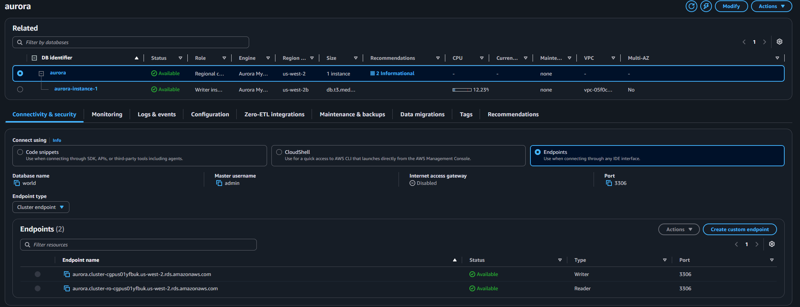
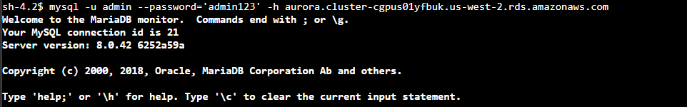
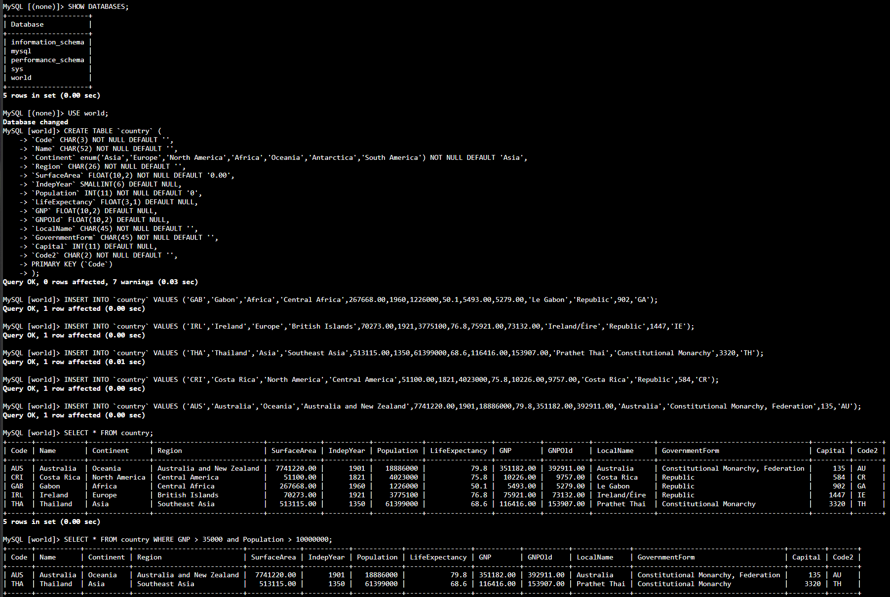

# Lab 274 Introducción a Amazon Aurora y Consulta de Datos desde Amazon EC2


## Descripción General

En este laboratorio práctico se aprovisionó e integró un clúster de base de datos relacional totalmente administrado mediante **Amazon Aurora (compatible con MySQL)** dentro de una infraestructura virtual de Amazon VPC. Se configuró un entorno de cómputo en **Amazon EC2** (`Command Host`) conectándose vía **AWS Systems Manager Session Manager**, en el cual se instaló el cliente MariaDB/MySQL para establecer comunicación con el endpoint del clúster de Aurora, crear un esquema relacional (`world`), cargar registros de prueba y ejecutar consultas SQL optimizadas.

## Objetivos del Laboratorio

- Aprovisionar un clúster de base de datos relacional **Amazon Aurora MySQL** en un grupo de subredes privadas.
- Conectarse de manera segura a una instancia Linux **Amazon EC2** mediante **AWS Systems Manager Session Manager**.
- Configurar el cliente MariaDB/MySQL en la instancia de EC2 para interactuar con el endpoint de escritor del clúster.
- Crear bases de datos, definir tablas con llaves primarias, insertar datos e interactuar con la instancia mediante sentencias SQL (`SELECT`).

## Tarea 1: Crear una Instancia de Amazon Aurora

Aprovisionamiento del clúster de base de datos relacional compatible con MySQL:

1. Navegación hacia la consola de **RDS** > **Bases de datos** > **Crear base de datos**.
2. Configuración de opciones principales del motor:
   - **Método de creación:** Creación estándar
   - **Tipo de motor:** `Aurora (compatible con MySQL)`
   - **Versión del motor:** Predeterminada para versión principal `8.0`
   - **Plantilla:** `Dev/Test (Desarrollo/pruebas)`
3. Ajuste de credenciales y parámetros del clúster:
   - **Identificador de clúster de base de datos:** `aurora`
   - **Nombre de usuario maestro:** `admin`
   - **Contraseña maestra:** `admin123`
   - **Clase de instancia:** Clases ampliables (`db.t3.medium`)
   - **Disponibilidad y durabilidad:** `No crear una réplica de Aurora` (Single-AZ para entorno de pruebas)
4. Configuración de red y conectividad:
   - **Nube virtual privada (VPC):** `LabVPC`
   - **Grupo de subredes:** `dbsubnetgroup`
   - **Acceso público:** `No`
   - **Grupo de seguridad de VPC:** `DBSecurityGroup` (removiendo el grupo predeterminado)
5. Opciones adicionales y almacenamiento:
   - **Supervisión mejorada:** Canceled / Deshabilitado
   - **Nombre de base de datos inicial:** `world`
   - **Cifrado de almacenamiento:** Canceled / Deshabilitado
   - **Actualización de versión menor automática:** Canceled / Deshabilitado
6. Confirmación de creación y verificación del estado **Disponible** del clúster.

```text
[VPC: LabVPC]
  └── [Private Subnet Group: dbsubnetgroup]
        └── [Aurora DB Cluster: aurora] ── (Port 3306)
```

\

_Figura 1: Instancia de Amazon Aurora_

## Tarea 2: Conectarse a una Instancia de Linux de Amazon EC2

Acceso a la instancia de comandos mediante administración basada en agentes sin exposición de puertos SSH públicos:

1. Navegación hacia la consola de EC2 > Instancias.

2. Selección de la instancia etiquetada como `Command Host`.

3. Inicio de sesión mediante Session Manager (AWS Systems Manager):
   - Selección de Conectar > Pestana Session Manager > Conectar.

4. Apertura exitosa de la sesión de terminal en línea de comandos.

## Tarea 3: Configurar la Instancia EC2 para Conectarse a Aurora

Instalación de las herramientas de cliente de base de datos e identificación del endpoint de escritura:

Instalación del paquete de cliente mariadb en la instancia EC2:

1. Instalación del paquete de cliente `mariadb` en la instancia EC2:

```bash
sudo yum install mariadb -y
```

2. Obtención del **Punto de enlace del clúster (Writer Endpoint)** desde la consola de RDS (**Bases de datos** > **`aurora`** > Pestaña **Conectividad y seguridad**):

```text
aurora.cluster-cgpus01yfbuk.us-west-2.rds.amazonaws.com
```

3. Conexión al shell de MySQL a través del endpoint de escritor:

```bash
mysql -u admin --password='admin123' -h aurora.cluster-cgpus01yfbuk.us-west-2.rds.amazonaws.com
```

4. Verificación del prompt activo de MariaDB/MySQL:

```sql
Welcome to the MariaDB monitor. Commands end with ; or \g.
MySQL [(none)]>
```


_Figura 2: Conexión shell y verificación del prompt activo de MariaDB/MySQL_

## Tarea 4: Crear una Tabla e Insertar Registros de Consulta

Modelado de datos relacionales, inserción de tuplas y ejecución de sentencias de consulta:

1. Inspección de bases de datos existentes y selección de la base de datos `world`:

```SQL
SHOW DATABASES;
USE world;
```

2. Creación de la tabla `country`:

```SQL
CREATE TABLE `country` (
`Code` CHAR(3) NOT NULL DEFAULT '',
`Name` CHAR(52) NOT NULL DEFAULT '',
`Continent` enum('Asia','Europe','North America','Africa','Oceania','Antarctica','South America') NOT NULL DEFAULT 'Asia',
`Region` CHAR(26) NOT NULL DEFAULT '',
`SurfaceArea` FLOAT(10,2) NOT NULL DEFAULT '0.00',
`IndepYear` SMALLINT(6) DEFAULT NULL,
`Population` INT(11) NOT NULL DEFAULT '0',
`LifeExpectancy` FLOAT(3,1) DEFAULT NULL,
`GNP` FLOAT(10,2) DEFAULT NULL,
`GNPOld` FLOAT(10,2) DEFAULT NULL,
`LocalName` CHAR(45) NOT NULL DEFAULT '',
`GovernmentForm` CHAR(45) NOT NULL DEFAULT '',
`Capital` INT(11) DEFAULT NULL,
`Code2` CHAR(2) NOT NULL DEFAULT '',
PRIMARY KEY (`Code`)
);
```

3. Inserción de registros de prueba en la tabla `country`:

```SQL
INSERT INTO `country` VALUES ('GAB','Gabon','Africa','Central Africa',267668.00,1960,1226000,50.1,5493.00,5279.00,'Le Gabon','Republic',902,'GA');
INSERT INTO `country` VALUES ('IRL','Ireland','Europe','British Islands',70273.00,1921,3775100,76.8,75921.00,73132.00,'Ireland/Éire','Republic',1447,'IE');
INSERT INTO `country` VALUES ('THA','Thailand','Asia','Southeast Asia',513115.00,1350,61399000,68.6,116416.00,153907.00,'Prathet Thai','Constitutional Monarchy',3320,'TH');
INSERT INTO `country` VALUES ('CRI','Costa Rica','North America','Central America',51100.00,1821,4023000,75.8,10226.00,9757.00,'Costa Rica','Republic',584,'CR');
INSERT INTO `country` VALUES ('AUS','Australia','Oceania','Australia and New Zealand',7741220.00,1901,18886000,79.8,351182.00,392911.00,'Australia','Constitutional Monarchy, Federation',135,'AU');
```

4. Consulta condicional de datos filtrados por Producto Nacional Bruto (GNP) y Población:

```sql
SELECT * FROM country WHERE GNP > 35000 and Population > 10000000;
```

\

_Figura 3: Captura de pantalla de los comandos de la tarea 4_

## Resumen de Recursos y Componentes

| Servicio / Recurso      | Nombre del Componente      | Descripción y Función Técnica                                                                                          |
| :---------------------- | :------------------------- | :--------------------------------------------------------------------------------------------------------------------- |
| **Amazon Aurora**       | `aurora`                   | Clúster de base de datos relacional compatible con MySQL, administrado para alto rendimiento y baja latencia.          |
| **Amazon EC2**          | `Command Host`             | Instancia Linux utilizada como bastión de administración para interactuar con la base de datos dentro de la VPC.       |
| **AWS Systems Manager** | `Session Manager`          | Servicio de gestión de acceso que permite conectarse por shell seguro a la instancia EC2 sin exponer el puerto 22 SSH. |
| **Amazon VPC**          | `LabVPC` / `dbsubnetgroup` | Red virtual privada y grupo de subredes que aíslan el tráfico de la base de datos en capas privadas.                   |
| **VPC Security Group**  | `DBSecurityGroup`          | Grupo de seguridad que controla el acceso de red al puerto `3306` del clúster de Aurora.                               |

## Conclusiones del Laboratorio

- **Rendimiento y Compatibilidad de Aurora:** Amazon Aurora ofrece compatibilidad total con el ecosistema de MySQL permitiendo utilizar herramientas estándar como el cliente de MariaDB, con una arquitectura orientada a la nube que optimiza el rendimiento de lectura y escritura.
- **Acceso Seguro sin Exposición Pública:** La combinación de **AWS Systems Manager Session Manager** y grupos de seguridad privados permite administrar instancias de base de datos desde instancias EC2 internas sin necesidad de habilitar direccionamiento IP público ni abrir puertos SSH/3306 hacia Internet.
- **Abstracción de Endpoints de Clúster:** El uso de endpoints administrados por Aurora (Writer Endpoint y Reader Endpoint) desacopla la capa de aplicación de la infraestructura subyacente, facilitando la conmutación por error (_failover_) y el escalado de réplicas de lectura de forma transparente.
