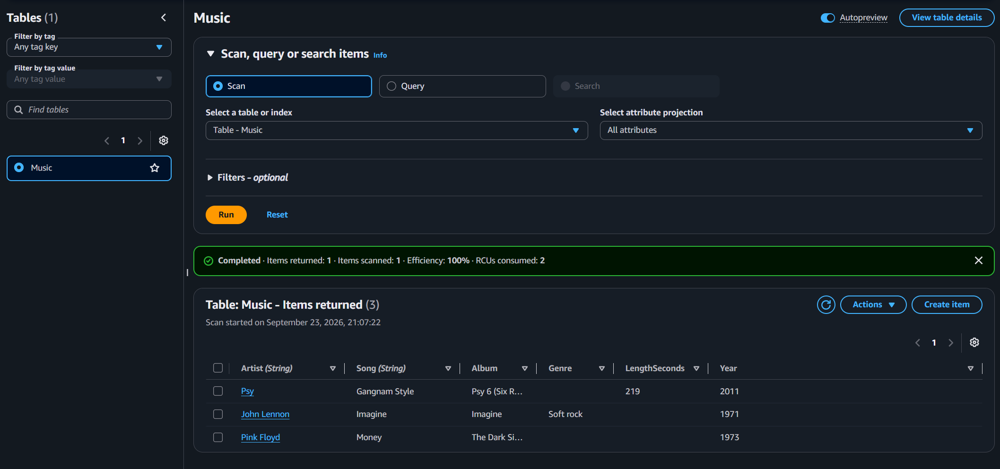
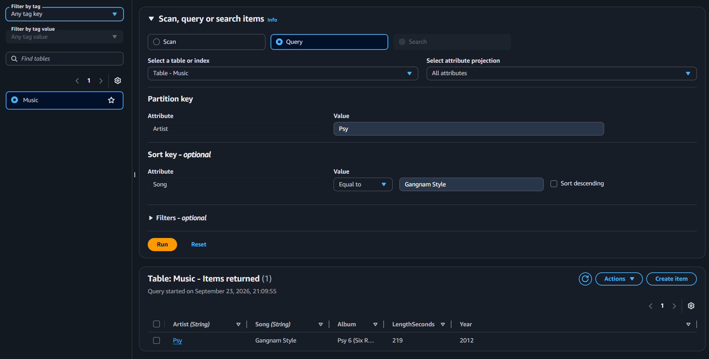
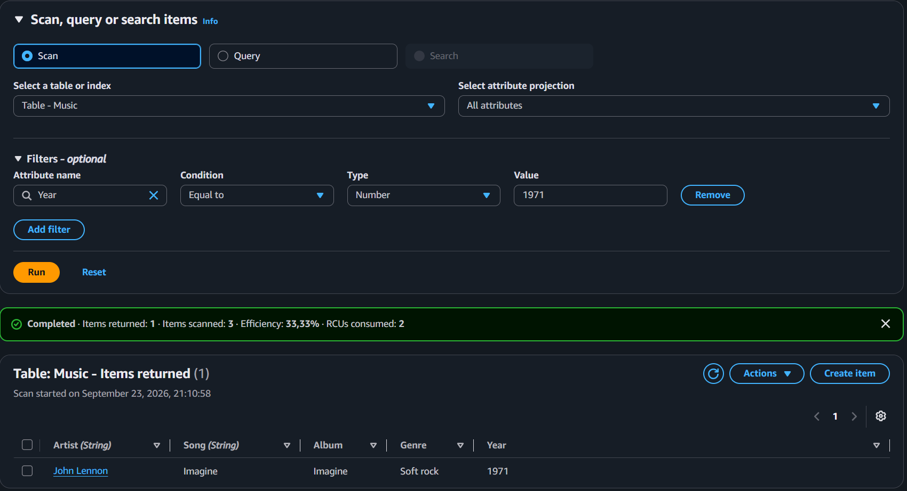

# Lab 275 Introducción a Amazon DynamoDB


## Descripción General

En este laboratorio práctico se creó, administró y consultó una base de datos NoSQL completamente administrada mediante **Amazon DynamoDB**. Se exploró la naturaleza flexible y sin esquema (_schema-less_) del servicio modelando una biblioteca de música (`Music`), insertando elementos con atributos heterogéneos, realizando modificaciones de datos existentes en tiempo de ejecución y comparando en la práctica el rendimiento y la eficiencia entre las operaciones de consulta directa indexada (**Query**) y análisis completo (**Scan**). Finalmente, se procedió con la eliminación segura del recurso para completar el ciclo de vida del laboratorio.

## Objetivos del Laboratorio

- Aprovisionar una tabla en **Amazon DynamoDB** configurando la clave de partición (_Partition Key_) y la clave de ordenación (_Sort Key_).
- Cargar e ingresar elementos a la tabla DynamoDB demostrando la flexibilidad de atributos dinámicos en bases de datos NoSQL.
- Modificar y actualizar atributos en registros o elementos previamente almacenados desde la consola de administración.
- Ejecutar y diferenciar técnicamente las operaciones de recuperación de datos mediante **Query** (búsqueda indexada) y **Scan** (escaneo secuencial con filtros).
- Eliminar la tabla de DynamoDB de forma limpia finalizando el ciclo de vida de los datos.

## Tarea 1: Crear una Nueva Tabla

Aprovisionamiento de la tabla NoSQL para la biblioteca musical:

1. En la Consola de administración de AWS, navegación al menú **Services** > **Database** > **DynamoDB**.
2. Selección de **Create table** (Crear tabla).
3. Configuración de parámetros de la tabla:
   - **Table name:** `Music`
   - **Partition key:** `Artist` (`String`)
   - **Sort key - optional:** `Song` (`String`)
4. Mantenimiento de la configuración predeterminada para los índices y capacidad de aprovisionamiento.
5. Selección de **Create table** y verificación del estado **Active** (Activo) de la tabla `Music`.

```text
[DynamoDB Table: Music]
  ├── Partition Key (PK): Artist (String)
  └── Sort Key (SK):      Song (String)
```

## Tarea 2: Agregar Datos

Inserción de elementos en la tabla `Music` aprovechando el modelo sin esquema fijo:

1. Selección de la tabla `Music` > Actions > Create item.

2. Registro del primer elemento (Pink Floyd):
   - Artist: Pink Floyd
   - Song: Money
   - Adición de atributo String -> Album: The Dark Side of the Moon
   - Adición de atributo Number -> Year: 1973
   - Selección de Create item.

3. Registro del segundo elemento (John Lennon):
   - Artist: John Lennon
   - Song: Imagine
   - Album: Imagine
   - Year: 1971
   - Adición de atributo opcional String -> Genre: Soft rock
   - Selección de Create item.

4. Registro del tercer elemento (Psy):
   - Artist: Psy
   - Song: Gangnam Style
   - Album: Psy 6 (Six Rules), Part 1
   - Year: 2011
   - Adición de atributo opcional Number -> LengthSeconds: 219
   - Selección de Create item.

```json
[
  {
    "Artist": "Pink Floyd",
    "Song": "Money",
    "Album": "The Dark Side of the Moon",
    "Year": 1973
  },
  {
    "Artist": "John Lennon",
    "Song": "Imagine",
    "Album": "Imagine",
    "Year": 1971,
    "Genre": "Soft rock"
  },
  {
    "Artist": "Psy",
    "Song": "Gangnam Style",
    "Album": "Psy 6 (Six Rules), Part 1",
    "Year": 2011,
    "LengthSeconds": 219
  }
]
```

\

_Figura 1: Elementos creados en la tabla `Music` con atributos dinámicos_

## Tarea 3: Modificar un Elemento Existente

Edición de atributos sobre un registro existente desde el explorador de la consola:

1. Navegación en el panel lateral de DynamoDB > **Tables** > **Explore Items**.
2. Selección de la tabla **Music**.
3. Selección del elemento correspondiente al artista `Psy`.
4. Edición del atributo `Year` actualizando el valor de `2011` a `2012`.
5. Confirmación seleccionando **Save changes**.

## Tarea 4: Consultar la Tabla

Ejecución y evaluación de las dos estrategias de búsqueda disponibles en DynamoDB:

1. **Operación Query (Búsqueda Indexada):**
   - Expansión del panel **Scan/Query items** y selección de la opción **Query**.
   - Parámetros ingresados:
     - **Artist (Partition key):** `Psy`
     - **Song (Sort key):** `Gangnam Style`
   - Selección de **Run**. La consulta devuelve el registro objetivo de forma inmediata apuntando directamente a la partición correspondiente.


_Figura 2: Resultados de las operaciones Query en la consola de DynamoDB_

2. **Operación Scan (Análisis Completo):**
   - Cambio de modalidad a **Scan**.
   - Expansión de la sección **Filters** e ingreso de criterios:
     - **Attribute Name:** `Year`
     - **Type:** `Number`
     - **Value:** `1971`
   - Selección de **Run**. Se escanea toda la tabla de principio a fin, retornando únicamente la canción del año 1971 (_John Lennon - Imagine_).


_Figura 3: Resultados de las operaciones Scan en la consola de DynamoDB_

## Tarea 5: Eliminar la Tabla

Depuración limpia de recursos para finalizar el laboratorio:

1. Navegación a **Tables** en el panel de DynamoDB.
2. Selección de la tabla `Music`.
3. Menú **Actions** > **Delete table**.
4. Confirmación ingresando el texto `delete` en el panel de validación y selección de **Delete table**.
5. Verificación de la eliminación completa de la tabla y sus datos.

## Resumen de Recursos y Componentes

| Servicio / Recurso  | Nombre del Componente          | Descripción y Función Técnica                                                                                                        |
| :------------------ | :----------------------------- | :----------------------------------------------------------------------------------------------------------------------------------- |
| **Amazon DynamoDB** | `Music`                        | Tabla NoSQL administrada utilizada para almacenar los datos de la biblioteca de música.                                              |
| **Partition Key**   | `Artist` (`String`)            | Clave de partición primaria utilizada por el algoritmo hash interno de DynamoDB para distribuir los datos entre particiones físicas. |
| **Sort Key**        | `Sort Key` / `Song` (`String`) | Clave de ordenación opcional que compone la clave primaria compuesta junto a la clave de partición, ordenando físicamente los datos. |
| **DynamoDB Item 1** | _Pink Floyd - Money_           | Elemento con clave compuesta y atributos base: `Album` (String) y `Year` (Number).                                                   |
| **DynamoDB Item 2** | _John Lennon - Imagine_        | Elemento que integra el atributo adicional `Genre` (String), demostrando flexibilidad de datos.                                      |
| **DynamoDB Item 3** | _Psy - Gangnam Style_          | Elemento con el atributo adicional `LengthSeconds` (Number) y actualización de `Year` a 2012.                                        |

## Conclusiones del Laboratorio

- **Flexible y Sin Esquema (Schema-less):** DynamoDB permite que cada elemento dentro de la misma tabla posea un conjunto distinto de atributos sin requerir modificaciones estructurales en la tabla, permitiendo una gran agilidad en la evolución del modelo de datos.
- **Eficiencia de Acceso (`Query` vs `Scan`):**
  - **Query:** Utiliza las claves primarias para localizar e inspeccionar únicamente los elementos necesarios dentro de la partición de almacenamiento. Ofrece un rendimiento constante con mínimo consumo de Read Capacity Units (RCU).
  - **Scan:** Evalúa secuencialmente la totalidad de los registros guardados en la tabla para posteriormente aplicar filtros. Es una operación ineficiente para tablas de gran volumen que puede degradar el rendimiento y aumentar sensiblemente los costos operacionales.
- **Servicio Totalmente Administrado:** AWS abstrae completamente el aprovisionamiento de servidores, el parcheo del sistema operativo, la réplica de datos entre zonas de disponibilidad y la gestión del almacenamiento en disco, entregando alta disponibilidad de forma transparente.
